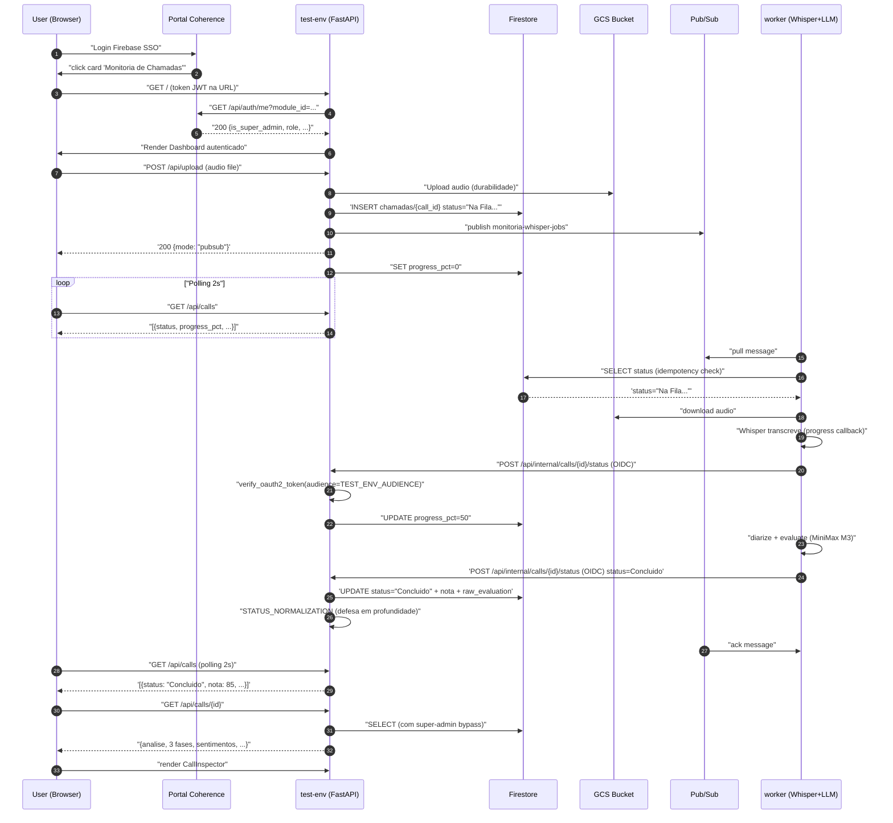

# 🏗️ Arquitetura do Projeto

> **Última atualização:** 07/07/2026 (Plano A++ + OIDC fix + revisão docs)

## Visão Geral

Sistema de "Monitoria de Chamadas" baseado em IA:
- **Transcrição** de áudios de atendimento ao cliente via **faster-whisper** (CPU, int8, OMP_NUM_THREADS=2)
- **Avaliação** contra critérios de qualidade via **MiniMax M3** (substituiu Gemini 1.5 Pro em 28/06/2026)
- **Dashboard** React/Vite com UX Clean Light Glassmorphism

## Stack Tecnológico

- **Backend:** Python 3.11, FastAPI, Uvicorn
- **Frontend:** React 19, Vite, TailwindCSS, Lucide Icons, Axios
- **IA (Transcrição):** `faster-whisper` base + CTranslate2 (int8, OMP_NUM_THREADS=2)
- **IA (Avaliação):** **MiniMax M3** (substituiu Gemini 1.5 Pro em 28/06/2026)
- **Worker dedicado:** `monitoria-whisper-worker` (Cloud Run service, Pub/Sub consumer)

## Integrações

| Serviço | Função |
|---|---|
| **Firestore** (`coherence-ominichannel-fs`, db `(default)`) | **Única fonte de verdade de DB** (Plano A++, 06/07/2026). Substituiu SQLite/GCS FUSE. Collections: `chamadas`, `user_settings`. Wrappers: `core/db.py::ChamadasDB`, `core/db.py::UserSettingsDB`. |
| **GCP Pub/Sub** | Fila de jobs assíncrona (`monitoria-whisper-jobs` topic, `monitoria-whisper-jobs-worker` subscription) |
| **GCP Cloud Storage** | Bucket de áudios brutos (`coherence-monitoria-audios-tmp`) |
| **Firebase Auth** | Identidade de usuários (token validado em `api.py::get_current_user` via `firebase_admin`) |
| **Portal Coherence** | SSO canônico via `/api/auth/me?module_id=monitoria-chamadas` (Bearer token) |
| **MiniMax M3 API** | Extração de QA, sentimentos, 3 fases de avaliação |
| **Google Cloud Identity Tokens (OIDC)** | Autenticação worker → test-env callback (`/api/internal/calls/{id}/status`) |

## Variáveis de Ambiente (GCP Cloud Run)

### test-env (`monitoria-test-env`)

| Variável | Default / Valor | Injetada via | Descrição |
|---|---|---|---|
| `MINIMAX_API_KEY` | (secreto) | `gcloud run services update` | Chave LLM MiniMax M3 |
| `FIRESTORE_PROJECT_ID` | `coherence-ominichannel-fs` | `cloudbuild-test.yaml` | Projeto GCP do Firestore |
| `PORTAL_API_URL` | `https://coherence-portal-test-c5nbfc5meq-uc.a.run.app` | `cloudbuild-test.yaml` | URL do Portal para SSO |
| `TEST_ENV_AUDIENCE` | `https://monitoria-test-env-894828119087.us-central1.run.app` | `cloudbuild-test.yaml` | Audience do OIDC (worker→test-env) |
| `PERM_CACHE_TTL_SEC` | `300` | `cloudbuild-test.yaml` | TTL do cache SSO |
| `OMP_NUM_THREADS` | `2` | `cloudbuild-test.yaml` | Evita hang do CTranslate2 |
| `PYTHONUNBUFFERED` | `1` | `cloudbuild-test.yaml` | Logs em tempo real |
| `WHISPER_DOWNLOAD_ROOT` | `/app/whisper_models` | (Dockerfile.base) | Modelo Whisper pré-baked |

### worker (`monitoria-whisper-worker`)

| Variável | Valor | Descrição |
|---|---|---|
| `GCP_PROJECT` | `coherence-ominichannel-fs` | Projeto GCP |
| `PUBSUB_TOPIC` | `monitoria-whisper-jobs` | Tópico Pub/Sub |
| `PUBSUB_SUBSCRIPTION` | `monitoria-whisper-jobs-worker` | Subscription |
| `AUDIO_BUCKET` | `coherence-monitoria-audios-tmp` | Bucket GCS |
| `WORKER_CALLBACK_URL` | `https://monitoria-test-env-894828119087.us-central1.run.app` | URL do test-env para callback OIDC |
| `OMP_NUM_THREADS` | `2` | Evita hang do CTranslate2 |
| `WHISPER_DOWNLOAD_ROOT` | `/app/whisper_models` | Modelo pré-baked |
| `MINIMAX_API_KEY` | (secreto) | Chave LLM |

## Fluxo de Dados — Diagrama



## Fluxo Pub/Sub (primário)

1. **Frontend** (React) faz upload de áudio para `POST /api/upload` no test-env.
2. **test-env** salva áudio no GCS (durabilidade), cria documento em `chamadas` (Firestore) via `get_db().create()` com `status="Na Fila de Processamento..."`, publica mensagem no Pub/Sub.
3. test-env retorna imediatamente. Frontend monitora `GET /api/calls` via short-polling (2s durante processamento, 10s idle).
4. **Worker** (`monitoria-whisper-worker`) consome a mensagem Pub/Sub.
5. **Worker**: idempotency check via `get_call(call_id).get('status')` (Firestore). Se ausente, órfão (ack). Se concluído/erro, ack idempotente. Senão, processa.
6. **Worker**: baixa áudio do GCS, transcreve via `faster-whisper`, diariza via `Evaluator.diarize()`, avalia via `Evaluator.evaluate()` (MiniMax M3).
7. **Worker** notifica test-env via **callback OIDC** (`POST /api/internal/calls/{call_id}/status` com identity token do Cloud Run metadata server).
8. **test-env** valida o token OIDC e normaliza o status (defesa em profundidade), atualiza Firestore via `get_db().update()`.
9. Frontend recebe `Concluído` no próximo poll. UI atualiza com 3 Fases (Apresentação/Métodos/Fechamento), Sentimentos, QA Score, Checklist, Relatório Diarizado.

## Fluxo In-Process (fallback)

- Usado quando worker está unhealthy OU áudio > 50MB.
- test-env processa localmente em `BackgroundTask` mas **durable**: áudio no GCS + Firestore INSERT.
- Se container morrer, `/api/internal/recover-stale` republica job no Pub/Sub.
- Auto-detecção: `_worker_healthy()` (verifica `/healthz` do worker via OIDC bypass).

## Componentes Deployados

| Serviço | Cloud Run | Responsabilidade |
|---|---|---|
| `monitoria-test-env` | público (via Portal) | API FastAPI, upload, settings, admin endpoints |
| `monitoria-whisper-worker` | `--no-allow-unauthenticated` (OIDC) | Consumer Pub/Sub, transcrição, diarização, avaliação LLM |
| `coherence-portal-test` | (projeto separado) | SSO, RBAC, audit logs |

## Persistência — Firestore Collections

### `chamadas`

```
documentId: <call_id uuid>
fields:
  filename (string)
  uploaded_at (string ISO)
  status (string) — ver "Status string canônicas" abaixo
  nota (number | null)
  transcricao (string | null) — JSON serializado
  transcricao_diarizada (string | null)
  sentimentos_cliente (string | null) — JSON serializado
  sentimentos_operador (string | null) — JSON serializado
  erros_fatais (string | null) — JSON serializado
  raw_evaluation (string | null) — JSON serializado (output do MiniMax M3)
  user_id (string) — Firebase sub do user que fez upload
  diretrizes_qualidade (string | null) — Diretrizes passadas no upload
  nota_sentimento_cliente (number | null)
  nota_qualidade_operador (number | null)
  gcs_uri (string | null) — `gs://bucket/path`
  audio_duration_sec (number | null) — detectada via ffprobe
  progress_pct (number | null) — 0-100, atualizado durante transcrição
  created_at (timestamp)
  updated_at (timestamp)
```

### `user_settings`

```
documentId: <user_id> (Firebase sub)
fields:
  checklist_items (string JSON) — lista de itens do POP
  estrategia_vendas (string) — playbook de up-sell/cross-sell
  estrategia_retencao (string) — playbook anti-cancelamento
  updated_at (timestamp)
```

## Status String Canônicas

| Status | Onde é setado | Significado |
|---|---|---|
| `"Na Fila de Processamento..."` | `api.py:500` (Pub/Sub) / `api.py:548` (in-process) | INSERT inicial após upload |
| `"Baixando audio do storage..."` | `worker.py:187` | Worker baixando do GCS |
| `"Transcrevendo Audio (Whisper)..."` | `worker.py:215` | Em transcrição (callback progresso 0-100%) |
| `"Separando falas (Diarizacao MiniMax)..."` | `worker.py:258` | Diarização |
| `"Analisando Qualidade e Sentimento (MiniMax M3)..."` | `worker.py:267` | Avaliação LLM |
| `"Concluído"` | `api.py:296` (in-process) / worker via callback OIDC (Plano A++ fix) | **Forma canônica (com acento)** |
| `"Concluido"` (sem acento) | LEGACY — pré-07/07/2026 | Normalizado para `Concluído` via `STATUS_NORMALIZATION` |
| `"Erro: ..."` | múltiplos locais (worker.py:200, 242, 277; api.py:984) | Falha em qualquer etapa |

**`STATUS_NORMALIZATION` dict** (`api.py:610`): converte variantes para forma canônica no callback OIDC, antes de gravar no Firestore. Defesa em profundidade contra typos futuros.

## Locking Policy

**Last-write-wins** (sem transactions Firestore).

- **Worker** é o único writer de `status` (via callback OIDC).
- **test-env** é o único writer de `nota`/`raw_evaluation` (callback final).
- Conflitos são raros e benignos: UI polling de 2s absorve sobreposições.

## Índices Firestore (provisionados em 06/07/2026)

| Collection | Fields | Order | Usado por |
|---|---|---|---|
| `chamadas` | `user_id, uploaded_at` | ASC, DESC | `GET /api/calls` |
| `chamadas` | `status, uploaded_at` | ASC, DESC | `list_by_status` (admin UI) |
| `chamadas` | `status, uploaded_at` | ASC, ASC | `list_stale` (recover/cleanup/stuck) |

Provisionamento via `gcloud firestore indexes composite create` (3 índices em estado READY).

## Decisões Arquiteturais Críticas

### Plano A++ (06/07/2026): SQLite + GCS FUSE → Firestore

**4 bugs históricos de SQLite GCS FUSE** motivaram a migração:
1. `BufferedWriteHandler.OutOfOrderError` no journal file
2. Stale file handle (concurrent writers)
3. File was clobbered due to generation/metageneration mismatch
4. Disk I/O error (FUSE cache invalidation)

**Resultado:** Firestore gerenciado (zero I/O, zero race conditions, queries indexadas). Ver `docs/DIARIO_BORDO.md` 06/07/2026 23:30 BRT e `docs/GUARDRAILS.md` REGRA #11.

### Fix de Acentuação (07/07/2026)

**Bug:** worker gravava `"Concluido"` (sem acento) no Firestore, mas `Dashboard.jsx` comparava com `"Concluído"` (com acento). Resultado: UI nunca reconhecia conclusão (ícone girando, barra visível, polling 2s infinito) e worker reprocessava a cada Pub/Sub redelivery.

**Fix em 3 commits** (`25b1ef2`, `ad61496`, `532bae3`):
- `worker.py:303`: typo corrigido
- `api.py`: `STATUS_NORMALIZATION` dict (defesa em profundidade)
- 2 endpoints admin (Firebase + OIDC) para migração retroativa
- Script one-shot `scripts/migrate_firestore_status_accent.py` (idempotente)

### Super-Admin Bypass (07/07/2026)

**Bug:** `GET /api/calls/{id}` rejeitava user que não era owner do documento (Firestore `user_id != sub`).

**Fix em commit `de962e9`:**
- Bypass para `is_super_admin=True` (validado via Portal `/api/auth/me`)
- Audit log: `[AdminBypass] super-admin={email} sub={sub} acessando chamada {id}... de outro user`
- User normal não foi afetado (mesma validação rígida)
- CallInspector com mensagens de erro específicas (403/404/401)

### OIDC Audience (07/07/2026)

**Bug:** após `07d94de` trocar `WORKER_CALLBACK_URL` para URL com project number (`894828119087`), o `TEST_ENV_AUDIENCE` em `api.py:568` ficou desatualizado (continuava com URL hash `c5nbfc5meq`). Worker gerava token com `audience=894828119087`, test-env rejeitava com 401.

**Fix em commit `25db426`:**
- `api.py:568` default atualizado para URL com project number
- `cloudbuild-test.yaml` injeta `TEST_ENV_AUDIENCE` explicitamente (evita depender do default hardcoded)

**3 lugares DEVEM estar alinhados:**
| Local | Variável |
|---|---|
| `cloudbuild-worker.yaml:55` | `WORKER_CALLBACK_URL` |
| `api.py:568` | `TEST_ENV_AUDIENCE` (default) |
| `cloudbuild-test.yaml:60` | `TEST_ENV_AUDIENCE` (env var injetada) |

## Capability Check

- ✅ Audio formats: MP3, WAV, MPEG
- ✅ Transcrição: faster-whisper base (PT-BR)
- ✅ Avaliação: MiniMax M3
- ✅ Worker: `monitoria-whisper-worker` (Pub/Sub consumer)
- ✅ Persistência: Firestore (Plano A++)
- ✅ Callback OIDC: worker → test-env (audience alinhado)
- ✅ RBAC: super-admin bypass em `GET /api/calls/{id}`
- ✅ Migração retroativa: `STATUS_NORMALIZATION` para variantes de status
