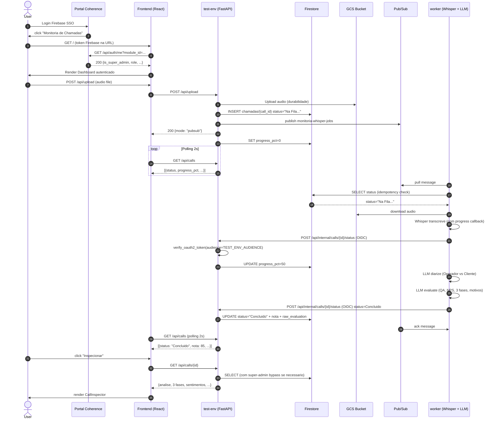

# Arquitetura do Modulo Monitoria de Chamadas

> Ultima atualizacao: 07/07/2026 (refactor total)

## Visao Geral

3 servicos GCP Cloud Run + Firestore + Pub/Sub:

| Servico | Cloud Run | Responsabilidade |
|---|---|---|
| `monitoria-test-env` | Publico via Portal | API FastAPI, upload, settings, endpoints admin |
| `monitoria-whisper-worker` | `--no-allow-unauthenticated` (OIDC) | Consumer Pub/Sub, transcricao, avaliacao LLM |
| `coherence-portal-test` | (projeto separado) | SSO, RBAC, audit logs |

## Fluxo E2E (Diagrama Mermaid)



## Componentes

### Frontend (React 19 + Vite)
```
frontend/src/
  App.jsx                 # Rotas + SSO + auth
  main.jsx                # entry point
  index.css               # estilos globais
  components/
    Dashboard.jsx         # lista de chamadas + upload
    CallInspector.jsx     # detalhe com 4 abas:
                           #   1. Relatorio (3 fases, QA, NPS)
                           #   2. Transcricao (diarizada)
                           #   3. Sentimentos (operador/cliente)
                           #   4. Audio (player)
    SettingsPanel.jsx     # QA settings do user
    QueueManager.jsx      # admin: gerenciar fila Pub/Sub
```

### Backend test-env (FastAPI + Firestore)
```
api.py                     # rotas principais
core/
  transcriber.py           # wrapper faster-whisper
  evaluator.py             # wrapper MiniMax M3 (diarize + evaluate)
  llm_provider.py          # cliente LLM centralizado
  db.py                    # wrapper Firestore (ChamadasDB + UserSettingsDB)
  portal_auth.py           # SSO via Portal
  portal_audit.py          # audit logs
  pubsub_admin.py          # helpers admin Pub/Sub
```

### Backend worker (Pub/Sub consumer)
```
worker.py                  # loop principal, callback, watchdog
core/ (mesmo do test-env)
```

## Persistencia - Firestore

### Collection: chamadas
```
documentId: <call_id uuid>
fields:
  filename (string)
  uploaded_at (string ISO)
  status (string) - ver "Status string canonicas"
  nota (number | null)
  transcricao (string | null) - JSON serializado
  transcricao_diarizada (string | null)
  sentimentos_cliente (string | null) - JSON serializado
  sentimentos_operador (string | null) - JSON serializado
  erros_fatais (string | null) - JSON serializado
  raw_evaluation (string | null) - JSON serializado (output do MiniMax M3)
  user_id (string) - Firebase sub
  diretrizes_qualidade (string | null)
  nota_sentimento_cliente (number | null)
  nota_qualidade_operador (number | null)
  gcs_uri (string | null)
  audio_duration_sec (number | null)
  progress_pct (number | null)
  created_at (timestamp)
  updated_at (timestamp)
```

### Collection: user_settings
```
documentId: <user_id>
fields:
  checklist_items (string JSON)
  estrategia_vendas (string)
  estrategia_retencao (string)
  updated_at (timestamp)
```

## Status string canonicas

| Status | Quem seta | Significado |
|---|---|---|
| `"Na Fila de Processamento..."` | api.py | INSERT inicial apos upload |
| `"Baixando audio do storage..."` | worker | Worker baixando do GCS |
| `"Transcrevendo Audio (Whisper)..."` | worker | Em transcricao (com progress_pct 0-100%) |
| `"Separando falas (Diarizacao MiniMax)..."` | worker | Diarizacao via LLM |
| `"Analisando Qualidade e Sentimento (MiniMax M3)..."` | worker | Avaliacao final via LLM |
| `"Concluido"` (com acento) | worker via callback | Forma canonica |
| `"Erro: ..."` | worker | Falha em qualquer etapa |

## Indice Firestore (provisionado em 06/07/2026)

| Collection | Fields | Order | Usado por |
|---|---|---|---|
| `chamadas` | `user_id`, `uploaded_at` | ASC, DESC | `GET /api/calls` |
| `chamadas` | `status`, `uploaded_at` | ASC, DESC | `list_by_status` (admin) |
| `chamadas` | `status`, `uploaded_at` | ASC, ASC | `list_stale` (recover/cleanup/stuck) |

## Locking policy

**Last-write-wins** (sem transactions Firestore):
- Worker: unico writer de `status` (via callback OIDC)
- test-env: unico writer de `nota`/`raw_evaluation` (callback final)
- Conflitos raros e benignos: UI polling de 2s absorve sobreposicoes

## Decisoes arquiteturais

### Plano A++ (06/07/2026): SQLite → Firestore
**Causa:** 4 bugs historicos do SQLite GCS FUSE:
1. `BufferedWriteHandler.OutOfOrderError` no journal file
2. Stale file handle (concurrent writers)
3. File clobbered (generation/metageneration mismatch)
4. Disk I/O error (FUSE cache invalidation)

**Fix:** Firestore gerenciado (zero I/O race conditions, queries indexadas).
Ver `docs/DIARIO_BORDO.md` 06/07/2026 23:30 BRT e `docs/GUARDRAILS.md` REGRA #11.

## Capability check

- Audio formats: MP3, WAV, MPEG
- Transcricao: faster-whisper base (PT-BR)
- Avaliacao: MiniMax M3
- Worker: monitoria-whisper-worker (Pub/Sub consumer)
- Persistencia: Firestore
- Callback OIDC: worker → test-env (audience alinhado)
- RBAC: super-admin bypass em `GET /api/calls/{id}`
- Status normalization: `STATUS_NORMALIZATION` no callback OIDC

## Ver tambem

- [HARNESS.md](HARNESS.md) - Objetivo principal + stack
- [GUARDRAILS.md](GUARDRAILS.md) - Regras inegociaveis
- [conexao_modulo.md](conexao_modulo.md) - Spec do contrato com Portal
- [DIARIO_BORDO.md](DIARIO_BORDO.md) - Historico de mudancas
