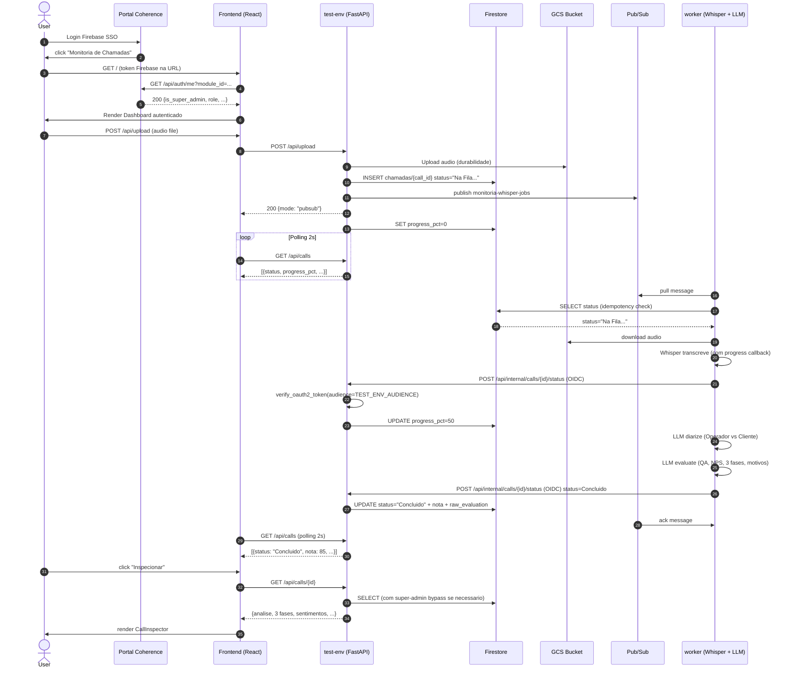

# Arquitetura do Modulo Monitoria de Chamadas

> Ultima atualizacao: 12/07/2026 (Deploy producao + LLM via GCP Secret Manager)

## Visao Geral

4 servicos Cloud Run + Firestore + Pub/Sub em 1 unico projeto GCP (`coherence-ominichannel-fs`):

| Servico | Tipo | Acesso | Responsabilidade |
|---|---|---|---|
| `monitoria-test-env` | API test | `https://monitoria-test-env-c5nbfc5meq-uc.a.run.app` | API FastAPI, upload, settings |
| `monitoria-whisper-worker` | Worker test | Privado (OIDC) | Consumer Pub/Sub test, transcricao, LLM |
| `monitoria` | API prod | `https://monitoria.coherenceai.com.br` (dominio customizado) | API FastAPI, upload, settings |
| `monitoria-worker` | Worker prod | Privado (OIDC) | Consumer Pub/Sub prod, transcricao, LLM |

| Topico | Subscription | Uso |
|---|---|---|
| `monitoria-whisper-jobs` | `monitoria-whisper-jobs-worker` (PULL, ack=600s) | Test: API test publica, worker test consome |
| `monitoria-whisper-jobs-prod` | `monitoria-whisper-jobs-worker-prod` (PULL, ack=600s) | Prod: API prod publica, worker prod consome |

## Triggers e Infraestrutura de Deploy
Os deploys automáticos em nuvem GCP são realizados pelo Cloud Build e isolados de duas formas:
1. **Regras de Ignorar Arquivos (`ignoredFiles`)**: Para evitar custos de infraestrutura e builds redundantes, modificações exclusivas em arquivos YAML de build (`cloudbuild*.yaml`), pastas de documentação (`docs/**`, `*.md`) ou scripts locais (`scripts/**`) são ignoradas pelos triggers de build do GCP.
2. **Integração de Módulos (Firestore Compartilhado)**: A arquitetura atual compartilha a base de dados Firestore entre os ambientes de teste e de produção. Para que o deploy de teste não sobrescreva a URL canoníca do Portal de Produção, o modulo de teste registra-se com o ID `monitoria-chamadas-test`. A promoção de código do branch `test` para `main` (produção) restaura o registro no ID canônico de produção `monitoria-chamadas`.

## Fluxo E2E (Diagrama Mermaid)



## Componentes

### Frontend (React 19 + Vite)
```
  frontend/src/
    App.jsx                 # Rotas + SSO + auth
    main.jsx                # entry point
    index.css               # estilos globais
    components/
      Dashboard.jsx         # lista de chamadas + upload + filtros + checkbox
      BatchDashboard.jsx    # visao agregada de grupo selecionado
      CallInspector.jsx     # detalhe com 4 abas:
                             #   1. Relatorio (3 fases, QA, NPS, sentimento por fase)
                             #   2. Transcricao (diarizada)
                             #   3. Sentimentos (operador/cliente)
                             #   4. Audio (player)
      SettingsPanel.jsx     # QA settings do user
      QueueManager.jsx      # admin: gerenciar fila Pub/Sub
```

### Backend test-env (FastAPI + Firestore)
```
api.py                     # rotas principais
core/
  transcriber.py           # wrapper faster-whisper (modelo base, int8)
  evaluator.py             # wrapper DeepSeek/NVIDIA/MiniMax (diarize + evaluate)
  llm_provider.py          # cliente LLM multi-provider (DeepSeek -> NVIDIA -> MiniMax)
  masker.py                # PII masking (LGPD)
  db.py                    # wrapper Firestore (ChamadasDB + UserSettingsDB)
  portal_auth.py           # SSO via Portal
  portal_audit.py          # audit logs
  pubsub_admin.py          # helpers admin Pub/Sub
```

### Worker Cloud Run (monitoria-whisper-worker)

| Recurso | Valor |
|---|---|
| CPU | 4 vCPU |
| RAM | 4 GiB |
| Modelo Whisper | base (74MB, int8, ~0.1x tempo real) |
| max-instances | 4 |
| min-instances | 1 (sempre ativo — Regra #16) |
| timeout | 3600s |
| concurrency | 2 |
| `--cpu-throttling` | ativo (Scale-to-Zero ao ficar ocioso - Regra #24) |
| `--cpu-boost` | ativo |
| Custo estimado | ~$0 idle / sob demanda |

## Persistencia - Firestore

### Collection: chamadas
```
documentId: <call_id uuid>
fields:
  filename (string)
  uploaded_at (string ISO)
  status (string) - ver "Status string canonicas"
  nota (number | null)
  transcricao (string | null) - JSON serializado
  transcricao_diarizada (string | null)
  sentimentos_cliente (string | null) - JSON serializado
  sentimentos_operador (string | null) - JSON serializado
  erros_fatais (string | null) - JSON serializado
   raw_evaluation (string | null) - JSON serializado (output do DeepSeek / NVIDIA / MiniMax)
  user_id (string) - Firebase sub
  diretrizes_qualidade (string | null)
  nota_sentimento_cliente (number | null)
  nota_qualidade_operador (number | null)
  gcs_uri (string | null)
  audio_duration_sec (number | null)
  progress_pct (number | null)
  created_at (timestamp)
  updated_at (timestamp)
```

### Collection: user_settings
```
documentId: <user_id>
fields:
  checklist_items (string JSON)
  estrategia_vendas (string)
  estrategia_retencao (string)
  updated_at (timestamp)
```

## Status string canonicas

| Status | Quem seta | Significado |
|---|---|---|
| `"Na Fila de Processamento..."` | api.py | INSERT inicial apos upload |
| `"Baixando audio do storage..."` | worker via OIDC | Worker baixando do GCS |
| `"Transcrevendo Audio (Whisper)..."` | worker via OIDC | Em transcricao (com progress_pct 0-100%) |
| `"Processando IA (DeepSeek)..."` | worker via OIDC | Diarizacao + avaliacao via DeepSeek |
| `"Concluido"` (com acento) | worker via OIDC callback | Forma canonica |
| `"Erro: ..."` | worker via OIDC | Falha em qualquer etapa |

## Indice Firestore (provisionado indices em 06/07/2026 e 10/07/2026)

| Collection | Fields | Order | Usado por |
|---|---|---|---|
| `chamadas` | `user_id`, `uploaded_at` | ASC, DESC | `GET /api/calls` |
| `chamadas` | `user_id`, `status`, `uploaded_at` | ASC, ASC, DESC | `GET /api/calls?status=...` (criado em 10/07/2026) |
| `chamadas` | `status`, `uploaded_at` | ASC, DESC | `list_by_status` (admin) |
| `chamadas` | `status`, `uploaded_at` | ASC, ASC | `list_stale` (recover/cleanup/stuck) |

## Locking policy

**Last-write-wins** (sem transactions Firestore):
- Worker: unico writer de `status` (via callback OIDC)
- test-env: unico writer de `nota`/`raw_evaluation` (callback final)
- Conflitos raros e benignos: UI polling de 2s absorve sobreposicoes

## Decisoes arquiteturais

### Plano A++ (06/07/2026): SQLite → Firestore
**Causa:** 4 bugs historicos do SQLite GCS FUSE:
1. `BufferedWriteHandler.OutOfOrderError` no journal file
2. Stale file handle (concurrent writers)
3. File clobbered (generation/metageneration mismatch)
4. Disk I/O error (FUSE cache invalidation)

**Fix:** Firestore gerenciado (zero I/O race conditions, queries indexadas).

### Plano Ultra-Economico (08/07/2026): large-v3 + Firestore direto → Revertido (10/07/2026)
**Causa:** Tentativa de reduzir custos substituindo OIDC callback por escrita direta no Firestore.
**Problema:** Timeout de processamento (840s) estourava com large-v3 (2.5x tempo real),
deixando o subscriber gRPC em estado inconsistente.
**Revertido em 10/07/2026:** Worker voltou a usar OIDC callback (como funcionava antes).
Modelo large-v3 substituido por base (74MB, ~0.1x tempo real).

### Subscriber auto-recovery (10/07/2026)
**Problema:** Stream gRPC do Pub/Sub encerra apos ~15 min de idle. Worker entrava em hot loop.
**Fix:** Main loop recria subscriber (com novo SubscriberClient) sempre que o future completa
(com ou sem excecao). Debounce de 10s.

## Capability check

- LLM secrets: GCP Secret Manager (`google-cloud-secret-manager` no requirements.txt). Cloud Run SA precisa de `roles/secretmanager.secretAccessor`.
- Audio formats: MP3, WAV, MPEG
- Transcricao: faster-whisper base (PT-BR, int8, ~0.1x tempo real)
- Avaliacao: DeepSeek V4 Flash (primario) → NVIDIA NIM (fallback) → MiniMax M3 (ultimo recurso)
- Worker: monitoria-whisper-worker (Pub/Sub consumer)
- Persistencia: Firestore (escrita exclusiva pelo test-env via OIDC callback)
- Callback OIDC: worker → test-env (audience alinhado)
- RBAC: super-admin bypass em `GET /api/calls/{id}`
- Status normalization: `STATUS_NORMALIZATION` no callback OIDC
- BatchDashboard: selecao multipla + visao agregada por grupo
- Sentimento por fase: LLM prompt inclui sentimento_cliente e sentimento_operador por fase

## Ver tambem

- [HARNESS.md](HARNESS.md) - Objetivo principal + stack
- [GUARDRAILS.md](GUARDRAILS.md) - Regras inegociaveis
- [conexao_modulo.md](conexao_modulo.md) - Spec do contrato com Portal
- [DIARIO_BORDO.md](DIARIO_BORDO.md) - Historico de mudancas
