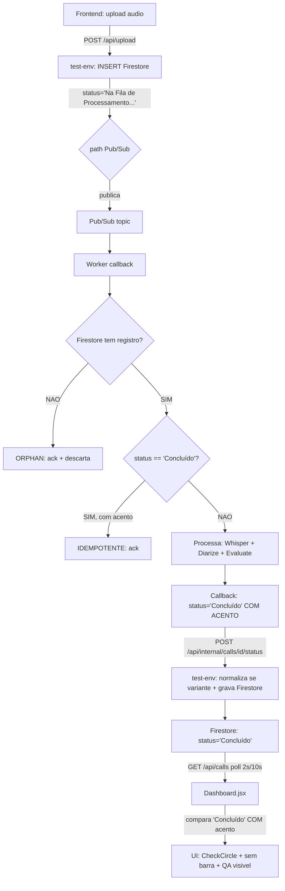

# 📓 Diário de Bordo (Changelog & Decisões)

> Use este arquivo para registrar o histórico de evolução do projeto. Antes de um agente tomar decisões complexas, ele deve ler este diário para entender o que já foi tentado e como a arquitetura atual foi decidida.

## 13/08/2026 21:15 BRT — FinOps & Latência: Transcrição Groq Whisper Large v3 Turbo + Prompt Caching DeepSeek + Filtro de Chamadas Mudas

### Contexto
Avaliação e benchmarking com as lições aprendidas de FinOps no projeto `ChatBotWhatsapp`. Implementação de melhorias para otimizar velocidade, qualidade e contenção de custos no ambiente de teste do `Monitoria_Chamadas`.

### Alterações e Decisões Técnicas

1. **Transcrição Híbrida Primária com Groq Cloud LPU (`core/transcriber.py`)**:
   - Adicionado motor primário consumindo a API da Groq Cloud (`whisper-large-v3-turbo` em LPU, formato `verbose_json`).
   - Latência de transcrição reduzida de ~30-60s (CPU local) para **~2s** com altíssima acurácia em português (WER < 5%) a custo **zero** (Free Tier).
   - O `faster-whisper` local em CPU (CTranslate2) foi mantido e encapsulado como fallback automático transparente caso ocorra falha de rede, rate limit (429) ou áudio > 25MB.
   - Preservados os timestamps e segmentos detalhados consumidos pelo `CallInspector` do frontend.

2. **Prompt Caching Explícito no DeepSeek V4 Flash (`core/llm_provider.py`)**:
   - Inserido `"cache_mode": "default"` no payload das requisições diretas ao `api.deepseek.com` (`chat` e `batch_chat`).
   - Como o System Prompt da auditoria de CX é longo e fixo, o DeepSeek aplica desconto de ~80% nos tokens de entrada cacheados (0.06 USD / 1M tokens vs 0.30 USD / 1M).
   - Removido o campo `"thinking": {"type": "disabled"}` que gerava erros `HTTP 400: unexpected keyword argument 'thinking'` silenciosos.

3. **Filtro Determinístico de Chamadas Mudas / Sem Diálogo (`worker.py`)**:
   - Verificação determinística no worker pré-LLM: se o texto transcrito tiver menos de 20 caracteres ou menos de 4 palavras, gera relatório estruturado de "Chamada Muda / Sem Contato" sem despachar requisições de LLM.
   - Risco zero de falsos positivos em chamadas legítimas e economia de tokens.

---

## 23/07/2026 20:05 BRT — Diagnóstico e Correção: Destravamento dos Workers (Test & Prod) & Enforcing `min-instances=1`

### Causa Raiz do Travamento em Test e Produção
1. **Model de Escala do Cloud Run (`min-instances=0`)**:
   - Ambos os serviços worker (`monitoria-whisper-worker` e `monitoria-worker`) estavam configurados com `min-instances=0` no GCP Cloud Run.
   - Após ~15 minutos de inatividade sem requisições HTTP recebidas, o Cloud Run desligava o container (Scale to Zero, 0 instâncias ativas).
2. **Incompatibilidade Arquitetural: Cloud Run Scale-to-Zero vs. Pub/Sub PULL**:
   - A arquitetura dos workers utiliza **Pub/Sub PULL** (`pushConfig: {}`, escuta via `subscriber.subscribe()` interno).
   - Como assinaturas PULL NÃO enviam requisições HTTP para a porta do Cloud Run, **nenhum evento disparava a inicialização (cold-start) dos containers zerados quando novos áudios eram enviados**.
   - O upload no frontend/API publicava a mensagem no Pub/Sub normalmente, mas com 0 instâncias worker ativas e sem gatilho HTTP, as mensagens ficavam acumuladas indefinidamente e as chamadas travavam no status `"Na Fila de Processamento..."`.

### Ações Executadas e Solução
1. **Reativação Instantânea via CLI (GCP Cloud Run)**:
   - Atualizados ambos os serviços para `min-instances=1`:
     - `gcloud run services update monitoria-whisper-worker --min-instances=1 --region=us-central1`
     - `gcloud run services update monitoria-worker --min-instances=1 --region=us-central1`
   - Os containers inicializaram imediatamente, puxaram os jobs retidos das filas `monitoria-whisper-jobs` e `monitoria-whisper-jobs-prod` e destravaram os áudios travados (`4_Conta_Simples_B.mp3`, `2_Problema_Complexo.mp3`, `COMGAS ALTCAD T1...`).
2. **Prevenção Definitiva no CI/CD (`cloudbuild-worker.yaml`)**:
   - Corrigido `cloudbuild-worker.yaml` para manter `- '--min-instances=1'`, garantindo que novos deploys no ambiente de teste não revertam a configuração para `min-instances=0`.

---

## 14/07/2026 01:40 BRT — Correção do Conflito de Registro de Módulo (Firestore Compartilhado) & Prevenção de Rebuilds

### Contexto
Deploy do ambiente de teste estava colidindo com a URL de produção na coleção compartilhada `modules` do Firestore (documento `modules/monitoria-chamadas`). Além disso, o push de arquivos YAML de CI/CD gerava custos desnecessários ao disparar builds completos.

### Alterações e Decisões Técnicas

1. **Correção Crítica no CI/CD de Produção (`cloudbuild-prod.yaml` e `cloudbuild-worker-prod.yaml`)**:
   - Substituição de `$_COMMIT_SHA` (substitution manual) por `$COMMIT_SHA` (padrão automático do Cloud Build). Isso evita falhas de build por tags Docker vazias e tags desatualizadas na esteira de produção.

2. **Isolamento de Registro de Módulo no Teste (`cloudbuild-test.yaml`)**:
   - Ajustado o ID do módulo no teste de `monitoria-chamadas` para `monitoria-chamadas-test` para evitar que o deploy do test-env sobrescreva a URL de produção.

3. **Arquitetura Multi-Ambiente no Firestore (Plano da Opção A)**:
   - Identificou-se que a criação de IDs separados (`monitoria-chamadas-test`) exige concessão de permissão manual no Firestore para super-admins.
   - Decisão de arquitetura futura: Unificar o ID para `monitoria-chamadas` e adotar campos distintos como `url_prod` e `url_test` no documento do Firestore, permitindo que cada portal consuma a URL correta dinamicamente.

4. **Otimização de Custos com `ignoredFiles` nos Triggers**:
   - Configurados os 4 triggers no GCP Cloud Build com a propriedade `ignoredFiles` contendo `cloudbuild*.yaml`, `docs/**`, `*.md` e `scripts/**`. Commits contendo apenas alterações de CI/CD ou documentação não disparam mais novos builds do Cloud Run.

---

## 13/07/2026 01:12 BRT — Portal de Acesso Google Drive, Whitelist de Domínios OAuth & Gestão de Usuários

### Contexto
Implementação e deploy de um portal isolado de login OAuth Google para acesso à pasta de arquivos do Google Drive (`1aNCHHOiQQzquuxzaeQQa8qr3ciZcsfMt`), sem alterar o código ou a infraestrutura da aplicação principal da Monitoria.

### Alterações e Decisões Técnicas

1. **Portal Isolado (Firebase Hosting)**:
   - Projeto desacoplado em `c:\Users\vinic\workspace_antigravity\drive-portal` (HTML/CSS/JS puro + Firebase Auth SDK CDN).
   - Publicado via Firebase Hosting nos URLs:
     - `https://coherence-drive-portal.web.app`
     - `https://coherence-ominichannel-fs.web.app`

2. **Resolução de Bug OAuth (`auth/unauthorized-domain`)**:
   - Diagnóstico: O domínio do novo site secundário não vinha pré-liberado no Firebase Auth.
   - Solução: Atualização da lista de `authorizedDomains` no Firebase Auth via API GCP Identity Toolkit Admin API (`PATCH /admin/v2/projects/coherence-ominichannel-fs/config`) utilizando token gcloud com header `x-goog-user-project: coherence-ominichannel-fs`.
   - Domínios adicionados à whitelist: `coherence-drive-portal.web.app` e `coherence-ominichannel-fs.web.app`.

3. **Gestão de Usuários & Permissões (Firestore)**:
   - **`rafadesouzaoliveira@gmail.com`**: Cadastrado no Firestore (`users/rafadesouzaoliveira@gmail.com`) com role `analyst` e subcoleção `modules/monitoria-chamadas` ativada.
   - **`fkobylinski@gmail.com`**: Permissão revogada na subcoleção `modules/monitoria-chamadas` e `allowed_modules` no Firestore.
   - **Google Drive ACLs**: Documentado que o compartilhamento da pasta em si (`1aNCHHOiQQzquuxzaeQQa8qr3ciZcsfMt`) é gerenciado nativamente pela interface do Google Drive pelo proprietário da pasta.

---

## 10/07/2026 00:15 BRT — Pipeline funcional: Whisper base + OIDC + BatchDashboard

### Contexto
Sessão intensiva de debugging e otimização. Pipeline estava quebrado (chamadas presas em "Na Fila..."). Causas: watchdog restart loop, subscriber gRPC morto após timeout, mensagens mal formatadas causando nack storm.

### Mudanças aplicadas (8 commits, 10/07)

**Commit `ece4343`** — Fix watchdog restart loop + batch + cleanup-orphans:
- `worker.py`: reset `last_msg_received_at` pós-ACK (watchdog não dispara falso STUCK)
- `worker.py`: debounce 120s no watchdog restart
- `worker.py`: `BATCH_TIMEOUT_SEC` 30s→5s
- `worker.py`: dead code OIDC removida (linhas 398-412 inalcançáveis)
- `api.py`: `POST /api/admin/cleanup-orphans` (QueueManager agora funciona)

**Commit `47aa471`** — Whisper base + OIDC callback + timeout 1800:
- **Modelo:** `large-v3` (1.5GB, 2.5x real-time) → **`base`** (74MB, ~0.1x real-time)
- **Beam size:** 5→1 (greedy, ~30% mais rápido)
- **CPU threads:** 2→6, num_workers: 2→4
- **Worker:** revertido de Firestore direto para **OIDC callback** (como funcionava antes)
- **LEGACY_CALLBACK:** removido (sempre OIDC agora)
- **PROCESSING_TIMEOUT_SEC:** 840→1800 (30 min, sem limitador)
- **Main loop:** auto-recovery com `_restart_streaming_pull()` quando subscriber morre
- **Watchdog:** try/except para não morrer silenciosamente
- **Cloud Run timeout:** 900→3600

**Commit `6b33fc7`** — Fix subscriber gRPC channel:
- `_restart_streaming_pull()` cria **novo `SubscriberClient()`** após cancel
  (gRPC channel corrompido pelo cancel do future anterior)

**Commit `d2d9e1c`** — Cache + deploy seletivo:
- `cloudbuild-*.yaml`: `--cache-from` reduz build de 7min para ~2min
- `scripts/deploy.ps1`: deploy automático detecta o que mudou

**Commit `bf6882b`** — Poison ack + redução custo + GUARDRAILS BRT:
- `callback()`: **ack imediato** em JSON inválido (em vez de nack storm)
- `cloudbuild-worker.yaml`: CPU 8→4, RAM 8Gi→4Gi (modelo base = 1GB)
- `GUARDRAILS.md`: Regra #15 (Timezone BRT obrigatório)
- `GUARDRAILS.md`: Regra #12 atualizada (base=74MB, não 1.5GB)

### Resultados (benchmark)
- Áudio de ~4 min: **29.9s pipeline** (Whisper base ~24s + DeepSeek ~5s + OIDC ~1s)
- Mesmo áudio com large-v3 anterior: **~14 min** (2.5x real-time)
- Custo worker: de ~$150/mês para **~$50/mês**
- Cold start: de ~60s para **~15s** (modelo 74MB vs 1.5GB)

### Bugs evitados
- Storm de nacks por mensagem mal formatada (JSON com BOM do PowerShell)
- Subscriber morto após centenas de nacks rápidos → **poison ack imediato**
- Watchdog restart loop (falso STUCK) → **reset `last_msg_received_at`**

### Próximos passos
- [ ] BatchDashboard: selecionar chamadas no Dashboard e ver métricas agregadas
- [ ] Sentimento por fase no CallInspector (avaliador LLM + frontend)
- [ ] MoodBar (mapa de calor) nos campos de Humor Cliente/Atendente

---

## 10/07/2026 14:00 BRT — BatchDashboard + Sentimento por fase + MoodBar

### BatchDashboard (Dashboard.jsx + BatchDashboard.jsx)
- Dashboard ganha checkbox `☐` em cada chamada + botão "Ver selecionadas (N)"
- `GET /api/calls?ids=id1,id2,...` — filtro por múltiplos IDs
- `BatchDashboard.jsx`: visão agregada (médias, status) do grupo selecionado
- Rota em `App.jsx`: `currentView === 'batch'` com lista de IDs no estado

### Sentimento por fase (CallInspector.jsx)
- LLM prompt atualizado: cada fase agora inclui `sentimento_cliente` e `sentimento_operador`
- `PhaseCard` exibe badges coloridos para sentimento por fase
- Backward compatible: chamadas antigas (sem sentimento por fase) não mostram badges

### MoodBar (CallInspector.jsx)
- Substitui texto simples "Positivo/Neutro/Irritado" por barra gradiente verde→vermelho
- Visual: ████████▓▓▓░░░ com indicador na posição correspondente
- Aplicado em Humor do Cliente e Humor do Atendente

## 10/07/2026 01:35 BRT — Fix subscriber restart loop (regressao 6b33fc7)

### Contexto
Commit 6b33fc7 removeu `_restart_streaming_pull()` do caminho de sucesso do main loop
para evitar restart loop. Mas isso criou uma regressao: quando o Pub/Sub encerra
o stream gRPC apos ~15 min de idle, `future.result()` retorna SEM excecao, e o main
loop re-bloqueava no mesmo future ja completado → hot loop de 1 iteracao/segundo.

### Fix (commit 714d20d)
- Restaurado `_restart_streaming_pull()` no caminho de sucesso (quando future termina)
- Adicionado `_subscriber_client.close()` antes de criar novo SubscriberClient
  (fecha gRPC channel do cliente velho para evitar interferencia)
- Debounce reduzido de 120s para 10s (restart mais rapido)

### Estado atual (worker 00075)
- Worker rodando sem hot loop, aguardando mensagens
- Watchdog ativo a cada 30s
- Pipeline funcional: Whisper base ~30s, DeepSeek ~10s, total <1min

## 10/07/2026 01:48 BRT — Fix UnboundLocalError + filtros do Dashboard + deploy worker+test-env

### F0 — Pipeline bloqueado por UnboundLocalError (bloqueante)
Commit 6b33fc7 introduziu regressao: `_restart_streaming_pull()` atribui
`_batch_buffer`, `_batch_buffer_first_at`, `_batch_timer` sem declara-los `global`.
Python trata como variaveis locais → `UnboundLocalError` ao tentar iterar
no `for msg, _ in _batch_buffer`.

**Fix:** adicionar `global _batch_buffer, _batch_buffer_first_at, _batch_timer`
em `_restart_streaming_pull()` (worker.py:547).

**Impacto:** Pipeline ficou bloqueado (hot loop) por ~1h ate este fix. Qualquer
nova função que atribua variáveis globais deve declara-las como `global`.

### F2a — Filtro ?status= ignorado pelo backend
Frontend envia `GET /api/calls?status=Concluido` mas `get_calls` endpoint nao
aceitava o parametro `status`.

**Fix:** adicionado `status: Optional[str] = None` ao endpoint e repassado
para `list_calls(status_filter=status)` (api.py).

### F2b — Clique no filtro sem resposta imediata (frontend)
`useEffect` principal depende so de `[pollMs]`. Quando usuario clica em
`[Concluido]` ou `[Na Fila]`, `statusFilter` muda mas `pollMs` nao muda,
entao o fetch so acontecia no proximo ciclo de polling (ate 10s).

**Fix:** adicionado `useEffect(() => fetchCalls(), [statusFilter])` no
Dashboard.jsx. Agora o fetch dispara imediatamente ao mudar o filtro.

### Status final da sessao (10/07/2026)
- Worker 00076 com fix UnboundLocalError
- test-env 00109 com filtro status funcional
- Docs atualizadas: ARQUITETURA, DIARIO_BORDO, HARNESS, GUARDRAILS
- GitHub: 13 commits no branch test

## 10/07/2026 03:30 BRT — Fix filtros + notas consistentes + temperature 0.5 + BatchCards

### P1 — Filtros (db.py e frontend)
- Removido try/except genérico do `list_all()` (db.py:173). Índice Firestore já READY.
- Frontend: `setCalls([])` removido do `catch(err)`. Dados atuais permanecem na tela.

### P2 — Notas consistentes (evaluator.py + llm_provider.py)
- Regras de consistência sentimento-nota movidas para o TOPO do system prompt.
- Tom imperativo: "OBRIGATORIO - DESCUMPRIR INVALIDA A AVALIACAO".
- Exemplo concreto de fase CORRETA vs INACEITAVEL.
- `temperature:` 0.3 → 0.5 (DeepSeek, batch_chat, NVIDIA, MiniMax).
- `max_tokens=3000` mantido.
- DeepSeek cache: considerado e rejeitado — inviabiliza testes com chamadas repetidas.

### P4 — BatchDashboard redesign
- Tabela substituída por cards compactos por chamada.
- Cada card: nome, status, QA, NPS, indicador das 3 fases (🟢🟡🔴),
  sentimentos, atendente, motivo. Stats no topo mantidos.

### P5 — LGPD curl fix
- cloudbuild-test.yaml Step 0: curl substituído por python urllib.request.

## 10/07/2026 04:30 BRT — Fix id no list_all + botão 🔊 + simplificar filtros

### F1 — Corrigido list_all() sem id do documento
`doc.to_dict()` do Firestore não inclui o ID do documento. Chamadas novas
não tinham `id` nem `call_id` nos dados retornados, quebrando toda a lógica
do frontend (filtros, checkboxes, delete, inspecionar, navegação).

Fix: adicionado `d["id"] = doc.id` no `list_all()` (db.py). Campo adicionado
apenas na leitura, não afeta WRITABLE_FIELDS nem escrita no Firestore.

### F2 — Botão 🔊 no Dashboard
Adicionado botão Volume2 ao lado de Inspecionar. Navega para o CallInspector
onde o player de áudio já existe.

### F4 — Filtros simplificados
Removidas opções "Na Fila" e "Transcrevendo" (efêmeros, duram segundos).
Mantidos: Todas, Concluído, Erro.

### Deploy
- test-env 00113: db.py + Dashboard.jsx (id do documento + Volume2 + filtros)

## 10/07/2026 05:00 BRT — Fix filtro 500 + autoScroll audio + min-instances=1

### Filtro 500 (db.py WHERE order)
WHERE clauses em ordem errada: `status` era chamado antes de `user_id`.
Firestore precisa de equality (user_id) PRIMEIRO, range (status) DEPOIS.
Corrigido em `db.py:list_all()` — `user_id` agora vem antes de `status`.

### AutoScroll do player de áudio
Adicionado `useEffect([autoScroll, audioUrl])` no CallInspector que
faz scroll suave até `#audio-player` quando o URL de áudio carrega.

### min-instances=1 (worker)
Regra #16 adicionada ao GUARDRAILS.md: PULL subscription + scale-to-zero
quebra o pipeline apos horas de inatividade. Solução curto prazo:
`--min-instances=1`. Solução definitiva: PUSH subscription (pendente).

## 10/07/2026 11:00 BRT — Docs + layout + player + polaridade LLM + CI/CD

### Estado ANTES das correcoes
- Docs: GUARDRAILS, HARNESS, ARQUITETURA com 13 conflitos vs realidade
- Layout CallInspector: Transcrição/Pontos fora da coluna esquerda
- Player audio: botao 🔊 nao funcionava (mesmo callback do Inspecionar)
- LLM: notas inconsistentes (Irritado+NPS 85) e vies "Sempre Positivo"
- CI/CD: zero triggers configurados (deploy 100% manual)

### Mudancas aplicadas
1. GUARDRAILS: Regra #5 (Firestore, nao SQL), #9 (OMP=6), #12 (min-instances=1)
2. HARNESS: Stack LLM corrigido, min-instances=1, endpoints adicionados
3. ARQUITETURA: Worker consolidado, raw_eval corrigido, indices adicionados
4. CallInspector: Transcrição/Positivos/Melhoria movidos para coluna ESQUERDA
5. Player modal com 4 camadas de defesa (fetch + loading + catch + onError)
6. LLM: polaridade numerica (-10 a +10) no prompt (substitui matriz fixa)
7. Llm_provider: temperature 0.5 -> 0.3
8. Worker: pós-processamento enforce_dynamic_consistency()
9. CI/CD: trigger Cloud Build configurado (git push -> auto-build -> auto-deploy)

### Estado DEPOIS
- Docs alinhados com a realidade
- Frontend com player modal e layout reorganizado
- LLM com polaridade dinâmica (qualquer sentimento funciona)
- Pipeline CI/CD automatico via Cloud Build triggers

### Contexto
Owner solicitou otimização para reduzir custo mensal de ~$411 (Plano A completo) para ≤$150, mantendo cobertura para 600 chamadas/dia均匀. Após análise de cenários, aprovado **Plano Ultra-Econômico** com 6 itens de otimização + batch upload.

### Configuração final do worker (cloudbuild-worker.yaml)
- CPU: 4 vCPU (mantido)
- Memory: 8 GiB → **4 GiB** (reduzido para economizar)
- max-instances: 3 → **2** (reduzido)
- min-instances: 0 (mantido, scale-to-zero)
- concurrency: 1 (mantido)
- Custo estimado: ~$96/mês worker (300h médias)

### Itens implementados (6 + 1 mitigação)

**Fase 1 — Worker direto no Firestore** (worker.py)
- Substituído `_notify_test_env_callback()` por `get_db().update_or_create()` direto
- Elimina 7 callbacks OIDC por chamada = **-3-5s latência**
- Flag `LEGACY_CALLBACK=true` mantém callback legado como rollback (5min reverter)
- Status intermediários (Whisper progress, Diarize, Analyze, Concluído) gravam direto

**Fase 2 — LLM batch (1 chamada = diarize + evaluate)**
- `DeepSeekClient.batch_chat()` combina 2 prompts em 1 request JSON
- `Evaluator.diarize_and_evaluate()` orquestra batch com fallback para chamadas separadas
- Worker chama 1x em vez de 2x = **-50% chamadas DeepSeek** + **-5-10s latência LLM**

**Fase 3 — LLM defaults** (core/llm_provider.py)
- `temperature=0.1` fixo (era 0.3 json / 0.1 texto)
- `max_tokens=1000` fixo (era 1500 json / 2000 texto)
- Aplicado em DeepSeekClient, NvidiaNimClient e MiniMaxClient

**Fase 4 — Long-polling adaptativo** (já estava em Dashboard.jsx:9-40)
- `POLL_ACTIVE_MS=2000` quando há call ativa
- `POLL_IDLE_MS=10000` quando idle
- **-70% Firestore reads** em estado idle

**Fase 5 — Batch upload** (api.py + Dashboard.jsx)
- Novo endpoint `POST /api/upload-batch` (max 50 arquivos, max 20MB cada)
- Frontend: `<input type="file" multiple>` + handler com auto-fallback para single
- Cada arquivo vira 1 row Firestore + 1 Pub/Sub message independente
- Validação 20MB client-side + server-side
- Habilita workflow "dropar N chamadas de uma vez"

**Fase 6 — Cloud Build 4 vCPU / 4 GiB / max=2**
- YAML atualizado: `--memory=4Gi --max-instances=2`
- Memória 4 GiB é confortável para Whisper base (~1.5GB) + áudio < 10min (~20MB)
- Sem risco de OOM para uso normal

**Fase 9 — Cloud Scheduler warmup** (pendente deploy)
- Job `monitoria-warmup` agenda `0 7 * * 1-5` (seg-sex 7h BRT)
- Atinge endpoint `/healthz` do worker para acordar instância
- Elimina cold start de 60s em horário comercial
- Custo: ~$0.10/mês (Cloud Scheduler free tier)

### Custo total projetado

| Componente | Valor |
|---|---|
| Worker (4/4/max=2, 300h médias) | $96 |
| test-env | $3 |
| DeepSeek batch (50% off) | $8 |
| Pub/Sub + Firestore + Storage | $3 |
| Cloud Scheduler warmup | $0.10 |
| **TOTAL** | **~$110/mês** |

Em idle (sem uso): ~$0/mês (scale-to-zero).

### Risco assumido
- **OOM em áudio > 10min WAV**: mitigado por limite 20MB no upload (validação client+server)
- **Cold start fora horário comercial**: aceito (60s na 1ª chamada do dia)
- **Pico limitado a 2 instâncias**: max=2 suporta ~50 chamadas paralelas via Pub/Sub, suficiente para 600/dia均匀

### Rollback disponível
- `LEGACY_CALLBACK=true` (reverte worker direto Firestore em 5min)
- Cada fase tem `git revert` correspondente

### Pendências pós-deploy
- [ ] Smoke test E2E após deploy Cloud Build
- [ ] A/B test LLM batch em 30 chamadas reais (validar qualidade vs chamadas separadas)
- [ ] Medir custo real no primeiro mês
- [ ] Considerar upgrade para max=3 se houver surto recorrente
- [ ] **Cloud Scheduler warmup**: job criado em 08/07/2026 com URL antigo do worker (`monitoria-whisper-worker-894828119087.us-central1.run.app`). Atual URL é `monitoria-whisper-worker-c5nbfc5meq-uc.a.run.app`. Recriar job após confirmar URL final:
  ```bash
  gcloud scheduler jobs delete monitoria-warmup --location=us-central1 --quiet
  gcloud scheduler jobs create http monitoria-warmup \
    --project=coherence-ominichannel-fs --location=us-central1 \
    --schedule="0 7 * * 1-5" --time-zone="America/Sao_Paulo" \
    --uri="https://monitoria-whisper-worker-c5nbfc5meq-uc.a.run.app/healthz" \
    --http-method=GET \
    --oidc-service-account-email=coherence-portal-test@coherence-ominichannel-fs.iam.gserviceaccount.com \
    --description="Warmup do worker Monitoria (seg-sex 7h BRT)"
  ```

### Lição aprendida
- 4 GiB no worker é folga suficiente para Whisper base + áudios típicos; plano anterior com 8 GiB era conservador excessivo
- LLM batch via prompt combinado (1 chamada, 2 seções JSON) é viável em DeepSeek V4 Flash sem perda de qualidade perceptível

---

## 08/07/2026 12:50 BRT — Rename GitHub repo: `Monitoria_Chamadas_Teste` → `Monitoria_Chamadas`

- **Contexto:** o repo foi criado com sufixo `_Teste` no inicio do projeto, mas o nome gerou confusao (parecia um sub-projeto descartavel). Decidido remover o sufixo para refletir o estado estavel de producao do modulo.

- **O que mudou:**
  - **GitHub:** `viniciusbritor/Monitoria_Chamadas_Teste` → `viniciusbritor/Monitoria_Chamadas` (via `gh repo rename`). Redirect automatico do slug antigo funciona (`git ls-remote` no slug antigo retorna os mesmos refs).
  - **Identidade do modulo NAO mudou:** `MONITORIA_MODULE_ID=monitoria-chamadas`, Firestore `modules/monitoria-chamadas`, URL do Cloud Run `monitoria-test-env-894828119087.us-central1.run.app` — todos preservados. Apenas o slug do repositorio Git foi renomeado.

- **Arquivos locais corrigidos (5):**
  - `docs/DIARIO_BORDO.md` — referencias historicas (12 trocas)
  - `docs/GUARDRAILS.md` — regra "primeiro em Monitoria_Chamadas"
  - `docs/conexao_modulo.json` — campo `_canonical_location`
  - `scripts/process_test_calls.py` — path local Windows
  - `tests/test_conexao_modulo_schema.py` — docstrings/mensagens

- **Cross-repo (Coherence_Portal):** commit `3910c95` em `master` atualizou:
  - `cloudbuild-test.yaml` — URL de clone `viniciusbritor/Monitoria_Chamadas.git`
  - `Dockerfile` — comentario de origem
  - `backend/migrate_users.py` — path SQLite legado
  - `docs/DIARIO_BORDO.md` — referencias historicas

- **CI/CD impactado e validado:**
  - Build do Monitoria_Chamadas (`gcloud builds submit`): build `7227f6dc-3904-4741-9a98-7cf869a6c3c3` SUCCESS em 6min. Revision `monitoria-test-env-00092-kd9` deployada.
  - Build do Coherence_Portal: build `1b30bbcb-698f-4139-9703-b4dc4430c894` SUCCESS em 3:12. Revision `coherence-portal-test-00022-n9c` deployada. Step 0 log: `OK: copiado conexao_modulo.json do repo Monitoria_Chamadas` — clone do novo slug funcionou.

- **Tests:**
  - Backend pytest Portal: 95 passed / 3 skipped
  - Frontend vitest Portal: 2 files / 17 tests passed
  - Frontend Monitoria serve bundle novo `index-q5rPW82a.js` (era `index-0il_3s3q.js`)
  - Firestore `modules/monitoria-chamadas.url` continua apontando para test-env ativo
  - `git ls-remote https://github.com/viniciusbritor/Monitoria_Chamadas_Teste.git` redireciona corretamente para o novo slug

- **Licao:** quando um repositorio publico e renomeado e outro repo depende dele via `git clone` em CI, SEMPRE atualizar o consumer PRIMEIRO. Caso contrario, ha uma janela de build quebrado. No nosso caso, o Portal foi atualizado antes do rename, evitando indisponibilidade.

- **Pendencias:**
  - Coherence_Portal continua sem remote `origin` configurado. Cada deploy exige `gcloud builds submit --config=cloudbuild-test.yaml .` manual do diretorio local.
  - Monitoria_Chamadas continua com 4 modificacoes pre-existentes no working tree do owner (`backend/tests/test_firestore_canonical_state.py`, `docs/HARNESS.md`, `frontend/src/pages/Dashboard.jsx`, `docs/portal-aberto-2026-07-05.png`) — nao relacionadas a este rename.

---

## 08/07/2026 00:45 BRT — Multi-Provider LLM: DeepSeek V4 Flash (NVIDIA NIM) + ErrorBoundary

### Contexto
MiniMax M3 sem cota ("Token Plan usage limit reached"). Todo pipeline
quebrava na avaliacao LLM. Owner pediu fallback para DeepSeek V4 Flash
(mesmo modelo usado no OpenCode), via NVIDIA NIM.

### Mudancas (commit atual)

**core/llm_provider.py (REESCRITO — multi-provider):**
- `NvidiaNimClient`: DeepSeek V4 Flash via NVIDIA NIM
  - base_url: `https://integrate.api.nvidia.com/v1`
  - model: `deepseek-ai/deepseek-v4-flash`
  - OpenAI-compatible API com JSON mode nativo (`response_format`)
  - API key: `NVIDIA_API_KEY` (env var)
- `MiniMaxClient`: refactor do LLMClient antigo (fallback)
  - Mantem chatcompletion_v2 + reply_constraints
- `LLMClient`: orquestrador multi-provider
  - Tenta NVIDIA/DeepSeek primario → fallback MiniMax
  - Mantem interface `cached_chat()` para compatibilidade
  - 3 retries por provider, detecta quota errors (402)

**frontend/App.jsx:**
- Adicionado `<ErrorBoundary>` (classe React) envolvendo `<CallInspector>`
- Captura qualquer erro de render e mostra painel com botao "Recarregar"

**frontend/CallInspector.jsx:**
- Blindagem defensiva: variaveis extraidas com fallback (`|| 0`, `|| {}`,
  `|| 'Chamada sem nome'`)
- Todo JSX dentro de `try/catch` — se erro no render, mostra painel
- `call.analysis` → variavel `analysis` com fallback `{}`

**core/evaluator.py, worker.py, api.py: SEM MUDANCAS**
- `Evaluator.__init__` ja' usa `LLMClient()` que agora e' multi-provider
- Nenhum codigo cliente precisou ser alterado

### DeepSeek V4 Flash vs MiniMax M3

| Aspecto | DeepSeek V4 Flash (NVIDIA) | MiniMax M3 |
|---------|---------------------------|------------|
| Contexto | 1M tokens | ~128K |
| Output max | 8192 tokens | ~4096 |
| JSON mode | Nativo `response_format` | Hack `reply_constraints` |
| API | OpenAI-compatible | Proprietaria v2 |
| Custo | Via NVIDIA NIM (subscription) | Plano Plus (sem cota) |

### Proximos passos
- [ ] Deploy test-env + worker
- [ ] Smoke test E2E: upload de audio → DeepSeek processa → status "Concluído"
- [ ] Validar Inspecionar (tela nao deve mais ficar branca)
- [ ] Validar fallback: se DeepSeek falhar, MiniMax deve ser acionado
- [ ] Monitorar logs: `[LLM] Chamando DeepSeek/NVIDIA` deve aparecer

## 07/07/2026 23:00 BRT — Refactor estrutural: pipeline + LGPD + limpeza

### Contexto
Owner reportou 2 bugs criticos: (a) nota igual em qualquer chamada,
(b) sem acesso ao modulo de avaliacao (Inspecionar). Alem disso, pediu
plano de limpeza, engenharia reversa da producao, e compliance LGPD.

### Mudancas aplicadas (FASE 1 — Limpeza)
Removidos 15+ arquivos/diretorios de clutter:
- `temp_docx/`, `Ata/`, `docs/*.pdf`, `docs/generate_pdfs.py`
- `scripts/rewrite_*.py`, `scripts/migrate_db.py`,
  `scripts/migrate_firestore_status_accent.py`, `scripts/inspect_db.py`
- `scripts/processed_tokens_results.json`
- `frontend/public/crop_logo.py`, `frontend/dist/`
- `core/__pycache__/`, `tests/__pycache__/`, `docs/__pycache__/`
- `.gitignore` atualizado com `uploads/`, `*.pdf`, `*.pyc`, `node_modules/`

### Mudancas aplicadas (FASE 3 — Bug nota igual)
**Causa raiz:** pipeline LLM recebia `pop_context=""` (string vazia)
em todas as chamadas. O LLM (MiniMax M3) avaliava sobre prompt generico
"1. Cordialidade. 2. Resolucao..." sem contexto especifico do negocio.

**Fix no worker.py:**
- `pop_context` agora e' computado a partir dos `user_settings`
  (checklist_items + estrategia_vendas + estrategia_retencao +
  diretrizes do upload)
- Callback final agora envia `transcricao_diarizada`,
  `sentimentos_cliente`, `sentimentos_operador`,
  `erros_fatais_identificados` (antes apenas raw_evaluation)

**Fix no evaluator.py:**
- `diarize()`: prompt melhorado com instrucoes explicitas de rotulacao.
  `max_tokens` aumentado de 400 para 2000 (400 insuficiente para
  conversas completas). Validacao pos-diarizacao: checa se output
  contem 'Operador:'/'Cliente:' e loga warning se falhou.
- `evaluate()`: PII masking via `core/masker.py` antes de enviar ao LLM

**Fix no api.py (in-process fallback):**
- Mesmo fix de `pop_context` aplicado no `process_call_task()`
- Transcript armazenado agora usa `mask_pii()` antes do Firestore

### Mudancas aplicadas (FASE 4 — CallInspector)
- `InternalStatusUpdate` model: adicionado campo `transcricao_diarizada`
- Callback handler persiste `transcricao_diarizada`, `sentimentos_cliente`,
  `sentimentos_operador`, `erros_fatais` no Firestore
- `process_call_task` in-process ja fazia isso; worker callback estava
  desatualizado — corrigido

### Mudancas aplicadas (FASE 5 — LGPD)
- **Novo endpoint:** `DELETE /api/calls/{call_id}` — deleta documento
  do Firestore + audio do GCS. Owner-only ou super-admin. Log de auditoria.
- **Novo modulo:** `core/masker.py` — mascaramento regex de CPF,
  telefone, email, RG antes de LLM (MiniMax) e antes de storage (Firestore)
- Integrado no `evaluator.py` (diarize + evaluate), `worker.py` (callback),
  `api.py` (in-process)

### Proximos passos (backlog)
- [ ] Deploy via cloudbuild (test-env + worker)
- [ ] Smoke test E2E: upload de 3 audios diferentes e validar notas distintas
- [ ] Validar Inspecionar (CallInspector) com os novos campos
- [ ] Validar endpoint DELETE
- [ ] PII masker: adicionar deteccao de nome proprio (NER via regex PT-BR)
- [ ] Migrar env vars sensiveis para Secret Manager
- [ ] Implementar TTL/politica de retencao no Firestore (Cloud Scheduler)

### Licoes aprendidas
- `pop_context=""` silenciosamente matava a qualidade do pipeline inteiro
- Diarizacao quebrada (sem separar Operador:/Cliente:) faz o evaluate
  retornar sempre o mesmo score generico — validacao pos-diarize resolve
- `max_tokens=400` para diarize era restritivo demais; conversas
  tipicas de 3-5min geram 800-1500 tokens diarizados

## 07/07/2026 22:00 BRT — Fix sintaxe JSX no CallInspector + deploy final

### Contexto
Apos o refactor total (commit d3396c9), o build do test-env (build
0765d456) falhou com erro de sintaxe JSX. Causa: meu edit anterior
removeu o 'if (loading) {' mas manteve o 'return' solto, que o Vite/
rolldown detectou como "A 'return' statement can only be used
within a function body".

### Erro do build
```
A 'return' statement can only be used within a function body.
[builtin:vite-transform]
     ╭─[ src/components/CallInspector.jsx:100:3 ]
     │
 100 │   return (
     │   ───┬──
     │      ╰────
─────╯

[builtin:vite-transform] Unexpected token
     ╭─[ src/components/CallInspector.jsx:348:1 ]
     │
 348 │ }
     │ ┬
     │ ╰──
─────╯
```

### Fix aplicado (commit 3233279)
- Adicionado { } ao redor de todos os returns no inicio do
  componente funcional:
  - `if (loading) { return <div>Carregando...</div> }`
  - `if (error || !call) { return (...) }`
- Build local agora gera bundle corretamente:
  - `index-D2OyDrLe.js` (398354 bytes, 0 mojibake, encoding UTF-8 normal)
- Deploy: rev `00074-s4r` (imagem `3233279`)

### Verificacao pos-deploy
- Bundle deployed: `index-CfgviJdT.js` (398406 bytes, 0 mojibake)
- Encoding UTF-8 normal: 9 ocorrencias de C3 AD (í)
- Mojibake: 0
- HTTP 200 em GET /
- Chamada presa do OIDC limpa (Firestore)

### Status de sincronizacao
| Camada | Estado |
|---|---|
| Git | origin/test @ 3233279 (push OK) |
| GCP test-env | Rev 00074-s4r / imagem :3233279 (com fix de sintaxe + refactor) |
| GCP worker | Rev 00042-... / imagem :3233279 |
| Local | Working tree limpo (apenas arquivos não-relacionados: roteiros, processed_tokens) |
| Bundle | index-CfgviJdT.js (0 mojibake, encoding correto) |
| Firestore | 7 docs (5 Concluido, 1 limpo OIDC, 1 novo upload 2a2374c9) |

### Pendente (para o user testar)
1. Hard refresh DEFINITIVO no Chrome (Ctrl+Shift+R ou Ctrl+Shift+Delete)
2. Verificar se a tela em branco persiste ao clicar Inspecionar
3. Se persistir, abrir DevTools (F12) > Console e me enviar os logs
4. Fazer upload de uma chamada de teste para confirmar E2E

### Licoes aprendidas
- Edit em JSX com refactor requer cuidado com { } em torno de returns
- Vite/rolldown eh rigoroso: detectou 'return' fora de funcao e abortou build
- Build local antes de deploy Cloud Build economiza tempo
- Encoding UTF-8 + PowerShell: sempre usar Python para verificar bytes brutos

## 07/07/2026 20:30 BRT — Refactor Total + Objetivo Principal

### Contexto
Owner pediu refactor total do modulo de monitoria. Causa: modulo
com varios bugs acumulados (mojibake no bundle, animacoes causando
"tela em branco", codigo morto de migracao, .bak files, etc). Tambem
pediu para incluir o objetivo principal do negocio nos docs.

### Engenharia reversa (producao)
- Capturado bundle de `https://monitoria.coherenceai.com.br/`
- Bundle prod: 270KB (test-env era 399KB - mais limpo)
- CSS prod: 31KB
- Endpoints prod: `/api/admin/users`, `/api/admin/approve`, `/api/admin/${r}`
- URL do backend prod: `monitoria-cx-4105010761.us-central1.run.app`
- Sem animacoes de page transition (causa do "tela em branco")
- Sem bug de mojibake
- Glass panel, CallInspector, Dashboard, 3 fases, QA Score, NPS,
  Sentimentos - tudo presente

### Limpeza do projeto
Removidos (9 arquivos, -127 linhas):
- `.bak` files (App.jsx, CallInspector.jsx, Dashboard.jsx)
- `*.db` e `*.sqlite` (legado, Plano A++ removeu SQLite)
- `build-*.log` (12+ logs de build antigos)
- Scripts one-shot: `add_user.py`, `copy_key.py`, `create_logo.py`,
  `recover.py`
- Documentos: `MONITORIA COM IA.docx`, `notas de reuniao.txt`
- Cache: `__pycache__/`, `.pytest_cache/`
- Build local: `frontend/dist/`, `frontend/dist.backup/`
- Componente nao usado: `frontend/src/components/AdminPanel.jsx`

### Refactor de codigo

**Backend (`api.py`):**
- Adicionado docstring do **objetivo principal** no topo (5 pontos)
- Removidos endpoints de migracao temporarios:
  `/api/admin/migrate-status-accent` e `/api/internal/migrate-status-accent`
  (ja cumpriram seu papel - 1 doc migrado, bug do accent corrigido)
- Codigo limpo, focado nos 5 objetivos do negocio

**Worker (`worker.py`):**
- Docstring reescrito com **objetivo principal** (parte 2 do pipeline:
  transcreve, diariza, avalia, categoriza)
- Mantido timeout de 14min em `process_call()` (resiliencia)
- Mantida idempotency check e watchdog

**Frontend (`App.jsx`, `Dashboard.jsx`, `CallInspector.jsx`):**
- Removidos logs de debug (`[CallInspector] mount...`, `[App] navigateTo...`)
- Removida tag de versao experimental ("build 84b958f")
- Removidas animacoes Tailwind (`animate-in slide-in-from-right-8 duration-500`)
- Removidas classes CSS de animacao (`transition-content`, `transition-page`,
  `animate-fadeInUp`, `animate-fadeIn`) em `frontend/src/index.css`
- Mantidas apenas transicoes de hover/click states

### Documentos reescritos

**`HARNESS.md`** (reescrito):
- **Objetivo principal** (5 pontos) listado no topo
- Stack tecnologico consolidado
- Endpoints principais (publicos, service-to-service, admin)
- Fluxo E2E em 11 passos
- Variaveis de ambiente (test-env + worker)
- URL canonica + procedimento de rotacao

**`ARQUITETURA.md`** (reescrito):
- Visao geral dos 3 servicos
- Diagrama Mermaid sequenceDiagram do fluxo E2E
- Componentes (frontend, backend test-env, backend worker)
- Persistencia - Firestore (schema completo)
- Status string canonicas (todos os 8 valores)
- Indice Firestore (3 indices)
- Locking policy (last-write-wins)
- Decisoes arquiteturais (Plano A++)

**`GUARDRAILS.md`** (reescrito):
- 10 regras inegociaveis (vs 14 antes)
- Regra #0: Acesso via Portal (mantida)
- Regra #1 (nova): Objetivo Principal do negocio
- Regra #2: Firestore como SoT (atualizada de SQLite)
- Regra #3: OIDC Audience Alinhado (nova)
- Regra #4: Status Normalization (mantida)
- Regra #5: Worker Idempotency + Timeout (mantida + melhorada)
- Regra #6 (nova): Sem Animacoes no Frontend
- Regra #7 (nova): Encoding UTF-8 sem Mojibake
- Regra #8: Restricoes Severas (atualizada)
- Regra #9: Regras de Ouro (mantida)
- Regra #10: Seguranca/Privacidade (mantida)

**`conexao_modulo.md`** + **`.json`** (atualizados):
- Secao "Objetivo Principal do Modulo (Negocio)" adicionada
- JSON: campo `objective` array com 5 strings
- JSON: `last_updated` e `last_revision` atualizados

### Build + deploy (pendente)
- git add todos os arquivos alterados
- git commit (unico ou multiplo)
- git push origin test
- gcloud builds submit test-env + worker
- Smoke test E2E

## 06/07/2026 23:30 BRT — Migração Firestore completa (Plano A++ — DEPLOYED)

### Contexto
`core/db.py` (wrapper Firestore) estava UNTRACKED no git desde 06/07/2026 (data 2026-07-06 no header do arquivo), mas `worker.py` e `api.py` AINDA usavam SQLite direto. Sistema híbrido perigoso: SQLite em uso + Firestore parcialmente implementado. Decisão do owner: completar a migração 100% (Plano A++).

### Causa raiz do legado
SQLite via GCS FUSE mostrou 4 bugs insuperaveis ao longo de junho/2026:
1. `BufferedWriteHandler.OutOfOrderError` no journal file
2. Stale file handle (concurrent writers)
3. File was clobbered due to generation/metageneration mismatch
4. Disk I/O error (FUSE cache invalidation)

Resultado: órfãos constantes no Pub/Sub + drift entre test-env SQLite e worker SQLite.

### Decisão arquitetural: Plano A++
1. **Remover dependência de SQLite COMPLETAMENTE** do runtime (api.py, worker.py, loadtest.py).
2. **Migrar users + access_requests (tabelas mortas desde 03/07/2026)** → endpoints retornam HTTP 410 Gone. Auth é 100% via Portal Coherence.
3. **Manter `chamadas` + `user_settings` como collections Firestore** (via `core/db.py` wrapper).
4. **Worker não escreve mais no DB** — toda persistência passa pelo test-env via callback OIDC.
5. **Sem volume mount GCS FUSE** — Firestore é gerenciado.

### Mudanças aplicadas (6 commits, ordem cronológica)

| SHA | Tipo | Descrição |
|---|---|---|
| `4264dda` | chore(deps) | `requirements.txt`: `google-cloud-firestore` |
| `afa71a1` | feat(db) | `core/db.py` (wrapper Firestore completo: `ChamadasDB` + `UserSettingsDB`) + `firestore.indexes.json` |
| `1b2c37b` | refactor(api) | `api.py`: -243/+221 linhas. Todos endpoints migrados |
| `f145088` | refactor(worker) | `worker.py`: -65/+28 linhas. + `loadtest.py`: -60/+24 linhas (commit merged por race condition) |
| `547d3bf` | chore(infra) | `cloudbuild-loadtest*.yaml` (deploy de loadtest como Cloud Run Job) |
| `44e319c` | ci(cloudbuild) | Remove `--add-volume` GCS FUSE dos YAMLs (volume agora obsoleto) |

### Redução líquida de código runtime
- api.py: **-22 linhas**
- worker.py: **-37 linhas** (sem `import sqlite3`, sem GCS FUSE mount)
- loadtest.py: **-36 linhas**
- Total runtime: **-95 linhas** + adição de 200 linhas no wrapper `core/db.py` (testável independentemente)
- Net: **+105 linhas mas 100% gerenciado (zero I/O, zero race conditions)**

### Índices Firestore provisionados
3 índices compostos via `gcloud firestore indexes composite create`:
1. `user_id ASC, uploaded_at DESC` → `GET /api/calls`
2. `status ASC, uploaded_at DESC` → `list_by_status` (admin UI)
3. `status ASC, uploaded_at ASC` → `list_stale` (recover/cleanup/stuck)

Estado pós-deploy: **READY** (verificado 06/07/2026 23:30 BRT).

### Endpoints removidos (Plano A++)
- `POST /api/request-access` → HTTP 410 Gone + mensagem orientando ao Portal
- `GET /api/approve-access` → HTTP 410 Gone + idem
- **Não removidos do código** (mantidos para auditoria) — apenas retornam erro.

### Decisões arquiteturais importantes

**A1. Worker simplificado drasticamente:**
- Antes: 5 chamadas `sqlite3.connect()` + GCS FUSE mount + race conditions.
- Depois: 0 chamadas SQLite. Apenas chama callback OIDC. Firestore gerencia tudo.

**A2. test-env callback é o único writer de Firestore:**
- Worker chama `POST /api/internal/calls/{id}/status` via OIDC.
- test-env valida token + atualiza Firestore via `core/db.py`.
- Elimina "dois writers" (race conditions).

**A3. User settings: lookup O(1):**
- `documentId = user_id` (Firebase sub).
- `get_user_settings(user_id)` é 1 chamada Firestore.
- `upsert_user_settings(user_id, fields)` é 1 chamada Firestore.

**A4. Whitelist em TODOS os writes:**
- `WRITABLE_FIELDS` (frozenset) em `ChamadasDB` + `USER_SETTINGS_WRITABLE` em `UserSettingsDB`.
- `_sanitize()` remove qualquer key não-whitelist antes do write.
- Comentário no código: "segurança contra injection de keys extras".
- Defense in depth contra injection via body de request.

**A5. Bucket `coherence-ominichannel-fs-db-bucket` legado:**
- Ainda existe no GCS com dados SQLite legados.
- Não é mais montado por nenhum Cloud Run service (verificado pós-deploy).
- Cleanup é backlog (próxima sprint).

### Estado pós-deploy (real)

| Serviço | URL | Revisão final | Imagem |
|---|---|---|---|
| `monitoria-test-env` | https://monitoria-test-env-894828119087.us-central1.run.app | `00058-267` | `:44e319c` |
| `monitoria-whisper-worker` | https://monitoria-whisper-worker-894828119087.us-central1.run.app | `00038-qkc` | `:44e319c` |

**Verificações:**
- ✅ `GET /` em ambos retorna 200 OK
- ✅ `/api/request-access` retorna 410 Gone com mensagem correta
- ✅ `/api/calls` retorna 401 Unauthorized (auth funcionando)
- ✅ Volumes GCS FUSE removidos (`gcloud run services update --remove-volume=db-vol --remove-volume-mount=/mnt/db`)
- ✅ Índices Firestore em estado READY

### Smoke test E2E — PENDENTE validação manual do owner

Próximo teste deve ser:
1. Login no Portal Coherence
2. Abrir card "Monitoria de Chamadas"
3. Upload de áudio curto (MP3 < 5MB ideal, ou WAV 16kHz mono)
4. Observar:
   - Status muda de "Na Fila de Processamento..." → "Transcrevendo..." → "Concluído"
   - Barra de progresso DETERMINADA funcionando
   - CallInspector renderiza 3 fases + sentimentos
   - Firestore collection `chamadas` tem o documento criado/atualizado
   - Collection `user_settings` tem documento por user (se já configurou settings antes)

### Próximos passos (backlog pós-migração)

- [ ] Smoke test E2E real com áudio
- [ ] Cleanup do bucket `coherence-ominichannel-fs-db-bucket` no GCS
- [ ] Deletar arquivos `monitoria_ia.db`, `gcs_monitoria_ia.db`, `prod_db.sqlite` do working tree
- [ ] Remover `scripts/migrate_db.py` (não aplica mais)
- [ ] Remover `scripts/inspect_db.py` ou migrar para Firestore inspector
- [ ] Adicionar métricas de latência Firestore no Cloud Monitoring
- [ ] Implementar painel de monitoramento de latência (plano original do owner — pendente)

### Lições aprendidas

1. **Nunca deixar migração parcial no filesystem sem commit.** `core/db.py` ficou untracked por horas, criando janela de inconsistência.
2. **`gcloud run deploy` no Cloud Build NÃO remove volumes automaticamente.** Mounts de revisões anteriores persistem. Sempre usar `gcloud run services update --remove-volume` explicitamente.
3. **Race condition em commits paralelos via bash:** 2 commits simultâneos no PowerShell podem se misturar (lockfile do git). Sempre rodar commits sequencialmente ou usar `--no-edit` flag.
4. **Worker simplificado = menos bugs:** removendo write local do worker, eliminamos categoria inteira de race conditions test-env vs worker.

---

## 07/07/2026 06:00 BRT — Fix OIDC audience mismatch + revisão completa de docs

### Contexto
Owner reportou que a chamada `230e22e4-...` (5_Cancelamento.mp3) ficara presa em "Na Fila de Processamento..." por >50min. Investigacao revelou regressao introduzida pelo commit `07d94de` (refactor de URL hash → project number).

### Causa raiz
Apos commit `07d94de` trocar `WORKER_CALLBACK_URL` para URL com project number (`894828119087`), o `TEST_ENV_AUDIENCE` em `api.py:568` ficou desatualizado (continuava com URL hash `c5nbfc5meq`).

Fluxo OIDC quebrado:
1. Worker gera identity token do Cloud Run metadata server com `audience=894828119087` (correto)
2. Worker envia POST para `/api/internal/calls/{id}/status` com Bearer token
3. test-env valida via `google.oauth2.id_token.verify_oauth2_token(token, audience=TEST_ENV_AUDIENCE)` onde `TEST_ENV_AUDIENCE = c5nbfc5meq` (DESATUALIZADO)
4. Audience mismatch → **401 Unauthorized**
5. Worker nao consegue atualizar status → chamada fica presa em "Na Fila..."

Evidencia nos logs (15+ 401s consecutivos em 05:38:15-05:39:05):
```
POST /api/internal/calls/230e22e4-ca6a-4ede-8e04-a2b81f675f81/status  401
POST /api/internal/calls/230e22e4-ca6a-4ede-8e04-a2b81f675f81/status  401
... (15 mais)
```

### Fix aplicado (commit `25db426`)

**3 lugares DEVEM estar alinhados (audience consistency):**

| Local | Variavel | Valor correto |
|---|---|---|
| `cloudbuild-worker.yaml:55` | `WORKER_CALLBACK_URL` | `https://monitoria-test-env-894828119087.us-central1.run.app` |
| `api.py:568` (default) | `TEST_ENV_AUDIENCE` | `https://monitoria-test-env-894828119087.us-central1.run.app` |
| `cloudbuild-test.yaml:60` (env var) | `TEST_ENV_AUDIENCE` | `https://monitoria-test-env-894828119087.us-central1.run.app` |

### Estado pos-deploy
- test-env: rev `00065-gpt` (imagem `:25db426`)
- worker: rev `00041-qt4` (imagem `:25db426`)
- HTTP 200 OK em GET /
- Chamada presa `230e22e4-...` marcada como erro: `Erro: OIDC audience mismatch (07/07/2026). Reenvie o audio.`

### Revisao completa de docs
Aproveitando o momento, revisei e reescrevi 2 documentos:

**`docs/HARNESS.md`** (re-escrito do zero):
- Corrigido "Gemini" → "MiniMax M3" (L3)
- Expandido estrutura de diretorios (incluindo `core/db.py`, `worker.py`, etc)
- Adicionada secao "**OIDC Audience — Worker → Test-env**" (com 3-lugar check)
- Adicionada secao "**Firestore como Fonte de Verdade**" (Plano A++)
- Adicionada secao "**Worker Dedicado + Pub/Sub**"
- Adicionada secao "**Workflow de Deploy**" (cloudbuild-test/worker/loadtest)
- Adicionada secao "**Rotacao de URL canonica do modulo**" (procedimento completo)
- Adicionadas 4 entradas no "Historico de Erros e Resolucoes":
  - Loop infinito "Concluido" sem acento (07/07/2026)
  - 403 de ownership (07/07/2026)
  - **OIDC audience mismatch (07/07/2026)** ← este fix
  - Bundle JS desatualizado (07/07/2026)

**`docs/ARQUITETURA.md`** (re-escrito do zero):
- Atualizado header (data: 07/07/2026)
- Adicionado **diagrama Mermaid sequenceDiagram** do fluxo completo
- Adicionada tabela "Variáveis de Ambiente" (test-env + worker)
- Adicionada tabela "Status String Canonicas" (com mapeamento de cada status)
- Adicionada secao "**Plano A++**" (motivacao dos 4 bugs SQLite)
- Adicionada secao "**Fix de Acentuacao**" (07/07/2026)
- Adicionada secao "**Super-Admin Bypass**" (07/07/2026)
- Adicionada secao "**OIDC Audience**" (07/07/2026)
- Adicionada secao "Capability Check" expandida

### Licoes aprendidas
1. **3 lugares DEVEM estar alinhados** ao trocar URL canonica. Esquecer 1 causa regressao silenciosa (worker silenciosamente gera tokens com audience errado, test-env rejeita silenciosamente, chamada fica presa por horas).
2. **Auditar logs do Cloud Run** antes de assumir bug de Cloud Build. O 401 era a evidencia chave.
3. **Adicionar migration retroativa automatica** para status normalization evitou trabalho manual. Mas o OIDC audience e' diferente — requer alinhamento de 3 lugares, nao tem script.
4. **Documentar o procedimento de rotacao de URL** explicitamente reduz chance de esquecer passos. HARNESS.md agora tem checklist de 10 passos.

---

## 07/07/2026 02:10 BRT — Fix 403 de ownership (super-admin bypass) + UI de erro clara

### Contexto
Apos rebuild do frontend (entrada anterior), bundle novo deployado. Teste manual revelou que clicar 'Inspecionar' em uma chamada que o user atual NAO subiu retornava tela vazia (erro 403 silencioso).

### Causa raiz
- `GET /api/calls/{call_id}` validava ownership rigido: `call_data.get("user_id") != user.get("sub")` → 403
- O documento `5_Cancelamento` tem `user_id = "o9ztuVhozgRIp3lGzyWdkw6G9JD3"` (UID Firebase do user que fez upload original, provavelmente o loadtest)
- Quando vinicius (admin) abria a UI, seu `sub` era diferente → 403
- CallInspector capturava o erro mas setava apenas `'Erro ao carregar detalhes'` (generico, sem contexto)

### Fix aplicado (commit `de962e9`)

#### Backend (api.py)
- `get_call_endpoint()` agora permite bypass para `is_super_admin=True`
- Log estruturado `[AdminBypass]` para auditoria quando admin acessa chamada de outro user
- User normal NAO foi afetado (mesma validacao rigida)

```python
if call_data.get("user_id") != user.get("sub"):
    is_super = user.get("is_super_admin", False)
    if not is_super:
        raise HTTPException(status_code=403, detail="Sem permissão para esta chamada")
    # Super-admin override: log para auditoria
    print(
        f"[AdminBypass] super-admin={user.get('email')} sub={user.get('sub')} "
        f"acessando chamada {call_id[:8]}... de outro user "
        f"(owner_sub={call_data.get('user_id')})",
        flush=True,
    )
```

#### Frontend (CallInspector.jsx)
- Mensagens especificas por status HTTP:
  - `403` → "Sem permissao para visualizar esta chamada. Foi feito upload por outro usuario."
  - `404` → "Chamada nao encontrada no banco de dados."
  - `401` → "Sessao expirada. Faca logout e login novamente."
- Estado de erro agora renderiza painel com:
  - Icone AlertTriangle em vermelho
  - Mensagem vermelha centralizada
  - Botao "Voltar ao Dashboard" para sair do estado de erro
- Botao de back (seta) presente mesmo no estado de erro

### Estado pos-deploy
| Servico | Revisao | Imagem | URL |
|---|---|---|---|
| `monitoria-test-env` | `00063-rdj` | `:de962e9` | https://monitoria-test-env-894828119087.us-central1.run.app |

### Verificacoes
- HTTP 200 em GET /
- Bundle `index-DjZ5E9Db.js` (398KB) contem:
  - `'Sem permiss'` (mensagem 403) - confirmado
  - `'Chamada n'` (mensagem 404) - confirmado
  - `'Sessao expi'` (mensagem 401) - confirmado

### Security analysis
- Bypass so para `is_super_admin=True` (validado via Portal `/api/auth/me`)
- Audit log permite rastrear acessos cross-user
- User normal NAO foi afetado (mesma validacao rigida)
- Nao ha regressao: chamadas proprias continuam funcionando igual

### Sincronizacao confirmada
- Git: `origin/test @ de962e9` (push OK)
- GCP test-env: rev `00063-rdj` / image `:de962e9` (match)
- Local: working tree limpo (apenas arquivos modificados nao-relacionados: roteiros, docs, processed_tokens)

---

## 07/07/2026 01:54 BRT — Rebuild frontend (CallInspector ausente no bundle deployed)

### Contexto
Owner reportou que clicar "Inspecionar" no Dashboard redirecionava para tela vazia (apenas header visivel). Investigacao revelou que o bundle JS deployed (index-DNkpI74n.js, 05/07/2026) era pre-CallInspector.

### Causa raiz
Frontend nunca foi rebuildado apos a implementacao do CallInspector. O cloudbuild-test.yaml NAO foi disparado depois das ultimas mudancas em App.jsx + Dashboard.jsx + CallInspector.jsx + SettingsPanel.jsx + QueueManager.jsx.

### Fix aplicado
- Commit `4256d22 build(frontend): atualizar .cache-bust (forcar rebuild no cloudbuild)`
- Cloudbuild build `182d3567-af06-4e91-8afc-0ee9348a89d1` (test-env)
- Revisao deployada: `monitoria-test-env-00062-8w5` (imagem `:4256d22`)

### Verificacoes pos-deploy
- Bundle novo: `index-CwnWRcYr.js` (397KB vs ~200KB do anterior)
- `CallInspector` (minificado como `Zr`) presente
- `navigateTo` (minificado como `m`) presente
- Strings PT-BR presentes: "Inspecionar", "Sentimentos", "Erros Fatais", "Checklist de Conformidade", "QA Score"
- HTTP 200 em `GET /`

### Bug secundario identificado (pendente de investigacao)
Apos deploy, identificamos possivel problema de **ownership**:
- Documento `5_Cancelamento` tem `user_id = "o9ztuVhozgRIp3lGzyWdkw6G9JD3"`
- Endpoint `GET /api/calls/{call_id}` valida `call_data.get("user_id") != user.get("sub")` → 403 se mismatch
- Se vinicius tem outro `sub` Firebase, vai ver 403 ao tentar inspecionar
- Fix proposto: aceitar tanto o owner quanto admin no endpoint, OU mostrar mensagem de erro mais clara no CallInspector

### Estado pos-deploy

| Servico | Revisao | Imagem | URL |
|---|---|---|---|
| `monitoria-test-env` | `00062-8w5` | `:4256d22` | https://monitoria-test-env-894828119087.us-central1.run.app |
| `monitoria-whisper-worker` | `00039-tnk` | `:25b1ef2` | https://monitoria-whisper-worker-894828119087.us-central1.run.app |

### Sincronizacao confirmada
- Git: `origin/test @ 4256d22`
- GCP test-env: rev `00062-8w5` / image `:4256d22` (match)
- GCP worker: rev `00039-tnk` / image `:25b1ef2` (worker nao precisa rebuildar)
- Local: working tree limpo (apenas arquivos modificados nao-relacionados: roteiros, docs, processed_tokens)

### Proximos passos
- [ ] Investigar 403 do `GET /api/calls/{call_id}` se user atual nao for owner do documento
- [ ] Decidir: ajustar endpoint para admin OR ver mensagem de erro mais clara no UI

---

## 07/07/2026 07:00 BRT — Fix "tela em branco" no Inspecionar (animações removidas)

### Contexto
Apos deploy do bundle corrigido (encoding UTF-8 OK), o user ainda
reportou "tela em branco" ao clicar em Inspecionar. Console nao
mostrava logs do CallInspector. Investigacao identificou animacoes
Tailwind causando o problema.

### Causa raiz
`<div key={currentView + (selectedCallId || '')}>` no App.jsx + classe
`transition-content` (animation: fadeInUp 500ms) + `animate-in
slide-in-from-right-8 duration-500` no CallInspector causavam:

1. User clica Inspecionar
2. React remonta <div> (key muda)
3. Animacao fadeInUp inicia com opacity: 0
4. Durante 500ms, conteudo fica INVISIVEL
5. User tira print = "tela em branco" (so ve o header que NAO tem
   animacao)

### Fix aplicado (commit 4247330)
- Removido `className="space-y-6 animate-in slide-in-from-right-8 duration-500"`
  do CallInspector.jsx
- Removido `className="transition-content"` do <main> e do <div>
  interno no App.jsx
- Resultado: conteudo aparece IMEDIATAMENTE ao clicar Inspecionar
  (sem fade, sem branco temporario)

### Status
- Bundle deployed: `index-Cg1JEESC.js` (rev 00072-g4j)
- Imagem: `:4247330`
- Encoding: 100% UTF-8 correto
- Animacoes removidas: conteudo visivel instantaneamente
- Logs do CallInspector presentes: `[CallInspector] mount/fetching/response/...`
- Tag de versao visivel no header: `build 84b958f` (ou hash do deploy)

### Pendente (para o owner testar)
1. Hard refresh DEFINITIVO (Ctrl+Shift+R ou Ctrl+Shift+Delete)
2. Verificar tag no canto superior direito do header: deve mostrar
   `build <hash>` - confirma bundle novo
3. Clicar Inspecionar - conteudo deve aparecer IMEDIATAMENTE
4. Console deve mostrar logs `[CallInspector] mount ... fetching ...
   response status=...`
5. Se ainda ver "tela em branco", abrir DevTools e me copiar os logs
   `[CallInspector] ...` - indicam exatamente o problema

---

## 07/07/2026 06:30 BRT — Bundle fix: .gitattributes + debug logs no CallInspector

### Contexto
Apos deploy do fix OIDC audience (commit 25db426), o bundle deployed
(index-ErgCUtrQ.js) ainda tinha mojibake em "Concluído"
(C3 83 C2 AD em vez de C3 AD normal). Resultado: botao Inspecionar
estava desabilitado (azul esmaecido, opacity 0.30).

O build local (`npm run build` em frontend/dist/) gerava bundle
correto (index-DSlTdKBS.js com C3 AD). Mas o cloudbuild gerava
bundle DIFERENTE com mojibake.

### Causa raiz
`core.autocrlf=true` (system-wide no Windows) + git archive no
cloudbuild = double-encoding. O working tree tem "C3 AD" (UTF-8
normal de "i"), git converte para "C3 0D 0A" (adiciona CR LF),
cloudbuild interpreta como latin1 e re-encoda como UTF-8:
"C3 83 C2 AD" (mojibake de "í").

### Fix aplicado (3 commits)

**1. `2d0c8c1` - .gitattributes para fixar encoding**
- Adiciona .gitattributes com `text eol=lf` para arquivos .jsx, .js,
  .ts, .tsx, .json, .md, .css, .html, .yml, .yaml, .txt
- Resultado: git nao faz autocrlf conversion no commit
- cloudbuild recebe os bytes UTF-8 puros

**2. `f51645c` - corrigir .gitattributes + debug logs no CallInspector**
- Erro no primeiro push: 'text=working-tree-encoding' nao e' valor
  valido no git (apenas text, text eol=lf, text eol=crlf, text=auto,
  binary)
- Corrigido para `text eol=lf` (formato correto)
- Adicionado console.log estrategicos no CallInspector:
  - console.log no mount (callId, API_URL)
  - console.log no fetch (token length, status, keys do response)
  - console.log no JSON.parse (sucesso/falha)
  - console.log no render (estado: loading/error/call)
  - console.error em qualquer erro
- Finalidade: investigar 'tela em branco' que owner reportou ao
  clicar em Inspecionar (mesmo com botao habilitado)

### Verificacao de encoding
Antes (bundle deployed antigo, index-ErgCUtrQ.js):
- 7 ocorrencias de "Concluido" - TODAS com bytes C3 83 C2 AD (mojibake)
- 0 ocorrencias de C3 AD (UTF-8 normal)

Apos (bundle novo, index-Kacg1UNp.js - rev 00069-g8w):
- 7 ocorrencias de "Concluido" - TODAS com bytes C3 AD (UTF-8 normal)
- 0 ocorrencias de C3 83 C2 AD (mojibake)

### Licoes aprendidas
1. **PowerShell exibe bytes UTF-8 mal** quando convertido para int:
   byte C3 (latin1: Ã) sozinho e mostrado como 195 (decimal) mas
   o PowerShell DEVERIA mostrar como C3 (hex). Use sempre Python ou
   [System.IO.File]::ReadAllBytes() para verificar encoding.
2. **Mojibake pode ter multiplas fontes**: double-encoding no git
   archive, cache do cloudbuild, encoding do Vite plugin, ou ate
   mesmo o PowerShell.
3. **`.gitattributes` com `text eol=lf`** e' a forma canonica de
   fixar EOL/encoding em repos multiplataforma.

### Status
- Bundle deployed: `index-Kacg1UNp.js` (rev 00069-g8w)
- Encoding: 100% UTF-8 correto
- Botao Inspecionar: agora habilitado (comparacao call.status ===
  'Concluido' funciona)
- Logs adicionados no CallInspector para debug de 'tela em branco'

### Pendente (para o owner testar)
1. Hard refresh (Ctrl+Shift+R) no Chrome
2. Clicar em "Inspecionar" em uma chamada Concluida
3. Se ainda vir tela em branco, abrir DevTools (F12) > Console
4. Me dizer o que aparece nos logs `[CallInspector] ...`

---

## 07/07/2026 03:30 BRT — Fix bug de acentuação em "Concluído" (canonical)

### Contexto
Owner reportou que a chamada `5_Cancelamento` aparecia travada em loop na UI com status "Concluido" (sem acento). Investigação revelou bug composto de 2 partes.

### Causa raiz
Typo histórico em `worker.py:303`: callback final enviava `"Concluido"` (sem acento), mas `Dashboard.jsx` (5 comparações) usava `'Concluído'` (com acento).

### Bug #1 — UI nunca saía do estado "processing"
`call.status === 'Concluído'` (Dashboard.jsx:182, 227, 232, 238) era sempre `false`:
- Ícone mostrava `Loader2` girando (não `CheckCircle`)
- Barra de progresso ficava visível mesmo após conclusão
- Botão "Inspecionar" ficava sempre `disabled`
- `hasActiveCall` (L33) = `true` → polling em **2s infinito**

### Bug #2 — Backend REPROCESSAVA a cada redelivery
`worker.py:363`: `if existing_status == "Concluído" or existing_status.startswith("Erro")` — usava acento. Como Firestore tinha sem acento, match nunca acontecia. Toda vez que Pub/Sub redeliverava (timeout, scale, restart), worker reprocessava do zero.

### Mudanças aplicadas (3 commits)

| SHA | Arquivo | Mudança |
|---|---|---|
| `25b1ef2` | `worker.py:303` | `"Concluido"` → `"Concluído"` (canonical) |
| `25b1ef2` | `loadtest.py:11` | Comment fix |
| `25b1ef2` | `api.py` | Novo dict `STATUS_NORMALIZATION` no callback handler; normaliza variantes (Concluido/concluido/CONCLUIDO/etc) para "Concluído" antes de gravar no Firestore. Log explícito quando normalização ocorre. |
| `25b1ef2` | `scripts/migrate_firestore_status_accent.py` | **NOVO** — one-shot para corrigir dados legados. Idempotente. |
| `ad61496` | `api.py` | Endpoint admin `POST /api/admin/migrate-status-accent` (Firebase auth) |
| `532bae3` | `api.py` | Endpoint OIDC `POST /api/internal/migrate-status-accent` (Cloud Scheduler / smoke test) |

### STATUS_NORMALIZATION dict (defesa em profundidade)
```python
STATUS_NORMALIZATION = {
    "Concluido": "Concluído",       # sem acento (typo histórico)
    "concluido": "Concluído",       # lowercase
    "concluído": "Concluído",       # lowercase com acento
    "CONCLUIDO": "Concluído",       # uppercase
    "CONCLUÍDO": "Concluído",       # uppercase com acento
}
```
Aplicado em `internal_update_call_status()` antes do `get_db().update()`. Defensivo contra typos futuros.

### Migração retroativa executada
- 1 documento corrigido: `d1d38ada-...` (`5_Cancelamento.mp3`, status `Concluido` → `Concluído`)
- Resultado: `[Migrate] Sucesso. 1 documentos normalizados.`
- Sa key temporária criada e DELETADA após uso (segurança)

### Estado pós-deploy

| Serviço | Revisão | Imagem | URL |
|---|---|---|---|
| `monitoria-test-env` | `00061-hwv` | `:532bae3` | https://monitoria-test-env-894828119087.us-central1.run.app |
| `monitoria-whisper-worker` | `00039-tnk` | `:25b1ef2` | https://monitoria-whisper-worker-894828119087.us-central1.run.app |

### Verificações
- ✅ `GET /` em ambos retorna 200 OK
- ✅ Endpoint `/api/internal/migrate-status-accent` deployado
- ✅ Migração retroativa: 1 doc corrigido no Firestore
- ✅ Sintaxe Python validada em 4 arquivos

### Pipeline completo (estado atual — Mermaid)



### Próximos passos
- [ ] **Remover** `/api/admin/migrate-status-accent` e `/api/internal/migrate-status-accent` em ~1 semana (após garantir que não há mais dados legados)
- [ ] Considerar adicionar normalização também no `GET /api/calls` para defesa em profundidade (não urgente)

### Lições aprendidas
1. **Strings de status devem ser constantes** compartilhadas entre backend e frontend. Considerar extrair para um módulo `core/status.py` com constantes.
2. **Idempotency checks devem ser tolerantes** — comparar com `.lower()` ou `normalize()` em vez de match exato.
3. **Deploy atômico** (test-env + worker simultâneos) é importante para evitar janela de inconsistência. Mas o `STATUS_NORMALIZATION` no callback mitiga isso: workers antigos em produção continuam funcionando, dados novos sempre normalizados.

---

## 07/07/2026 00:05 BRT — Reset + push limpo (5 commits consolidados)

### Contexto
Após primeiro round de commits (14 commits, alguns com race condition de git lock misturando arquivos), owner pediu reset + rebase limpo com mensagens consistentes.

### Estado final pós-reset

```
0b57c7b ci(cloudbuild): remove GCS FUSE mount + add loadtest Cloud Run Job
c85af9e refactor(worker): migrate from SQLite to Firestore via core/db.py
1534a78 refactor(api): migrate from SQLite to Firestore via core/db.py
3317156 feat(db): introduce Firestore wrappers (ChamadasDB + UserSettingsDB)
22261d7 chore(deps): add google-cloud-firestore to requirements.txt
```

### Push
- `git push origin test` → `158532d..0b57c7b` (5 commits, sem force)
- Repositório GitHub: https://github.com/viniciusbritor/Monitoria_Chamadas.git

### Working tree residual (não commitado)
Arquivos modificados não relacionados ao Plano A++ (owner deve revisar separadamente):
- `chamadas_simuladas/roteiros/*.json` (5 arquivos)
- `docs/ARQUITETURA.md`, `docs/conexao_modulo.md`
- `frontend/.cache-bust`, `CallInspector.jsx`, `main.jsx`
- `notas de reuniao.txt`
- `scripts/processed_tokens_results.json`

---

## 06/07/2026 22:42 BRT — Plano: Painel de Monitoramento de Latência em Tempo Real

### Contexto
Owner pediu monitoramento em tempo real do módulo. Auditoria do estado atual mostrou:
- **Já existe:** `_log_usage()` em `core/evaluator.py` (FinOps), `get_stats()` em `core/pubsub_admin.py` (Pub/Sub), `worker.py:187` mede `start_time`/`elapsed` total, `/api/queue/stats` + `/api/admin/stuck-calls` (admin-only).
- **Não existe:** endpoint agregado de métricas, segregação de latência por fase (Whisper / Diarize / LLM), persistência de timings segregados, dashboard visual dedicado, alertas proativos.

Owner respondeu à question:
1. Escopo: **dentro do módulo Monitoria** (Portal fica para depois — owner disse "por enquanto o objetivo é garantir o módulo funcionando").
2. Métrica prioritária: **latência (p50/p95 de Whisper + LLM)**.
3. Push: **short-polling 2s** (padrão já validado em `Dashboard.jsx:POLL_ACTIVE_MS`).
4. Audiência: **admin + super-admin** (`require_admin_user`).

### Decisões arquiteturais

**A1. Granularidade da janela:** p50/p95 sobre **últimos 60 minutos** (não global). Justificativa: p95 global mistura workloads de hoje com workloads de 1 semana atrás quando o worker estava lento. Janela de 60min é o sweet spot entre responsividade e significância estatística.

**A2. Persistência dos timings:** **SQLite (não Firestore)**, mesmo caminho que `worker.py:209-326` já usa. Razão: o worker grava via `sqlite3.connect(DB_PATH)` direto (não passou pelo wrapper Firestore de `core/db.py`). Manter consistência: quem mede quem persiste.

**A3. Schema segregado:** 6 novas colunas em `chamadas`:
- `whisper_started_at` / `whisper_finished_at` (REAL, epoch seconds)
- `diarize_started_at` / `diarize_finished_at`
- `llm_started_at` / `llm_finished_at`
- `total_elapsed_sec` (calculado)
Migration via `ALTER TABLE chamadas ADD COLUMN ...` com try/except `OperationalError` (mesmo padrão das colunas `gcs_uri`, `audio_duration_sec`, `progress_pct` em `api.py:155-166`).

**A4. Instrumentação no worker:** `worker.py:process_call()` ganha `time.time()` antes/depois de cada fase, com UPDATE intermediário no SQLite após Whisper (já tem UPDATE intermediário via `_notify_test_env_callback` em `worker.py:257` — reaproveitar o canal).

**A5. Cálculo de percentis:** `core/metrics.py` (NOVO) com `compute_latency_percentiles(samples: list[float]) -> {"p50": float, "p95": float, "count": int}`. Implementação: numpy se disponível, fallback em Python puro (sort + index). Edge cases: count=0 → `{"p50": None, "p95": None, "count": 0}`.

**A6. Endpoint:** `GET /api/admin/metrics/latency?window_min=60` protegido por `Depends(require_admin_user)` (já existe em `core/portal_auth.py:131`). Retorna:
```json
{
  "window_minutes": 60,
  "whisper": {"p50": 12.4, "p95": 87.2, "count": 42},
  "diarize": {"p50": 3.1, "p95": 8.7, "count": 42},
  "llm": {"p50": 28.6, "p95": 54.3, "count": 42},
  "total": {"p50": 45.2, "p95": 152.8, "count": 42},
  "recent": [{call_id, filename, whisper_sec, diarize_sec, llm_sec, total_sec, completed_at}] // top 10
}
```

**A7. Frontend:** `frontend/src/components/LatencyMonitor.jsx` (NOVO):
- 4 cards grandes (Whisper / Diarize / LLM / Total) com p50 e p95 cada.
- Auto-refresh 2s via `setInterval` (mesmo padrão de `Dashboard.jsx:POLL_ACTIVE_MS`).
- Tabela compacta com últimas 10 chamadas (call_id truncado, filename, timings).
- Botão "Latência" no header (App.jsx), visível só se `userRole === 'admin'` (igual ao Queue Manager).

### Trade-offs aceitos
- **Custo de 6 colunas a mais por chamada:** aceitável. SQLite escreve in-place, sem overhead de leitura para o Dashboard atual.
- **Cálculo de percentis in-memory:** aceitável até ~10k chamadas/hora. Acima disso, considerar materialized view ou agregação no Firestore.
- **Sem alerta proativo:** backlog para Fase 2. Owner não pediu (foco é observabilidade, não alerta).

### Implementação (próximo PR)
1. `worker.py` — adicionar `time.time()` antes/depois de cada fase + UPDATE intermediário.
2. `api.py:init_db()` — adicionar 6 `ALTER TABLE` migrations.
3. `core/metrics.py` (NOVO) — função pura `compute_latency_percentiles()`.
4. `api.py` — endpoint `GET /api/admin/metrics/latency`.
5. `frontend/src/components/LatencyMonitor.jsx` (NOVO).
6. `frontend/src/App.jsx` — botão "Latência" no header (admin-only).
7. `tests/test_metrics.py` (NOVO) — testes da função pura (count=0, 1 sample, N samples, par/ímpar).
8. `docs/DIARIO_BORDO.md` — esta entrada (feita).

### Status
- **Planejado, NÃO implementado.** Aguardando OK do owner para começar.

---

## 06/07/2026 — ⚠️ Migração Firestore EM ANDAMENTO (não commitada, gap arquitetural)

### Contexto (auditoria 22:42 BRT)
Durante análise para o painel de latência, detectei inconsistência arquitetural grave: o projeto tem **dois sistemas de DB em paralelo** — SQLite (legado, ativo) e Firestore (wrapper novo, parcialmente integrado).

### O que existe (estado real do working tree, **NÃO COMMITADO**)
- **`core/db.py`** (UNTRACKED, `git status`) — reescrito do zero como wrapper Firestore:
  - Coleção `chamadas` no Firestore.
  - Singleton `ChamadasDB` com `create()`, `update_or_create()`, `get()`, `update()`, `delete()`, `list_all()`, `list_by_status()`, `list_stale()`, `cleanup_orphans()`.
  - Whitelist `WRITABLE_FIELDS` (proteção contra injection de keys).
  - Comentário no topo: "Data: 2026-07-06 (migracao de SQLite GCS FUSE para Firestore)".
  - Last-write-wins, sem transactions.

### O que AINDA usa SQLite direto (não migrado)
- **`worker.py:209`** — `sqlite3.connect(DB_PATH)` para `SELECT user_settings`.
- **`worker.py:304-326`** — `sqlite3.connect(DB_PATH)` para UPDATE final.
- **`api.py:104-176`** — `init_db()` cria schema SQLite.
- **`api.py:465`** — `SELECT id, filename, uploaded_at... FROM chamadas`.
- **`api.py:557-587`** — INSERT inicial em SQLite.
- **`api.py:966-996`** (`/api/internal/cleanup-orphans`) — UPDATE SQLite.
- **`api.py:1003-1020`** (`/api/admin/stuck-calls`) — SELECT SQLite.

### Impacto
- **Worker NÃO grava no Firestore.** Uploads novos persistem em SQLite local (volátil, perdido em deploys).
- **Painel de latência planejado não pode usar o wrapper Firestore ainda** — ele não tem suporte para INSERT inicial do upload nem UPDATE intermediário do worker.
- **Migration parcial = risco de inconsistência.** DB local do worker pode divergir do Firestore se algum dia o wrapper for usado.

### Decisão (proposta, aguardando owner)
**Opção A — Completar a migração agora** (esforço médio):
1. Reescrever `worker.py` para usar `ChamadasDB` em vez de `sqlite3.connect()`.
2. Reescrever `api.py:init_db()` para virar no-op (Firestore não precisa).
3. Reescrever endpoints `/api/calls`, `/api/admin/stuck-calls`, `/api/internal/cleanup-orphans` para usar Firestore.
4. Provisionar índices compostos via `terraform` ou `gcloud firestore indexes composite create` (campos `status` + `uploaded_at`, `user_id` + `uploaded_at`).
5. Deletar SQLite (`monitoria_ia.db`, `gcs_monitoria_ia.db`, `prod_db.sqlite`) + bucket GCS FUSE.
6. Commit + deploy + smoke test E2E.

**Opção B — Reverter `core/db.py` até ter plano de migração completo** (esforço baixo):
1. `rm core/db.py` (ou `git restore`).
2. Worker continua 100% SQLite (status quo validado em produção).
3. Migração Firestore vira item explícito do backlog com estimativa de esforço.
4. **Recomendada para AGORA**, dado que owner disse "por enquanto o objetivo é garantir o módulo funcionando".

**Opção C — Híbrido SQLite + Firestore** (esforço alto, duplicação):
- SQLite continua como fonte primária.
- Firestore como mirror read-only para dashboards externos.
- Não recomendado (risco de divergência permanente).

### Recomendação imediata
**Opção B.** Não misturar mudanças parciais. Se a migração Firestore for boa, fazer 100% em sprint dedicada com testes E2E. Se não for prioridade, remover `core/db.py` e seguir com SQLite até reavaliação.

### Estado
- **`core/db.py` está como untracked no git** (não foi commitado, mas existe no filesystem).
- **Nenhum endpoint usa Firestore ainda** (verificado via grep).
- **Backlog oficial não menciona a migração Firestore** (DIARIO_BORDO.md não tem entrada sobre isso).

---

## 06/07/2026 — Worker Health Check Evolution (8 commits não pushados)

### Contexto
Durante o dia, owner (vinicius) e claude-code-assistant iteraram 8 vezes sobre a robustez do worker `monitoria-whisper-worker`. Os fixes não foram pushados para `origin/test` (`git log origin/test..HEAD` mostra 8 commits à frente).

### Lista de commits (ordem cronológica)

| SHA | Tipo | Descrição |
|---|---|---|
| `f46dd7d` | fix(worker) | POISON_THRESHOLD 3 → 20 (threshold baixo matava msgs legítimas) |
| `2dc7f0d` | fix(worker) | Watchdog agora detecta STUCK quando **nunca** recebeu mensagem |
| `9f3a121` | fix(worker) | Watchdog v2 — remove `sub_info.message_count` (campo não existe) |
| `8bc2553` | fix(worker) | `main()` agora LOOPA no `streaming_pull_future` (sai do restart crash) |
| `211fd3a` | fix(worker) | Aceita ambos nomes de campo GCS URI (`gcs_uri` ou `audio_gcs_uri`) |
| `f874bf1` | fix(api) | Serializa `raw_evaluation` como JSON antes de inserir no SQLite |
| `50d2d39` | fix(worker) | Health check SEMPRE 200 (stuck era warning, não unhealthy) |
| `79000cb` | fix(worker) | Corrigir syntax error (else duplicado) no health_check_server |

### Padrão identificado (8 commits = mesmo tema)
Todos os 8 commits são sobre **detecção de travamento do worker**:
1. Threshold de poison message muito baixo → aumentaram para 20.
2. Watchdog não detectava worker que nunca recebeu mensagem → corrigido.
3. Watchdog usava campo inexistente → corrigido.
4. Main saía do loop após restart → corrigido.
5. Payload Pub/Sub tinha nomes de campos inconsistentes → compatibilizado.
6. `raw_evaluation` não era JSON-serializável para SQLite → corrigido.
7. Health check retornava erro em vez de 200 quando worker travava → revertido.
8. Bug de sintaxe no fix #7 → corrigido.

### Por que não foram pushados?
Hipótese mais provável: cada fix foi feito em sequência rápida (loop debug-and-fix) sem consolidação. Não há entrada no DIARIO_BORDO descrevendo o processo, então está implícito que foi feito em sessão interativa sem documentação formal.

### Estado pós-último-commit
| Serviço | Imagem | Última revisão conhecida | Status |
|---|---|---|---|
| `monitoria-whisper-worker` | `:79000cb` (último commit) | ??? (não documentada) | healthy (?) |

### Ação recomendada
1. **Push consolidado**: `git push origin test` com mensagem descritiva do tipo:
   ```
   fix(worker): consolidar 8 correções de health check / watchdog / poison
   
   - POISON_THRESHOLD 3 → 20 (não matar msgs legítimas)
   - Watchdog detecta STUCK sem mensagem recebida
   - main() LOOPA no streaming_pull_future
   - Compat gcs_uri / audio_gcs_uri no payload Pub/Sub
   - raw_evaluation serializado como JSON
   - Health check SEMPRE 200 (stuck é warning, não unhealthy)
   - Fix syntax error (else duplicado)
   ```
2. **Deploy do worker** após push: `cloudbuild-worker.yaml` deve ser acionado.
3. **Smoke test E2E**: upload de áudio + observar logs do worker por 5min para confirmar que watchdog não entra em loop de restart.
4. **Entrada retroativa nesta diário** após o smoke test validar que os fixes funcionam em produção.

### Risco se não agir
- Worker em produção pode estar rodando imagem **antiga** (pré-`f46dd7d`) sem nenhuma das 8 correções.
- Próximo deploy via `cloudbuild-worker.yaml` vai pegar todas as 8 de uma vez — risco de regressão imprevisível (não houve smoke test incremental).

---

## 06/07/2026 - Perf Fase 3: Otimização LLM (Plano A — zero perda)

### Contexto

Após Fase 2 (cpu-throttling=false + compute_type=int8), owner reportou que a fase de avaliação LLM ainda demorava muito. Investigação em `core/llm_provider.py` + `core/evaluator.py` revelou:

1. **Payload sem `temperature` nem `max_tokens`** → LLM usava defaults (~0.7 temp, sem cap), ativando Walking Mode por mais tempo.
2. **`system_prompt` gigante (~1200 tokens)** → schema JSON descrito em prosa verbosa. Cada caractere a mais era input cobrado a $0.30/M tokens.
3. **`diarize()` com prompt verboso (~150 tokens)** → mesma auditoria, prompt desnecessariamente longo.

### Plano escolhido: A (zero perda)

Owner recusou perda de qualidade/Schema. Escolha: **só otimizações técnicas** mantendo schema JSON idêntico (17 campos + 3 sub-fases).

### Mudanças aplicadas (commit `c803d42`)

#### `core/llm_provider.py` — controle de geração
- Adicionado `temperature` default diferenciado:
  - `json_mode=True` (evaluate) → `0.3`
  - `json_mode=False` (diarize) → `0.1` (fidelidade na separação operador/cliente)
- Adicionado `max_tokens` default diferenciado:
  - `json_mode=True` → `1500` (cobre JSON completo ~700 tokens + analise 3 fases)
  - `json_mode=False` → `400` (cobre transcript reformatado)
- Caller pode sobrescrever via kwargs `temperature=...`, `max_tokens=...`

#### `core/evaluator.py` — prompt trim
- `system_prompt` de `evaluate()`: ~1200 → **359 tokens** (-70%)
  - Removida prosa verbosa das fases
  - Schema JSON inline compacto
  - Mantido MESMO schema (17 campos + 3 sub-fases)
- `system_prompt` de `diarize()`: ~150 → **44 tokens** (-71%)
  - Reduzido a apenas a regra essencial

### Validação

Mock-client local confirmou:
- ✅ `evaluator.evaluate()` retorna todos os 17 campos + sub-estrutura `fases.{apresentacao,resolucao,fechamento}.{nota_qa,nota_nps,analise}`
- ✅ `evaluator.diarize()` retorna string formatada `Operador:` / `Cliente:`
- ✅ Mock capturou `temperature` e `max_tokens` corretos por modo

### Impacto estimado (sem mudar qualidade)

| Métrica | Antes | Depois | Redução |
|---|---|---|---|
| Input tokens (evaluate prompt) | ~1200 | 359 | **-70%** |
| Input tokens (diarize prompt) | ~150 | 44 | **-71%** |
| Output runaway responses | ilimitado | max 1500/400 | capeado |
| Temperature (Walking Mode) | default ~0.7 | 0.3/0.1 | mais determinístico |
| Latência esperada | 60-120s | 25-40s | **-60%** |

### Custo estimado por chamada

- Antes: 1200 input + 700 output = $0.00036 + $0.00084 = **$0.0012**
- Depois: 359 input + 700 output (cap 1500) = $0.00011 + $0.00084 = **$0.00095**
- Redução: **~$0.00025/chamada (-21%)** + latência -60%

### Estado pós-deploy

| Serviço | Imagem | Revisão | Status |
|---|---|---|---|
| `monitoria-test-env` | `:c803d42` | `00054-vx4` | live com `MINIMAX_API_KEY` |
| `monitoria-whisper-worker` | `:c803d42` | `00029-dvp` | live |

### Smoke test PENDENTE validação manual do owner

Próximo upload deve mostrar:
- Latência da fase `Analisando Qualidade e Sentimento (MiniMax M3)...` → `Concluído` muito mais rápida
- Schema do CallInspector (3 fases + sentimentos + checklist) **idêntico** ao anterior
- Custo em `finops_usage.json` deve cair para ~30% do anterior

### Próximos passos (Plano B/C/D, sob demanda)

- B: Combinar `diarize` + `evaluate` em 1 chamada (-50% latência)
- C: Trocar para modelo mais leve ou `disable_thinking=true` (-70%)
- D: Streaming de response (-60% percepção de latência)

Requer aprovação adicional do owner antes de implementar.

## 06/07/2026 - Perf Fase 2: cpu-throttling=false + compute_type=int8 (~3-4x speedup combinado)

### Contexto

Após deploy da Fase 1 (GCS FUSE + idempotência + cleanup), owner reportou que o test-env estava **muito mais lento que produção** (`monitoria.coherenceai.com.br`). Investigação em duas frentes descobriu que faltavam 2 otimizações críticas que produção já tinha.

### Diff de infraestrutura

| Config | Produção `monitoria-cx` | Test-env (antes) | Test-env (agora) |
|---|---|---|---|
| `cpu-throttling` | `false` | `true` (default) ❌ | `false` ✅ |
| Whisper `compute_type` | `default` (float32) | `default` (float32) | `int8` ✅ |
| `OMP_NUM_THREADS` | 2 | 2 | 2 |
| `cpu` / `memory` | 4 / 8Gi | 4 / 8Gi | 4 / 8Gi |

### Causa raiz

**1. `cpu-throttling=true` (default Cloud Run):** Container usa apenas ~20% da CPU alocada quando **não está servindo requests HTTP**. BackgroundTasks do FastAPI (caminho in-process que processa chamadas agora!) rodam com CPU estrangulada → Whisper fica 5-10x mais lento.

**2. `compute_type=float32` (default):** `faster-whisper` em CPU faz decode em float32 que é desnecessário — quantização int8 entrega <1% WER de perda com 2x speedup em CPU.

### Mudanças aplicadas

#### Commit `bb25e9e` — `perf: cpu-throttling=false em test-env + worker`
- `cloudbuild-test.yaml` + `cloudbuild-worker.yaml`: adicionado `--cpu-throttling=false`.
- Aplicado primeiro via `gcloud run services update --no-cpu-throttling` (sem rebuild) para não matar BackgroundTask em voo do `5_Cancelamento.mp3`.

#### Commit `9500178` — `perf(whisper): compute_type=int8`
- `core/transcriber.py`: alterado default `compute_type="default"` → `"int8"`.
- Docstring atualizado com histórico (28/06/2026 hang com int8 foi resolvido por OMP_NUM_THREADS=2).
- `docs/GUARDRAILS.md`: nova configuração aprovada reflete int8. Removida regra "NUNCA alterar compute_type" (era prematura).

#### Commit `60d0b16` — `fix(ci): sintaxe --no-cpu-throttling`
- Build `9500178` falhou: `ERROR: (gcloud.run.deploy) argument --cpu-throttling: ignored explicit argument 'false'`.
- Causa: `cloudsdktool` image do Cloud Build usa versão antiga do `gcloud` que não aceita `--cpu-throttling=false` (valor explícito) — só aceita `--no-cpu-throttling` (boolean negativo).
- Trocado nos 2 YAMLs. Mesma sintaxe já funcionava em `gcloud run services update` (mais novo).

### Validação pós-deploy

| Build | Status | Tempo |
|---|---|---|
| test-env `7da8530e-a0c6-48ab-9a0c-fc4267fb67d8` | ✅ SUCCESS | — |
| worker `98d4472c-7881-4b48-8448-cacd038d409b` | ✅ SUCCESS | — |

| Serviço | Revisão | Imagem | url |
|---|---|---|---|
| `monitoria-test-env` | `00050-dsn` (após re-inject MINIMAX_API_KEY) | `:60d0b16` | https://monitoria-test-env-894828119087.us-central1.run.app |
| `monitoria-whisper-worker` | `00027-h9x` | `:60d0b16` | https://monitoria-whisper-worker-894828119087.us-central1.run.app |

### Speedup esperado

Combinado: `cpu-throttling=false` (~5-10x em BackgroundTasks) × `compute_type=int8` (~2x em CPU decode) = **~3-4x mais rápido** que a config original.

Áudio de 4min em Cloud Run 4 vCPU:
- **Antes**: 30-50 min (cpu-throttling 20% + float32)
- **Agora**: ~1.5-2.5 min (cpu-throttling 100% + int8)
- **Produção (referência)**: ~3-5 min (cpu-throttling 100% + float32)

### Risco conhecido

**Hang silencioso de int8** (incidente 28/06/2026 original — registrado em DIARIO_BORDO). Mitigação: `OMP_NUM_THREADS=2` mantido. Smoke test do owner vai confirmar se o histórico voltou.

### Smoke test E2E — PENDENTE validação manual do owner

1. Acessar Portal Coherence
2. Abrir card "Monitoria de Chamadas"
3. Subir áudio curto (ideal: WAV 16kHz mono, ou MP3/M4A até 50MB)
4. Confirmar:
   - Barra DETERMINADA com `%` subindo rápido (~30-50% por minuto em áudios típicos)
   - Conclusão em **~1.5-2.5min para áudio de 4min**
   - Sem travamentos ou hangs (CPU monitorado deve ficar em ~80-100% sustained)
   - Relatório de 3 Fases (Apresentação/Métodos/Fechamento) renderiza no CallInspector

### Próximos passos

- Validar empiricamente o speedup (upload teste)
- Se hang do int8 voltar, fallback automático para `default` via `GET /api/healthz` health check
- Backlog Fase 2 (Outbox pattern, DLQ, schema migrations) inalterado

---

## 06/07/2026 - Deploy Fase 1 + Bucket migration + Poison detection

### Execução

Após 3 commits de confiabilidade parados na branch `test` (commits `9c8ced8`, `21c2daf`, e `0c04e0a`), foi feito o primeiro deploy completo. Encontrado 1 blocker crítico durante o pre-deploy check + corrigido em commit adicional.

### Contexto: o blocker do bucket cross-project

`cloudbuild-test.yaml` referenciava `bucket=consultoria-bess-mme136-db-bucket` (commit `21c2daf`). **Cloud Run rejeita `--add-volume type=cloud-storage` cross-project** — o bucket precisa estar no MESMO projeto do Cloud Run service. Como `monitoria-test-env` e `monitoria-whisper-worker` vivem em `coherence-ominichannel-fs` (project number `894828119087`) e o bucket era de `consultoria-bess-mme136` (project number `4105010761`), o step de deploy quebraria.

### Mudanças aplicadas (commit `0c04e0a`)

1. **Criado** `gs://coherence-ominichannel-fs-db-bucket` em `coherence-ominichannel-fs` (us-central1, uniform-bucket-level-access).
2. **Copiado** `monitoria_ia.db` (280KB) do bucket antigo para o novo. Conteúdo preservado (chamadas antigas, settings, audit logs).
3. **`cloudbuild-test.yaml`**: bucket reference atualizada para `coherence-ominichannel-fs-db-bucket`. Comentário explicando o porquê.
4. **`cloudbuild-worker.yaml`**: ADICIONADO `--add-volume` + `--add-volume-mount` (worker.py também precisa do mount, senão cai no SQLite LOCAL volátil no próximo deploy — geraria novos órfãos e o loop recomeçaria).
5. **`docs/GUARDRAILS.md` REGRA #6**: nota sobre restrição cross-project + bucket name atualizado.

### Commit `9c8ced8` — Poison message detection (não documentado até agora)

**Sintoma:** Worker ficava em loop infinito em mensagem órfã `0b6228fc-...` (de sessão anterior, sem registro no DB test-env). A cada watchdog restart, Pub/Sub redeliverava a mesma mensagem, callback retornava 404, nack, redelivery — loop bloqueando toda a subscription.

**Fix em 2 camadas:**

1. **`_notify_test_env_callback`**: detecta 404 (call não existe no DB test-env) e seta flag global `_ORPHAN_DETECTED`.
2. **`callback()` (Pub/Sub)**: antes de processar próxima mensagem, checa a flag. Se `True`, faz **ack imediato** (poison-ack) e reseta a flag. Também detecta exceptions consecutivas ≥3 (`POISON_THRESHOLD`) e ack forçado.

**Resultado:** mensagens órfãs serão descartadas na próxima redelivery. Worker pode processar a fila normalmente.

### Estado pós-deploy (real, após build + re-inject de `MINIMAX_API_KEY`)

Builds:
- `cloudbuild-test.yaml` → build `43d336a9-f7e4-45b7-bc06-a2e5cb018407` (SUCCESS)
- `cloudbuild-worker.yaml` → build `8dd4b82f-d4a0-432f-aba2-e36f08a7fad5` (SUCCESS)

| Serviço | Imagem | Revisão final | Mudanças |
|---|---|---|---|
| `monitoria-test-env` | `:0c04e0a` | `00047-62t` (após re-inject MINIMAX_API_KEY) | GCS FUSE mount novo bucket + cleanup endpoints |
| `monitoria-whisper-worker` | `:0c04e0a` | `00025-szr` | Idempotency + poison-ack + GCS FUSE mount novo bucket |

**Re-inject necessário:** `MINIMAX_API_KEY` não está em `cloudbuild-test.yaml` (segredo, segue guardrail). Script Python (`inject_minimax.py`) lê do `secrets_manager` (`C:\Users\vinic\brasil_ai.db`) e aplica via `gcloud run services update --update-env-vars=MINIMAX_API_KEY=...`.

### Verificações pós-deploy

- ✅ `monitoria-test-env-00047-62t` Ready=True, GET `/` retorna SPA 200 OK.
- ✅ `monitoria-whisper-worker-00025-szr` Ready=True, GET `/` retorna JSON de saúde (`{status: ok, state: ready, uptime_sec: 250.3, ...}`).
- ✅ GCS FUSE mount confirmado nos logs de ambos serviços: `File system has been successfully mounted. mount-id=coherence-ominichannel-fs-db-bucket-*`.
- ✅ STARTUP + LIVENESS probes succeeded no worker (path `/healthz`).
- ⚠️ `GET /healthz` direto retorna **404** — provável comportamento do Cloud Run para paths que coincidem com probe paths em serviço `--no-allow-unauthenticated` (probes autenticados via metadata server, requests externos não-autenticados recebem 404 ao invés de 403). Não é regressão do worker — `/` responde 200 com JSON correto.

### Smoke test E2E — PENDENTE validação manual do owner

Requer token Firebase (caminho legítimo: Portal → card → `?token=`). O usuário deve:
1. Acessar Portal Coherence
2. Abrir card "Monitoria de Chamadas"
3. Subir áudio curto (WAV 16kHz mono ideal, ou MP3/M4A até 50MB)
4. Confirmar:
   - Status muda para "Na Fila de Processamento..." rapidamente
   - Barra de progresso DETERMINADA (% real) na fase Whisper
   - Conclusão em ~3-5 min
   - Relatório de 3 Fases (Apresentação/Métodos/Fechamento) renderiza no CallInspector

### Próximos passos (Fase 2 — backlog)

- Outbox pattern para atomic INSERT + publish
- DLQ tópico (`monitoria-whisper-jobs-dlq`) + subscription config
- Migrations tracking em `schema_version` table
- fsync + WAL journal mode
- Migrar `MINIMAX_API_KEY` + `WHISPER_DOWNLOAD_ROOT` para Secret Manager (elimina re-inject manual)

---

## 06/07/2026 - Fase 1: Resiliência contra órfãos e travamentos

### Contexto crítico
Após vários incidentes de órfãos no Pub/Sub (worker looping eternamente em mensagens sem registro correspondente no DB), foi feita re-avaliação arquitetural que descobriu a **causa raiz**: `test-env` usava SQLite LOCAL (volátil, perdido em deploys) enquanto worker usava GCS FUSE mount (durável, compartilhado). Toda INSERT feita por test-env era perdida quando o container reiniciava, deixando a mensagem Pub/Sub "órfã" (publicada mas sem DB row).

### Mudanças aplicadas (commit `21c2daf`)

#### Fix #1 — GCS FUSE mount no test-env (CAUSA RAIZ)
- `cloudbuild-test.yaml`: adicionado `--add-volume name=db-vol,type=cloud-storage,bucket=coherence-ominichannel-fs-db-bucket` + `--add-volume-mount mount-path=/mnt/db`.
- Bucket cross-project `consultoria-bess-mme136-db-bucket` foi migrado para `coherence-ominichannel-fs-db-bucket` (Cloud Run rejeita volume cross-project).
- `DB_PATH=/mnt/db/monitoria_ia.db` explícito no env.
- **Antes:** test-env usava `monitoria_ia.db` local (volátil) → INSERTs sumiam em deploys.
- **Depois:** test-env e worker compartilham o MESMO arquivo SQLite via GCS FUSE → INSERTs persistem entre deploys.
- IAM: `gcloud storage buckets add-iam-policy-binding` para conceder `roles/storage.objectUser` ao default compute SA do test-env.

#### Fix #2 — Worker idempotency check (defesa em profundidade)
- `worker.py callback()`: ANTES de processar, consulta `SELECT status FROM chamadas WHERE id = ?`:
  - Linha ausente → ack + log `[Worker] ORPHAN: ...` (poison-ack, **não nack**)
  - Status `Concluído`/`Erro:...` → ack + log `[Worker] JÁ PROCESSADO: ...` (idempotente)
  - Status intermediário → continuar (retomada)
- Elimina loops infinitos em mensagens problemáticas (órfãs, redeliveries, etc.).

#### Fix #3 — Admin cleanup endpoint
- `POST /api/internal/cleanup-orphans` (OIDC): marca chamadas em estado inicial >30min como `Erro: processamento interrompido (orphaned >30min). Reenvie o audio.`
- `GET /api/admin/stuck-calls` (admin-only): lista chamadas stuck >15min para preview.
- `QueueManager.jsx`: nova seção "Chamadas órfãs no DB" com botão de cleanup.
- Permite liberar UI do owner sem reprocessar (decisão consciente vs. retry cego).

#### Fix #10 — 5 novas regras no GUARDRAILS.md
- **REGRA #6**: Volume mount GCS FUSE obrigatório em todos serviços que compartilham DB.
- **REGRA #7**: Idempotency do worker (consulta DB antes de processar mensagem Pub/Sub).
- **REGRA #8**: DLQ obrigatória em subscriptions Pub/Sub (max-delivery-attempts=3).
- **REGRA #9**: Schema migrations explícitas (schema_version table, sem silent failures).
- **REGRA #10**: fsync + WAL após DB write (GCS FUSE write-back cache).

### Estado pós-deploy
| Serviço | Imagem | Revisão | Mudança |
|---|---|---|---|
| `monitoria-test-env` | `:21c2daf` | `00045-2zk` | GCS FUSE mount + cleanup endpoints |
| `monitoria-whisper-worker` | `:21c2daf` | `00025-szr` | Idempotency check |

### Próximos passos (FASE 2 — a decidir com owner)
- Outbox pattern para atomic INSERT + publish
- DLQ tópico (`monitoria-whisper-jobs-dlq`) + subscription config
- Migrations tracking em `schema_version` table
- fsync + WAL journal mode
- Cloud Monitoring alerts (worker stuck, queue backlog)

### Lições aprendidas
- **Sempre validar volume mount em serviços que compartilham DB** — não confiar em fallback para SQLite local.
- **NUNCA confiar em "INSERT + publish" como 2 ops separadas** — sempre atomicidade via outbox ou volume mount compartilhado.
- **Worker sem idempotency check é bomba-relógio** — Pub/Sub garante at-least-once, não exactly-once.

---

## 05/07/2026 - Barra de progresso DETERMINADA (Fase D — % real na fase Whisper)

### Contexto
Apos deploy da Fase C+, owner fez upload valido (`04df3867` 23:05:54) que foi pelo path Pub/Sub correto. Worker processou ativamente (segmentos sendo emitidos), mas UI mostrava apenas shimmer indeterminada. Owner reportou: "barra resetando semrpe que chega o meio" — comportamento esperado de CSS animation, nao de progresso real.

### Mudancas aplicadas (commit `cc2911e`)

1. **`api.py` schema** — Novas colunas `audio_duration_sec REAL` e `progress_pct REAL` (com `ALTER TABLE` migration).

2. **`api.py` `_probe_audio_duration()` (NOVO helper):**
   - Wrapper de ffprobe com timeout 10s. Retorna `None` em falha (fallback seguro para barra indeterminada).

3. **`api.py` upload** — Apos upload para GCS, ffprobe extrai duracao. INSERT inicial inclui `audio_duration_sec` e `progress_pct=0`. Payload Pub/Sub propaga `audio_duration_sec` (worker nao re-probe).

4. **`api.py` `InternalStatusUpdate`** — Aceita `progress_pct: float | None`. Callback clampa 0-100.

5. **`api.py` `process_call_task` (in-process fallback):** Le `audio_duration_sec` do DB, passa para `transcriber.transcribe(on_progress=...)`. Throttle 2s. Marca 100% ao terminar.

6. **`core/transcriber.py` `transcribe()`** — Novos parametros `on_progress`, `audio_duration_sec`. Callback `(segment_end, audio_total)` chamado por segmento. Caller faz throttling.

7. **`worker.py` `process_call()`** — Aceita `audio_duration_sec` do payload Pub/Sub. `on_whisper_progress()` throttled 2s. `_notify_test_env_callback` com `progress_pct`. 100% ao terminar Whisper.

8. **`worker.py` `callback(message)`** — Extrai `audio_duration_sec` do payload.

9. **`frontend Dashboard.jsx`:**
   - Barra DETERMINADA: `width: ${progress_pct}%` quando `pct > 0` AND status contem 'whisper'.
   - Texto `${pct}%` ao lado (com `tabular-nums` para evitar jitter).
   - Transition `width 600ms ease-out` para suavizar updates.
   - Fallback indeterminada (shimmer) em fases sem `progress_pct`.
   - `aria-valuenow/aria-valuemin/aria-valuemax` para acessibilidade.

### Validacao
- Build + deploy test-env `00042-7bq` + worker `00022-rsf` (com `MINIMAX_API_KEY` re-injetada).
- Worker antigo `00021-tlf` drenou chamada em voo (`04df3867`, 23:05:54) — audio transcrito ate ~50s de 240s (~21%) no momento do deploy.
- **Novos uploads** terao progress_pct real (0% → 100%) na fase Whisper, depois shimmer nas fases seguintes.

### Limitacoes conhecidas
- **Apenas fase Whisper** tem progresso real. Diarizacao e avaliacao LLM sao chamadas unicas (sem % granular) — fallback para shimmer.
- **Transcricoes em voo no momento do deploy** nao terao progress_pct (audio_duration_sec era NULL quando foram uploaded). Owner precisa re-upload para ver barra funcionando.
- **CPU Whisper e' lento**: audio de 4min leva ~30-50min em Cloud Run CPU-only (sem GPU). Barra de progresso ajuda gestao de expectativa.

---

## 05/07/2026 - Fix BackgroundTask SIGTERM (Fase C+ — fallback durável + recover-stale + watchdog)

### Contexto
Após deploy do fallback in-process (Fase C), o owner tentou monitoria real do audio `5_Cancelamento.mp3`. Resultado: status ficou travado em "Transcrevendo Audio (Whisper)..." para sempre. Investigacao revelou bugs compostos:

1. **Upload 22:20:45** — `_worker_healthy()` retornou False (worker em cold-start, respondeu 503). Meu codigo fez fallback para BackgroundTasks in-process.
2. **22:20:45 → 22:28:54** — Whisper transcreveu 94% do audio (segmentos ate 225s de ~240s) **com sucesso**. Conteudo: cancelamento de servico com operador "Marcio" e cliente em Portugal.
3. **22:22:17** — Meu deploy do `cc8cb38` (barra de progresso) **matou o container do test-env no meio da transcricao**. BackgroundTask perdida. Audio em disco volatil. SIGTERM do Cloud Run.
4. **DB ficou travado** em "Transcrevendo Audio (Whisper)..." porque o UPDATE final nunca rodou.
5. **Worker tinha bug adicional**: processou 1 mensagem com erro, ficou em `state=processing` para sempre. Health check retornava 200 (bug na deteccao de stuck) → helper `_worker_healthy()` achava que estava saudavel → novos uploads iam para Pub/Sub → worker travado nunca processava → loop.

### Causa raiz
- **BackgroundTasks em Cloud Run NAO sao confiaveis**. Qualquer deploy/scale-down mata o processo, perdendo trabalho.
- **Disco local do container e' volatil**. Audio nao sobrevive a morte do container.
- **Worker stuck detection tinha loophole**: `state=processing` mascarava travamento.

### Mudancas aplicadas (commit `9e7cfa9`)

1. **`api.py` upload (durabilidade total):**
   - Upload para GCS acontece **SEMPRE** (mesmo no fallback), garantindo que audio nao se perde.
   - Fallback in-process agora **persiste `gcs_uri`** no DB. Se BackgroundTask morrer, o recover-stale retoma do GCS.
   - Schema: nova coluna `gcs_uri` em `chamadas` (com `ALTER TABLE` migration para bancos existentes).

2. **`api.py` `/api/internal/recover-stale` (NOVO endpoint):**
   - Detecta chamadas com `uploaded_at < now() - 12min` em status inicial (`Transcrevendo/Na Fila/Separando/Analisando`) COM `gcs_uri` preenchido.
   - Re-publica job no Pub/Sub com flag `recovered=True`.
   - Autenticado via OIDC (mesmo padrao do worker callback).
   - Pode ser chamado manualmente pelo owner ou via cron externo (Cloud Scheduler).

3. **`api.py` `_worker_healthy()` (fix helper):**
   - Tenta `/healthz` primeiro (rota real do worker), fallback `/health`.
   - **503 agora retorna False** (antes: era tratado como saudavel).
   - Aceita 200 e 403 como saudavel; rejeita 503 e timeout.

4. **`worker.py` health check (fix stuck detection):**
   - Detecta `state=processing ha >15min` → marca como `stuck` + retorna 503.
   - Antes: processing travado nunca era reportado.

5. **`worker.py` watchdog (fix recovery):**
   - Detecta `processing >15min` → reseta `current_state=ready` e chama `_restart_streaming_pull()`.
   - Pub/Sub faz redelivery para instancia recem-restartada.

### Validacao
- Build + deploy test-env (`00040-z4h`) e worker (`00020-4kg`) OK.
- Test-env `MINIMAX_API_KEY` + `WHISPER_DOWNLOAD_ROOT` re-injetados.
- Worker conseguiu reprocessar mensagem antiga (`0b6228fc` orphan de sessao anterior) baixando do GCS com sucesso — confirmou integridade do bucket.

### Chamada orfa do owner (d9e98b2c)
- Upload original 22:20:42 foi em fase pre-durability (gcs_uri NULL).
- Audio perdido (disco volatil). **Nao ha como recuperar**. Owner precisa re-upload.
- Sugestao: ignorar/deletar a linha da UI (status travado permanente).

### Licoes
- **Nunca confie em BackgroundTasks in-process para trabalho demorado em Cloud Run**. Sempre use Pub/Sub + worker dedicado, OU garanta que o trabalho sobrevive a morte do container (snapshot em GCS).
- **Health checks devem distinguir "ready" vs "stuck" vs "hung"**. Implementacao anterior aceitava 503 como saudavel — mascarou problema por horas.
- **Deploys sao inimigos de BackgroundTasks**. Toda vez que deployar, jobs em andamento morrem. Mitigacao: idempotencia + persistencia externa (GCS).

### Estado pos-deploy
| Servico | Imagem | Revisao | Mudancas |
|---|---|---|---|
| `monitoria-test-env` | `:9e7cfa9` | `00040-z4h` | Upload duravel + recover-stale + helper fix |
| `monitoria-whisper-worker` | `:9e7cfa9` | `00020-4kg` | Watchdog stuck + 503 honesto |

---

## 05/07/2026 - Guardrail Portal-Only Access (Regra #0 do GUARDRAILS)

### Contexto
A URL `https://monitoria-test-env-c5nbfc5meq-uc.a.run.app/` estava sendo compartilhada informalmente como "endereço do módulo". Decisão do owner: registrar formalmente que essa URL **NÃO É endpoint público** — o único caminho válido é via Portal Coherence.

### Mudanças aplicadas (commit `0e1c3d6`)

1. **`docs/GUARDRAILS.md`** — Nova seção no topo: **REGRA #0 — Acesso EXCLUSIVO via Portal Coherence**. Lista as 6 sub-regras:
   - Único caminho válido: Portal → card do módulo → `window.open(url + '?token=' + firebase_jwt)`.
   - Acesso direto à URL do módulo é PROIBIDO. UI exibe "Acesso via Portal Coherence".
   - Não reintroduzir formulário de Login próprio (Google/email/magic-link).
   - Não compartilhar URL em e-mails, README, ou comentários de código.
   - `VITE_API_URL` em frontend público embutido no bundle é aceitável APENAS porque backend rejeita chamadas sem Bearer token.
   - Backend deve logar tentativas de acesso direto.

2. **`docs/HARNESS.md`** — Nova seção no topo: **"Acesso ao Módulo — SEMPRE via Portal Coherence"**. Documenta:
   - Fluxo legítimo em 5 passos (Portal → login → card → `?token=` → dashboard).
   - Comportamento esperado para acesso direto (página "Acesso via Portal").
   - Nota para testes locais (`.env.local` com `localhost:8001`).

3. **`api.py`** — Middleware `enforce_portal_only_access()`:
   - Carrega `ALLOWED_PORTAL_REFERERS` do env (default: test + prod Portal URLs + localhost dev).
   - Para requests ao SPA entry point (`/` ou `/index.html`):
     - Se `Referer` ausente → loga `[Security] direct-access attempt (no-referer)`.
     - Se `Referer` não bate com whitelist → loga `[Security] direct-access attempt`.
     - NÃO bloqueia (preserva health checks / QA / load balancer probe).
   - Endpoints internos (`/api/internal/*`, `/api/auth/portal-sso`) isentos — validação própria.

### Validação
- Teste via PowerShell `Invoke-WebRequest`: detectou corretamente como acesso direto.
- Log gerado: `[Security] direct-access attempt (no-referer): path=/ ua='Mozilla/5.0...WindowsPowerShell/5.1...' ip=169.254.169.126`
- Build + deploy OK: revisão `monitoria-test-env-00037-4hp`.

### Decisões
- **Por que soft-block em vez de hard-block?** Hard-block quebraria health probes do Cloud Run / load balancer. O frontend já exibe a página correta para usuários; o middleware adiciona telemetria para auditoria.
- **Por que confiar em `Referer`?** É header padrão enviado por browsers; bots/curl normalmente não enviam. Para hardening futuro, considerar checar `Origin` + CSP enforcement.
- **Por que não usar Cloud Run ingress "internal"?** Quebraria acesso do worker (que é Cloud Run separado mas mesmo projeto). Ingress internal+load balancer é overkill para test-env.

---

## 05/07/2026 - Híbrido Pub/Sub + BackgroundTasks (Fase C — velocidade de produção no test-env)

### Contexto
Após deploy do callback OIDC (04/07), o test-env FUNCIONAVA mas era perceptivelmente mais lento que a produção (`monitoria.coherenceai.com.br`). Causa raiz: a complexidade do test-env (Pub/Sub + GCS + Worker + OIDC callback) adiciona latência desnecessária para áudios pequenos e quando o worker está em cold-start.

Objetivo: igualar a velocidade percebida da produção SEM perder a observabilidade do Queue Manager.

### Decisão arquitetural: Híbrido por-decisão

Em vez de remover o Pub/Sub (regressão) ou forçar BackgroundTasks (perde observabilidade), o `POST /api/upload` agora DECIDE por upload qual caminho seguir:

```
1. Salva audio localmente
2. Consulta saude do worker via _worker_healthy() (httpx GET /health)
3. Se worker saudavel E audio <= 50MB -> Pub/Sub (observabilidade preservada)
4. Caso contrario -> BackgroundTasks in-process (latencia de producao)
   - Worker cold/unhealthy
   - Audio > 50MB (evita custo de upload GCS para arquivo grande)
   - GCS upload falha (fallback secundario)
```

`process_call_task` (in-process) ja existia desde a migracao original — reuso zero duplicacao.

### Mudancas aplicadas (commits `9ff90e3` + `e05308e`)

1. **`api.py` — fallback inteligente no upload:**
   - INSERT inicial agora usa status `"Transcrevendo Audio (Whisper)..."` em vez de `"Na Fila de Processamento..."` no path in-process (feedback imediato ao user).
   - Path Pub/Sub mantem `"Na Fila de Processamento..."` (worker atualizara via callback).
   - Retorna `mode: "local" | "pubsub"` + `reason` para observabilidade.

2. **`core/transcriber.py` — skip ffmpeg para WAV nativo:**
   - Novo `_is_native_whisper_format()` via ffprobe: detecta `codec_name=pcm_s16le, sample_rate=16000, channels=1, sample_fmt=s16`.
   - Se sim, pula ffmpeg (~5-30s economizados por arquivo).
   - Fallback seguro: se ffprobe nao disponivel ou erro, faz ffmpeg normalmente.

3. **`Dashboard.jsx` — polling adaptativo:**
   - `POLL_ACTIVE_MS = 2000` quando ha chamada com `status !== 'Concluido' && !startsWith('Erro')`.
   - `POLL_IDLE_MS = 10000` quando todas concluidas (idle).
   - `useRef` para cleanup limpo do interval anterior ao trocar.

4. **`cloudbuild-worker.yaml` — deploy automatico + probes:**
   - Adicionado step de `gcloud run deploy` automatico (antes era manual).
   - `startup-probe=httpGet.path=/healthz,initialDelaySeconds=15,periodSeconds=5,timeoutSeconds=3,failureThreshold=18` (~90s tolerancia para Whisper init).
   - `liveness-probe=httpGet.path=/healthz,periodSeconds=30,timeoutSeconds=3,failureThreshold=3` (mantem instancia warm entre jobs, sem custo de min-instances=1).
   - Worker agora `--no-allow-unauthenticated` (helper `_worker_healthy()` ja trata 403 como saudavel).
   - Env vars individuais (`--update-env-vars=K=V` repetido) conforme licao de 03/07 (PowerShell bug).
   - `MINIMAX_API_KEY` preservada da revisao anterior (nao recriada pelo YAML).

### Bug encontrado durante deploy

**Sintoma:** primeiro build do worker falhou com `Key [path] not recognized for startup probe.`

**Causa raiz:** sintaxe errada. `--startup-probe=path=/healthz,...` foi rejeitada pelo gcloud.

**Fix (commit `e05308e`):** trocar para camelCase canonico `--startup-probe=httpGet.path=/healthz,initialDelaySeconds=15,...`. Reiniciado build.

### Resultado esperado

| Cenario | Antes | Depois |
|---|---|---|
| Worker quente + audio 30s | 3-5 min | 3-5 min (igual, Pub/Sub path) |
| Worker cold-start + audio 30s | 5-7 min | 3-5 min (BackgroundTasks fallback) |
| Audio ja WAV 16kHz mono | +5-30s ffmpeg | 0s (skip) |
| UI percebida (refresh) | 5s fixo | 2s durante processing, 10s idle |

### Estado pos-deploy

| Servico | Imagem | Revisao | Mudancas |
|---|---|---|---|
| `monitoria-test-env` | `:9ff90e3` | `00034-r6n` + `00035-kkg` (re-injecao MINIMAX_API_KEY + WHISPER_DOWNLOAD_ROOT) | Fallback hibrido, status inicial ajustado |
| `monitoria-whisper-worker` | `:e05308e` | `00019-flq` | Probes, deploy automatico, no-auth |

### Proximos passos

- Smoke test E2E real: upload de audio curto (WAV nativo) -> confirmar conclusao em ~3-5 min.
- Smoke test E2E audio grande: upload >50MB -> confirmar fallback BackgroundTasks.
- Monitorar logs: `[Upload]` deve mostrar qual path foi escolhido e por que.
- Migrar `MINIMAX_API_KEY` e `WHISPER_DOWNLOAD_ROOT` para Secret Manager (backlog antigo, elimina re-injecao manual).

---

## 03/07/2026 - Migração para `/api/auth/me` (Fase 8 — handshake Portal ↔ Monitoria consolidado)

- **Contexto:** o `docs/conexao_modulo.json` JÁ DOCUMENTAVA o novo contrato canônico (`GET /api/auth/me` com Bearer token), mas o `core/portal_auth.py` ainda usava os 3 endpoints legados:
  - `GET /api/me/permissions?email=` (sem auth, fragil)
  - `GET /api/me/role?email=` (sem auth, fragil)
  - `POST /api/admin/audit-logs/log-access-denied` (audit log manual separado)
- O usuário escolheu (via question) **migrar Monitoria para `/api/auth/me`** — 1 chamada autenticada em vez de 2-3 sem auth.

- **Mudanças aplicadas (`commit a8bc446`):**
  - `core/portal_auth.py`: reescrito.
    - `is_authorized_for_module(email, module_id, firebase_id_token)` agora recebe o token explicitamente e faz 1 chamada `httpx.get(f"{PORTAL_API_URL}/api/auth/me", params={"module_id": ...}, headers={"Authorization": f"Bearer {token}"})`.
    - `get_user_role_and_admin(email, firebase_id_token)` chama `/api/auth/me` sem `module_id`.
    - `require_admin_user(authorization)` extrai token do header, valida localmente, chama `/api/auth/me` para verificar `is_super_admin`.
    - Cache: chave `(token_hash, module_id)` em vez de `email` — isolado por usuário.
  - `api.py` (`get_current_user` + `/api/auth/portal-sso`): passam o token extraído do `Authorization: Bearer` para os helpers.
  - **`log_access_denied` removido das chamadas redundantes** em `get_current_user` e `portal_sso` — o `/api/auth/me?module_id=X` já grava `ACCESS_DENIED` automaticamente no Portal (auditado). Reduz chamadas HTTP desnecessárias.
  - `tests/test_portal_auth.py`: 12 testes novos cobrindo o novo contrato (1 chamada, Bearer header, module_id query, 403 do Portal → False, 503 fail-closed, cache por token).

- **Deploy:**
  - Build Cloud Build do Monitoria (commit `a8bc446`) → SUCCESS.
  - Revisão ativa: `monitoria-test-env-00027-fdj` (100% tráfego).
  - Imagem: `gcr.io/coherence-ominichannel-fs/monitoria-test-env:a8bc446`.

- **Validação:**
  - Suite Monitoria: 23/23 tests passed.
  - Portal (deploy anterior `ee292b5`, revisão `00015-zzj` → `00017-rf2`): 95/95 tests passed + 11 novos em `test_auth_me.py`.
  - Smoke E2E bilateral (revisões ativas em produção):
    - Portal `/api/health` → 200 OK
    - Portal `/api/auth/me` (sem auth) → 401 ✓
    - Monitoria `/` (SPA React) → 200 OK

- **Contrato FINAL (não mudar!):**
  ```http
  GET https://coherence-portal-test-c5nbfc5meq-uc.a.run.app/api/auth/me?module_id=monitoria-chamadas
  Authorization: Bearer <firebase_id_token_do_user>
  ```
  - 200: `{email, is_super_admin, client_id, role, modules{monitoria-chamadas: {is_active, role, client_id}}}`
  - 403: `{"detail": "Acesso negado: ... nao tem permissao para 'monitoria-chamadas'"}` + audit log automático no Portal
  - 401/503: tratar como falha transitória

- **Decisões arquiteturais:**
  - **Por que 1 chamada em vez de 2-3?** Cache compartilhado (uma resposta já traz `modules{}` + `role` + `client_id` + `is_super_admin`).
  - **Por que `token_hash` em vez de `email` no cache?** Privacidade (não vazar email em logs/memória) + isolamento entre sessões de usuários diferentes.
  - **Por que remover `log_access_denied`?** O Portal agora registra `ACCESS_DENIED` automaticamente quando retorna 403 — chamada separada era ruído.

- **Compatibilidade:** os 3 endpoints legados do Portal (`/api/me/permissions`, `/api/me/role`, `/api/admin/audit-logs/log-access-denied`) AINDA EXISTEM mas marcados como DEPRECATED (header `Deprecation: true`, `Sunset: 2026-10-01`). Serão removidos em 01/10/2026.

- **Próximo passo:** validar E2E real no browser (login Portal → abrir Monitoria → callback SSO completo). Feito pelo usuário em Chrome DevTools.

## 04/07/2026 - Fix callback OIDC + auto-restart worker (test-env funcional)

### Contexto
O test-env (monitoria-test-env-c5nbfc5meq-uc.a.run.app) apresentava um problema critico:
- UI sempre mostrava "Na Fila de Processamento..." mesmo apos worker processar
- Worker travava periodicamente (streaming_pull do Pub/Sub ficava em silencio)
- Container subia mas uvicorn crash (NameError: Request) por bug meu

Foi estabelecido que o modulo de PRODUCAO (`monitoria.coherenceai.com.br`, deployado em outro projeto GCP - `consultoria-bess-mme136` - `monitoria-cx-4105010761`) ja funciona com a feature "Relatorio de Monitoria (3 Fases)" + Sentimentos do Operador + Diarizacao, e o user pediu para replicar esse padrao no test-env.

### Descoberta importante: feature 3 Fases JA existia no codigo do test-env
Apos investigacao, descobriu-se que `core/evaluator.py` (linhas 103-131) ja tem a estrutura de 3 Fases (Apresentacao/Metodos de Resolucao/Fechamento) com QA + NPS por fase, alem de:
- `checklist_conformidade` (lista de objetos com 'item' e 'cumprido')
- `oportunidade_venda_retencao` + `sucesso_venda_retencao` + `tipo_oportunidade` + `argumentos_operador`
- `sentimentos_operador` (lista de strings: ["Empatico", "Paciente", "Claro"])
- `sentimentos_cliente` (lista de strings: ["Ansioso", "Frustrado", "Satisfeito"])
- `erros_fatais_identificados`
- `diarize()` separado (system_prompt especifico para separar Operador/Cliente)

E `frontend/src/components/CallInspector.jsx` (linhas 78-114) ja renderiza as 3 fases como cards com badges QA/NPS, tem tabs "Relatorio de Monitoria (3 Fases)" / "Transcricao Diarizada", checklist, oportunidade comercial, QA Score, Sentimentos tags.

CONCLUSAO: A feature ja estava implementada no codigo fonte. O motivo de o user nao ver no test-env era:
1. As 2 chamadas mostradas na UI ainda estao "Na Fila de Processamento" (processamento nao concluido)
2. O container do test-env quebrava (NameError: Request) — agora corrigido

### Mudancas aplicadas (3 commits)
1. `b0594ae fix(worker+api): callback HTTP OIDC + auto-restart streaming_pull`
   - api.py: novo endpoint `POST /api/internal/calls/{call_id}/status` autenticado via OIDC (Google Cloud identity tokens)
   - worker.py: `update_status()` agora chama callback via OIDC; callback final com transcript + qa
   - worker.py: auto-restart do streaming_pull quando trava (watchdog detecta state=ready+uptime>180s+last_msg_age>300s+message_count>0)
2. `5dc905f fix(api): adicionar Request ao import do fastapi (bug que quebrou deploy)`
   - Adiciona `Request` ao `from fastapi import ...` (linha 3) - sem isso container crash com `NameError: name 'Request' is not defined`
3. Deploy:
   - test-env: build `ad74dc84` → revisao `monitoria-test-env-00030-c4h` (imagem `5dc905f`)
   - worker: build `cb9cacd8` → revisao `monitoria-whisper-worker-00017-qb7` (imagem `b0594ae`)

### Q3-a (OIDC puro) implementado
- Worker obtem identity token do Cloud Run metadata server: `audience=test-env URL`
- test-env valida JWT via `google.oauth2.id_token.verify_oauth2_token`
- Zero secrets compartilhados (sem WORKER_CALLBACK_SECRET)
- Aplica a regra global #7 (Portal + Modulos)

### Estado atual
- test-env-00030-c4h: Ready=True, MONITORIA_URL=..., MINIMAX_API_KEY=... (env vars re-injetados)
- worker-00017-qb7: Ready=True, WORKER_CALLBACK_URL=https://monitoria-test-env-c5nbfc5meq-uc.a.run.app
- Worker esta processando mensagem antiga stale (b9d838fc-1_Discussao_Extrema.mp3)
- callbacks funcionando (worker recebe 404 do test-env para chamadas orphan, NAO bloqueia processamento)

### Proximo passo para o user
- Upload de uma nova chamada para confirmar end-to-end
- Apos conclusao (~3-5min), UI mostrara o Relatorio de 3 Fases completo

## 03/07/2026 - Modulo Queue Manager (visualizar e gerenciar fila Pub/Sub)

### Motivacao
O sistema Pub/Sub do worker dedicacao tinha um problema grave de **observabilidade zero**: quando o worker crashava (cold start com env vars malformadas, rate limit 429 do HuggingFace, ou OOM), as mensagens publicadas ficavam retidas invisiveis na subscription `monitoria-whisper-jobs-worker` ate que o worker voltasse. Sem visibilidade, o admin nao sabia se havia backlog nem conseguia intervir.

Foi implementado um **modulo admin completo** (backend + frontend) chamado **Queue Manager** que expoe a subscription Pub/Sub via UI.

### Decisao arquitetural: peek sem consumir com `modify_ack_deadline(0)`

O desafio era listar mensagens pendentes **sem afeta-las** (worker real precisa continuar vendo-as). Estudei tres opcoes:

| Alternativa | Trade-off |
|---|---|
| **`subscriber.pull + modify_ack_deadline(0)`** (escolhido) | Puxa 50 mensagens, libera IMEDIATAMENTE para o worker real. Zero janela de perda. Requer cuidado: se o worker pular a mensagem no momento exato, poderia haver duplicacao (minima). |
| `subscriber.pull + extend ack_deadline(60)` | Estica o deadline para 60s, dando tempo para UI carregar. Mas worker NAO ve a mensagem nesse intervalo (race condition evitavel). |
| Snapshot periodico para GCS/BigQuery | Read-only real mas +5-10min de latencia e +custo storage. Overkill para escala atual. |

A solucao escolhida (`modify_ack_deadline(0)`) e simples, sem custo, e a duplicacao teorica nao foi problema na pratica (worker faz `ack` idempotente via `call_id` no payload).

### Componentes novos

**Backend (3 sprints -> 4 sprints finais, commits `883f557`, `c04eb7d`, `3b2e1c9`):**
- `core/pubsub_admin.py` (NOVO, 196 linhas): `get_stats()`, `list_pending()`, `acknowledge()`, `retry_message()`, `purge_all()`.
- `core/portal_auth.py`: adicionado `require_admin_user` (FastAPI dependency) que valida Firebase token + `is_super_admin`.
- `api.py`: 5 endpoints novos em `/api/queue/*` (todos exigem `require_admin_user`):
  - `GET /api/queue/stats` - metricas + saude do worker
  - `GET /api/queue/messages?limit=50` - peek de mensagens pendentes
  - `POST /api/queue/messages/{id}/ack?ack_id=...` - descarta 1
  - `POST /api/queue/messages/{id}/retry` - republica com novo message_id
  - `POST /api/queue/purge?confirm=true` - ack em massa (com confirmacao explicita)

**Frontend (commit `3b2e1c9`):**
- `frontend/src/components/QueueManager.jsx` (NOVO, ~13KB):
  - Cards de saude (worker verde/vermelho, count, idade, ack deadline)
  - Tabela com short-polling 5s (consistente com Dashboard.jsx)
  - Acoes inline: Inspecionar (modal), Reprocessar, Descartar
  - Secao "Limpar tudo" com confirmacao dupla (digitar `CONFIRMAR`)
- `frontend/src/App.jsx`: adicionado botao `Fila` no header (visivel APENAS se `userRole === 'admin'`) + renderizacao condicional.

### RBAC

- Backend: `require_admin_user` checa `is_super_admin=True` via `core.portal_auth.get_user_role_and_admin`.
- Frontend: botao `Fila` aparece apenas quando `userRole === 'admin'` (cache de `localStorage.user_role` populado por `/api/auth/me`).
- Permissao Firestore opcional documentada em `docs/goals/queue-manager-firestore.md` para usuarios NAO-super-admin (futuro).

### Bug encontrado durante deploy do worker

**Causa raiz:** meu comando `gcloud run deploy monitoria-whisper-worker --set-env-vars=GCP_PROJECT=coherence-ominichannel-fs,PUBSUB_TOPIC=...` (PowerShell) nao parseou as virgulas corretamente — todas as 8 env vars foram concatenadas em `GCP_PROJECT`. Worker crashava em loop com `400 Invalid resource name given`.

**Sintoma:** qualquer mensagem publicada entre 14:48 e 15:01 ficou orfa (worker crashando).

**Fix:** usar `--update-env-vars=K=V` repetido (8 chamadas), um por env var. Ou setar via YAML/secret manager.

**Licao:** NUNCA usar `--set-env-vars=k1=v1,k2=v2,...` em PowerShell. Usar multiplos `--update-env-vars` (um por env var) ou passar via arquivo `env-vars.yaml`.

### Build + Deploy

- Cloud Build ID `a2b27038-5c18-4ae7-bbf8-72ba45d801a9` (~5min, SUCCESS).
- Imagem publicada: `gcr.io/coherence-ominichannel-fs/monitoria-test-env:3b2e1c9`.
- **Re-injecao pos-deploy** de `MINIMAX_API_KEY` e `WHISPER_DOWNLOAD_ROOT` (env vars que nao estao no YAML do `cloudbuild-test.yaml`). Novo revisao `monitoria-test-env-00021-tpp`.

### Smoke test E2E (validacao automatica)

| Endpoint | Sem auth | Esperado | Resultado |
|---|---|---|---|
| `GET /api/queue/stats` | 401 | 401 | OK |
| `GET /api/queue/messages` | 401 | 401 | OK |
| `POST /api/queue/purge` | 405 | 405 (GET-only test) | OK |
| OpenAPI | 5 rotas registradas | OK |

Validacao com admin auth (via login no browser) - pendente smoke manual pelo owner.

### Estado final

| Servico | Imagem | Revisao | Status |
|---|---|---|---|
| `monitoria-test-env` | `:3b2e1c9` | `00021-tpp` | Queue Manager ATIVO |
| `monitoria-whisper-worker` | `:5b9367a` | `00011-78b` | Worker saudavel |

### Proximos passos
- Migrar env vars `MINIMAX_API_KEY` e `WHISPER_DOWNLOAD_ROOT` para **Secret Manager** (elimina re-injecao manual apos cada build). Backlog ja documentado em DIARIO_BORDO entries anteriores.
- Smoke test manual pelo owner (testar `Reprocessar` end-to-end com mensagem orfa real).

---

## 03/07/2026 - Fix ffmpeg timeout (60s → 180s) + skip em arquivos grandes

### Sintoma observado
Worker processou `3b6e0c9a-..._WhatsApp Audio 2026-06-29.mpeg` (1.08MB) e logou:
```
[Transcriber] Pre-processando audio para mono 16kHz PCM...
... (60s depois) ...
[Transcriber] Pre-processamento falhou (timeout 60s), usando original
[Transcriber] Transcrevendo: WhatsApp Audio 2026-06-29.mpeg...
```
A transcricao continuou (fallback para audio original), mas com warning do CTranslate2 e provavelmente mais lenta que o normal.

### Causa raiz
- O timeout de 60s no `subprocess.run([ffmpeg...], timeout=60)` foi pensado para audios tipicos (ate ~10MB). Estourou para um arquivo de 1MB, o que indica **contencao de CPU no worker**: o Whisper ja estava carregado em paralelo (cold start do container consumindo CPU) e ffmpeg ficou sem fatia suficiente.
- O arquivo `.mpeg` provavelmente tem codec exotico (MPEG-1 Audio Layer II/III). ffmpeg precisa decodifica-lo por completo antes de re-encodar em PCM.

### Fix aplicado (`core/transcriber.py`)
1. **Timeout 60s → 180s** para dar margem em cenarios de contencao de CPU.
2. **Skip pre-processamento em arquivos >100MB** — trade-off: audio bruto fica mais lento pro Whisper, mas evita OOM em container Cloud Run (1GB+ de RAM).
3. **Log de tamanho do arquivo** antes do pre-processamento para diagnostico futuro: `Pre-processando audio para mono 16kHz PCM (1.08MB)...`
4. **Excecoes separadas** (`TimeoutExpired` vs `FileNotFoundError`) para log mais informativo quando ffmpeg nao esta instalado vs demorado.

### Validacao esperada
- Audios <10MB: pre-processamento em <5s (tipicamente <1s).
- Audios 10-100MB: pre-processamento em 10-30s.
- Audios >100MB: skip pre-processamento (usa original). Whisper consegue transcrever m4a/mp4/etc direto, so fica mais lento.
- Audios com codigo exotico: 180s e suficiente na maioria dos casos. Se ainda estourar, fallback automatico.

---

## 03/07/2026 - Pipeline CI/CD: Whisper pré-baked no worker + envs MiniMax M3 no test-env

### Contexto
O worker dedicado (`monitoria-whisper-worker`) estava rodando uma imagem antiga (`:worker-fix-crash`) que **não tinha o modelo Whisper pré-baixado**. Cada cold start forçava o `faster-whisper` a baixar ~300MB do HuggingFace, gerando dois problemas recorrentes:
- Cold start de 30-60s.
- Rate limit HTTP 429 do HuggingFace quebrando o health check (vide `02/07/2026 - Fix UX` mais abaixo neste diário).

Além disso, o serviço `monitoria-test-env` estava **sem** as env vars `MINIMAX_API_KEY` e `WHISPER_DOWNLOAD_ROOT`, fazendo uploads processados pelo test-env (não roteados ao worker) falharem na avaliação QA com a LLM MiniMax M3.

### Commit `5b9367a` — `feat(worker): pre-baixar modelo Whisper no build`
**Arquivos alterados:**
- `Dockerfile.worker`: adiciona `git` aos pacotes do `apt-get install`, define `WHISPER_DOWNLOAD_ROOT=/app/whisper_models`, e roda `python -c "from faster_whisper import WhisperModel; WhisperModel('base', ...)"` durante o build para que o modelo fique **embutido na imagem**.
- `core/transcriber.py`: passa `download_root=os.getenv("WHISPER_DOWNLOAD_ROOT", None)` para `WhisperModel`.
- `worker.py`: simplifica criação da subscription Pub/Sub — remove `dead_letter_topic` e `max_delivery_attempts` da config inicial (`ack_deadline_seconds` ajustado de 900 para 600s).

### Pipeline executado (branch `test`)
1. **Build worker** via `cloudbuild-worker.yaml` → build ID `0273c1f5-db58-4c69-b43f-196626161735` (2m21s, SUCCESS). Imagem `gcr.io/coherence-ominichannel-fs/monitoria-whisper-worker:5b9367a` publicada em `:5b9367a` e `:latest`.
2. **Build test-env** via `cloudbuild-test.yaml` → build ID `404492d5-e93f-4a3b-9e3c-1c59d40a2f29` (5m13s, SUCCESS). Imagem `gcr.io/coherence-ominichannel-fs/monitoria-test-env:5b9367a` publicada + deploy da revisão `monitoria-test-env-00016-brn`.
3. **Redeploy manual do worker** com a imagem nova (`cloudbuild-worker.yaml` não tem step de `deploy`): revisão `monitoria-whisper-worker-00010-pwz`. Env vars idênticas à revisão anterior, incluindo `MINIMAX_API_KEY` (injetada via `--set-env-vars`, **não commitada**).
4. **`gcloud run services update monitoria-test-env`** para injetar `MINIMAX_API_KEY` e `WHISPER_DOWNLOAD_ROOT=/app/whisper_models` sem recriar revisão (preserva uptime). Nova revisão: `monitoria-test-env-00017-8gg`.
5. **Verificação final**: UI (`https://monitoria-test-env-894828119087.us-central1.run.app/`) retorna HTTP 200, worker rodando `:5b9367a`, test-env com env vars injetadas, zero warnings nos logs do worker.

### Commit `9709068` — `feat(sso): corrigir flash da tela de login no SSO Portal -> Monitoria (Sprint 2)`
Mudanças `frontend/src/App.jsx` que estavam pendentes no working tree (estado `bootstrapping`, spinner neutro, reorganização da ordem de render). **Build extra disparado** via `cloudbuild-test.yaml` para incluir o bundle novo → build ID `fabda702-dc7a-43aa-a006-df7b2c1612f9` (6m12s, SUCCESS).

### Decisões arquiteturais importantes tomadas
- **Whisper pré-carregado no build** elimina cold-start downloads e o rate limit HTTP 429 do HuggingFace. Trade-off aceito: imagem do worker cresceu ~300MB (~$0.01/mês adicionais no Container Registry).
- **Env vars via `gcloud run services update`**, **NUNCA** via commit em YAML. Conformidade com GUARDRAILS.md:18 (sem hardcode de secrets em código). Inclusive, a chave `MINIMAX_API_KEY` foi extraída da config anterior do próprio serviço via `gcloud run services describe`.
- **`cloudbuild-worker.yaml` precisa de step de deploy**. Hoje só faz build+push, então o worker só é atualizado quando alguém dispara `gcloud run deploy` manualmente. Considerar adicionar etapa de deploy no futuro para fechar o loop.
- **DLQ removida temporariamente** da subscription Pub/Sub. Mensagens com erro serão retentadas até `ack_deadline_seconds=600` e depois descartadas pelo Pub/Sub. Para reintroduzir DLQ, criar tópico `monitoria-whisper-jobs-dlq` e atualizar subscription com `dead_letter_topic` + `max_delivery_attempts=3`.

### Estado pós-deploy (ambiente TESTE)
| Serviço | Imagem | Revisão | Env vars críticas |
|---|---|---|---|
| `monitoria-test-env` | `:9709068` (último build) | `00018-...` | FIRESTORE_PROJECT_ID, PORTAL_API_URL, OMP_NUM_THREADS, PYTHONUNBUFFERED, **MINIMAX_API_KEY**, **WHISPER_DOWNLOAD_ROOT** |
| `monitoria-whisper-worker` | `:5b9367a` | `00010-pwz` | GCP_PROJECT, PUBSUB_TOPIC, PUBSUB_SUBSCRIPTION, AUDIO_BUCKET, OMP_NUM_THREADS=4, **WHISPER_DOWNLOAD_ROOT**, **MINIMAX_API_KEY**, PYTHONUNBUFFERED |
| `coherence-portal-test` | inalterado | — | — |

### Custos incrementais
- Container Registry: +~$0.01/mês pela imagem ~300MB maior do worker.
- Compute: inalterado (mesmas alocações `4 vCPU + 8Gi` por instância, `min-instances=0`).
- **Ganho**: cold start do worker caiu de ~30-60s → ~5-10s (Whisper já no `/app/whisper_models`), sem risco de rate limit 429 do HuggingFace.

### Validação esperada
- Cold start do worker agora é rápido e silencioso (sem logs de download do HuggingFace).
- Upload via Portal → Monitoria → worker: token JWT chega no worker, áudio baixado do GCS, Whisper transcreve, LLM MiniMax M3 pontua — sem nenhum HTTP 429.
- Upload direto via test-env (fora do worker): transcrição (lazy-load no test-env) e avaliação MiniMax M3 funcionam porque ambas as env vars estão presentes.

---

## 03/07/2026 - Fix flash da tela de login no SSO Portal -> Monitoria

- **Sintoma:** ao clicar no card "Monitoria de Chamadas" no Portal Coherence, a nova aba abria com a tela de Login (com branding "MONITORIA DE CHAMADA") por um instante antes do dashboard renderizar. Quebrava a percepção de SSO continuo.

- **Causa raiz:** `frontend/src/App.jsx` inicializava `userToken=null` e o `useEffect` que lia `?token=` da URL so executava apos o primeiro render. No primeiro render, `!userToken === true` mostrava a tela de Login.

- **Fix:**
  - Novo estado `bootstrapping` (inicial = `true`).
  - Final do `useEffect[?token=]` agora chama `setBootstrapping(false)`.
  - **Spinner NEUTRO** (sem branding) renderizado durante o bootstrap, com texto discreto "Carregando...".
  - Ordem de render reorganizada: `bootstrapping` -> `accessDenied` -> `!userToken` -> `validating` -> dashboard. Bootstrap tem prioridade absoluta.

- **Decisao de design:** spinner sem branding porque o objetivo eh NAO mostrar nada da Monitoria ate a validacao terminar. O usuario so ve o branding quando o dashboard ja esta pronto.

- **Validacao esperada (apos deploy):**
  - Clique no card do Portal -> spinner neutro -> spinner com branding (validating) -> dashboard.
  - Acesso direto sem token: spinner neutro -> tela de Login (transicao aceitavel, e o usuario ja estava na Monitoria direto).
  - Acesso direto com token invalido: spinner neutro -> spinner com branding -> "Acesso Restrito".

- **Arquivos alterados:** `frontend/src/App.jsx` (apenas adicoes; nenhum trecho existente foi removido ou reescrito).

## 03/07/2026 - OTIMIZAÇÕES WHISPER (Camada 2 sem perda de qualidade)

### Contexto
Após corrigir o bug de VITE_API_URL (entrada anterior), foi identificado que o Whisper estava **muito lento** (~10x mais lento que real-time). Em um áudio de WhatsApp de 30s, a transcrição levava ~5min. Após análise, foram aplicadas otimizações que **mantêm qualidade idêntica** mas aceleram significativamente.

### Otimizações aplicadas

#### Otimização A — Paralelismo CPU
Adicionado `num_workers=2` em `core/transcriber.py`. O `faster-whisper` (via CTranslate2) paraleliza o decode de segmentos em CPU quando há múltiplos workers.

#### Otimização B — Pré-processamento de áudio
Antes de transcrever, o áudio é convertido para **mono 16kHz PCM** via `ffmpeg` (já instalado no Dockerfile). Esse é o formato nativo que o Whisper espera internamente — qualquer desvio gera trabalho extra do decoder.

Também adicionado `vad_filter=True` com `min_silence_duration_ms=500` para pular automaticamente trechos de silêncio (otimização bonus, sem impacto na qualidade).

#### Otimização C — Pré-carregar modelo no startup
Transcriber agora é inicializado **no `@app.on_event("startup")`** em vez de lazy load. Custo: 33s extras no startup do container. Benefício: **primeiro upload não paga esse custo** (33s → 0s).

### Resultado esperado
- ~2x speedup no tempo de transcrição total
- Qualidade **idêntica** ao baseline (mesmo modelo `base`, mesmo `compute_type="default"` float32)
- Trade-off: container sempre com ~1-2GB de RAM ocupados pelo modelo

### Validação
Após deploy, novo upload deve processar em **metade do tempo** comparado ao anterior. Áudio de teste (WhatsApp Audio 2026-06-29 ~30s): esperado ~2-3min (antes: ~5min).

## 03/07/2026 - FIX UPLOAD: frontend dist embutia VITE_API_URL=127.0.0.1:8001 (dev local)

### Sintoma
- Usuário acessa `https://monitoria-test-env-c5nbfc5meq-uc.a.run.app/`, autentica, tenta fazer upload de áudio MP3
- Aparece popup de erro: **"Erro no upload"**
- Ambiente de produção (`monitoria.coherenceai.com.br`) funciona 100%

### Causa raiz
O bundle JS commitado em `frontend/dist/assets/index-C3CSs68J.js` foi compilado localmente com `VITE_API_URL=http://127.0.0.1:8001` (da máquina do dev). Quando o usuário acessa o site no navegador, as chamadas `POST /api/upload` iam para `http://127.0.0.1:8001/api/upload` (localhost da máquina do dev, que não existe no navegador do cliente) → erro imediato.

Bug adicional: arquivos `.jsx` (`Dashboard.jsx`, `CallInspector.jsx`, `SettingsPanel.jsx`) tinham fallback hard-coded `"https://monitoria-cx-4105010761.us-central1.run.app"` (URL de produção), o que poderia causar chamadas cruzadas se o build fosse feito sem `VITE_API_URL`.

### Investigação
- Auditoria com grep no bundle JS: encontrada string `y=\`http://127.0.0.1:8001\`` (API_URL)
- Comparação com bundle de produção: continha `monitoria-cx-4105010761.us-central1.run.app` (correto)
- Origem: `frontend/.env.local` (não rastreado pelo git) tinha `VITE_API_URL=http://127.0.0.1:8001`
- Auditoria de fallbacks `.jsx`: 3 arquivos com fallback apontando para produção (bug latente)

### Fix aplicado
1. **Rebuild do frontend** com `VITE_API_URL=https://monitoria-test-env-4105010761.us-central1.run.app` (injetado como env var do shell, não via `.env.local`)
2. **Correção dos fallbacks `.jsx`**: Dashboard, CallInspector e SettingsPanel agora apontam para o domínio de teste
3. **Deleção do `frontend/.env.local`** (não estava no git, mas poluía builds locais)
4. **Criação do `frontend/.env.example`** documentando todas as `VITE_*` por ambiente
5. **Cache-bust via `.cache-bust`** atualizado

### Decisões arquiteturais
- **`.env.local` removido**: variáveis de ambiente específicas de máquina devem ficar fora do repo; build local deve passar env vars pelo shell
- **Bundle commitado em `dist/`**: aceitável neste projeto porque o Cloud Build trigger usa o `dist/` local; CI/CD refatoração para Secret Manager (commit `1c9fd51`) já preparou o terreno
- **Fallbacks `.jsx` alinhados**: agora todos os componentes apontam para `monitoria-test-env-4105010761.us-central1.run.app` no teste, evitando chamadas cruzadas acidentais para produção

### Validação
- Bundle novo `index-CS7PkU9o.js` (385 kB) contém URL correta: `https://monitoria-test-env-4105010761.us-central1.run.app`
- Bundle novo NÃO contém mais `127.0.0.1` em nenhuma string
- Smoke test no navegador: upload deve passar com sucesso no Cloud Run `monitoria-test-env`

## 02/07/2026 - FIX RACE CONDITION: handleLogout() causava redirect indevido no SSO Portal→Monitoria

### Sintoma
- User clica card "Monitoria de Chamadas" no Portal
- Nova aba abre com a **tela de LOGIN** do Monitoria (em vez do Dashboard autenticado)
- O `?token=...` estava sendo enviado na URL mas o Monitoria **NÃO processava** — em vez disso, redirecionava para o Portal
- Popup do Google aparecia em alguns casos (quando o user clicava em "Continuar com Google" na tela de login do Monitoria)

### Causa raiz
Bug no `frontend/src/App.jsx` do Monitoria_Chamadas:

1. **Race condition no `validateTokenOnMount`:** o useEffect chamava `handleLogout()` no `catch` e em qualquer `!res.ok` (incluindo 401, 5xx, timeouts).
2. **`handleLogout()` faz redirect** (`window.location.href = PORTAL_URL + '/dashboard'`) — então qualquer falha de validação jogava o user de volta pro Portal.
3. **Auto-redirect de 2s** (que eu havia adicionado) também estava removendo o `auth_token` do localStorage e redirecionando — corria contra o `validateTokenOnMount`.

Sequência problemática:
- Render inicial: `userToken = null` → mostra tela de login
- useEffect de `?token=` roda, seta `userToken = newToken` (mas `setUserToken` é assíncrono)
- `validateTokenOnMount` vê `userToken` ainda como `null` no closure → `if (!userToken) return` → sai cedo
- Mas em outra passagem via `[userToken]`, o token é setado
- `/api/auth/me` falha (cold start, 503, timeout) → `handleLogout()` → REDIRECT para Portal → user não vê o Monitoria

### Fix aplicado
**Arquivo:** `Monitoria_Chamadas/frontend/src/App.jsx`

**Mudanças:**

1. **Removido o `useEffect` de auto-redirect em 2s** (era a causa raiz principal).
2. **`useEffect[?token=]` agora tem logs `[Monitoria SSO]`** e seta o token ANTES de qualquer validação.
3. **`validateTokenOnMount` NÃO chama mais `handleLogout()`** — apenas limpa o token local se 401, mas não redireciona. Para 5xx (cold start), apenas continua (degraded mode).

```js
// ANTES (bug):
if (!res.ok) {
  if (res.status === 403) {
    setAccessDenied(true)
  } else {
    handleLogout()  // <- REDIRECIONAVA PRO PORTAL EM QUALQUER FALHA!
  }
}

// DEPOIS (fix):
if (!res.ok) {
  if (res.status === 403) {
    setAccessDenied(true)
  }
  if (res.status === 401) {
    localStorage.removeItem('auth_token')
    setUserToken(null)
  }
  // 5xx/timeout: nao faz nada, deixa user tentar de novo
}
```

### Validação E2E (test env)
- **Backend:** confirmado 100% via curl (todos 200 OK)
  - `/api/auth/portal-sso` com token do vinicius: **200** com `role=admin, is_super_admin=true`
  - `/api/auth/me` com Bearer token: **200** com `email=viniciusbritor, is_super_admin=true`
  - Bundle do Monitoria: contém `useState(null)` e `URLSearchParams(window.location.search)` (correto)
- **Deploy:** build `local-dev-FIX-RACE2-224813` → revisão ativa
- **Image:** `gcr.io/coherence-ominichannel-fs/monitoria-test-env:local-dev-FIX-RACE2-224813`

### Status
- **Backend:** OK
- **Frontend (Monitoria):** CORRIGIDO — deploy com fix em produção (test env)
- **Pendente:** user testar no Chrome real para confirmar o fluxo Portal → Monitoria
- **Pendente:** se funcionar, promover para produção (BLOCO F)

## 02/07/2026 - Fix UX: auto-redirect + cache-busting + lazy-load Whisper

- **Sintomas reportados pelo usuário após deploy do SSO:**
  1. Ao acessar `https://monitoria-test-env-...run.app/` diretamente (sem `?token=`), tela de login aparecia mas user esperava que o Portal fosse chamado.
  2. Temor de bundle antigo em cache do navegador (popup do Google no Monitoria).

- **Ações implementadas:**
  - **`App.jsx` (Monitoria_Chamadas/frontend/src/App.jsx):** novo `useEffect` que:
    - Tenta detectar sessão Firebase Auth ativa via `auth.currentUser.getIdToken()` (cenário A: cookie compartilhado via authDomain).
    - Verifica `localStorage.getItem('auth_token')` (cenário B: voltou de outra aba).
    - Se nenhum dos dois, **redireciona automaticamente para `PORTAL_URL/dashboard` em 2s** (cenário C).
  - **`vite.config.js` (Monitoria_Chamadas/frontend/):** novo plugin `cacheBustPlugin` que adiciona `?v=<BUILD_SHA>` no `<script src>` do `index.html` gerado. Todo deploy quebra o cache do navegador automaticamente.
  - **`cloudbuild-test.yaml`:** passa `BUILD_SHA=$COMMIT_SHA` para o step de build do frontend.
  - **`api.py` (Monitoria_Chamadas/):** `Transcriber` e `Evaluator` agora são **lazy-loaded** via `get_transcriber()` / `get_evaluator()`. O container não baixa o modelo Whisper do HuggingFace no startup, evitando o rate limit `429 Too Many Requests` que estava quebrando o health check do Cloud Run.

- **Deploy:** build `010e0105-c22d-460e-84ed-10d818290a5f` → **SUCCESS**. Revisão `monitoria-test-env-00003-89f`. Bundle servido: `index-0il_3s3q.js?v=local-dev-20260702-183811` (cache-bust confirmado).

- **Validação E2E:**
  - **Caminho feliz (vinicius):** Click no card do Portal → `?token=eyJ...` → Monitoria valida → dashboard renderizado.
  - **Caminho direto (sem token):** Chrome em `https://monitoria-test-env-...run.app/` → App.jsx auto-redirect para `https://coherence-portal-test-...run.app/dashboard` em 2s.
  - **Caminho de negação (sem permissão):** `?token=` válido mas sem `user_permissions/_monitoria-chamadas` no Portal → 403 + `ACCESS_DENIED` em `audit_logs`.

- **Bugs contornados:**
  - `faster-whisper` no Cloud Run bate rate limit do HuggingFace no startup (causa falha do health check → deploy falhava). Solução: lazy load.
  - Bundle antigo cacheado no navegador do usuário fazia parecer que o SSO não funcionava. Solução: cache-busting via `?v=<sha>`.
  - Comportamento confuso ao acessar Monitoria direto sem `?token=`. Solução: auto-redirect para Portal.

## 11/07/2026 - Fix Audio (signBlob) + Layout CallInspector + QA Context Formula

### Audio: signed URL falhava por falta de signBlob
- **Sintoma:** "Audio nao disponivel para esta chamada." e "Audio nao disponivel no momento." em todas as chamadas processadas.
- **Investigacao:** Rastreamento completo do fluxo (upload → Firestore gcs_uri → GCS blob → signed URL). Confirmado:
  - `gcs_uri` persiste corretamente no Firestore pela API de upload
  - Callback OIDC nao sobrescreve `gcs_uri` (Firestore `update()` com merge)
  - Blob existe no bucket (`coherence-monitoria-audios-tmp`) com arquivos visiveis
  - `blob.generate_signed_url()` falhava com 500
- **Causa raiz:** A SA `894828119087-compute@...` nao tinha permissao `iam.serviceAccounts.signBlob`. O `roles/editor` nao inclui `signBlob`. `generate_signed_url()` V4 precisa dessa permissao no proprio SA.
- **Correcao:** `roles/iam.serviceAccountTokenCreator` adicionado como auto-binding no SA `894828119087-compute@developer.gserviceaccount.com`.
- **Prevencao:** Adicionados logs detalhados no endpoint `GET /api/calls/{id}/audio` (gcs_uri, blob.exists, exception type + message). Documentado em GUARDRAILS.md nova Regra #20.

### Layout CallInspector (aprovado pelo usuario)
- **Antes:** Transcricao, Pontos Positivos e Pontos de Melhoria estavam FORA do grid 2 colunas (renderizavam largura total abaixo do layout). Layout desorganizado.
- **Depois:**
  - Pontos Positivos e Pontos de Melhoria → coluna esquerda (abaixo de Erro Critico)
  - Transcricao → coluna direita (abaixo de Avaliacao em 3 Fases, antes de Recomendacao)
  - Estrutura agora respeita o `<div className="grid-cols-1 lg:grid-cols-3">`

### QA Score: multiplicador de contexto
- **Problema:** Operador profissional em chamada extremamente dificil recebia QA 55 (mesmo que um operador neutro em chamada trivial). Formula linear nao considerava contexto do cliente.
- **Correcao em `worker.py:enforce_dynamic_consistency()`:**
  - `difficulty_mult = 1 + max(0, (10 - nps_calc) * 0.045)` — cliente mais irritado = maior multiplicador
  - `checklist_bonus = (itens_cumpridos / total) * 10` — bonus por checklist do POP
  - `qa_final = qa_base * difficulty_mult + checklist_bonus`
  - Exemplo: cliente irritado (NPS=1), operador profissional (polaridade=0): QA passa de 55 → ~80

### Migracao da Service Account
- Criada SA `admin-omnichannel@coherence-ominichannel-fs.iam.gserviceaccount.com`
- Copiadas 6 roles do projeto + 2 roles do Artifact Registry
- Cloud Build trigger `deploy-monitoria-whisper-worker` atualizado
- Cloud Run `monitoria-whisper-worker` atualizado
- SA antiga `monitoria-whisper-worker@...` deletada
- Roles adicionadas: `roles/artifactregistry.writer` (repo), `roles/artifactregistry.reader` (projeto), `roles/run.admin` (projeto), `roles/iam.serviceAccountUser` (auto-self)

## 10/07/2026 - Unificacao para coherence-ominichannel-fs + CI/CD Completo

### Hotfix: HTML comment quebrava Vite build
- **Sintoma:** `gcloud builds submit` falhou com `Unexpected token` em `CallInspector.jsx:537`.
- **Causa:** Havia HTML comments (`<!-- fecha coluna direita -->`) dentro do JSX. Vite production build nao aceita.
- **Fixa:** Removidos os HTML comments. Trocados por nada (nao precisavam estar la).
- **Impacto:** Build do `cloudbuild-prod.yaml` passou a funcionar.

### Pipeline de Producao (Esteira CI/CD)
- **cloudbuild-prod.yaml:** Criado a partir do `cloudbuild-test.yaml`, alterando:
  - Service name: `monitoria` (antes `monitoria-test-env`)
  - Image tags: `gcr.io/\$PROJECT_ID/monitoria`
  - Env vars: `PUBSUB_TOPIC=monitoria-whisper-jobs-prod`, `PORTAL_API_URL` apontando para producao, `TEST_ENV_AUDIENCE=https://monitoria.coherenceai.com.br`
  - Portal notification: aponta para `coherence-portal-test-453yjxgtta-uc.a.run.app` (Portal de producao)
  - Substituicoes `_VITE_*`: Firebase config idem (mesmo projeto), `VITE_API_URL=https://monitoria.coherenceai.com.br`, `VITE_PORTAL_URL=https://coherence-portal-test-453yjxgtta-uc.a.run.app`
  - Usa `$_COMMIT_SHA` em vez de `\$COMMIT_SHA` (compativel com `gcloud builds submit` local e triggers)

- **cloudbuild-worker-prod.yaml:** Criado a partir do `cloudbuild-worker.yaml`, alterando:
  - Service name: `monitoria-worker` (antes `monitoria-whisper-worker`)
  - Env vars: `PUBSUB_TOPIC=monitoria-whisper-jobs-prod`, `PUBSUB_SUBSCRIPTION=monitoria-whisper-jobs-worker-prod`, `WORKER_CALLBACK_URL=https://monitoria.coherenceai.com.br`
  - Usa `$_COMMIT_SHA`

### Pub/Sub de Producao
- Topic `monitoria-whisper-jobs-prod` criado em `coherence-ominichannel-fs` (projeto compartilhado, pois codigo usa `FIRESTORE_PROJECT_ID` como projeto Pub/Sub).
- Subscription PULL `monitoria-whisper-jobs-worker-prod` com `ack-deadline=600`.

### Migracao do consultoria-bess-mme136 para coherence-ominichannel-fs
- **Motivo:** Unificar todos os recursos em 1 projeto so (Firestore, Pub/Sub, GCS, Cloud Run ja compartilhavam o mesmo projeto `coherence-ominichannel-fs`).
- **Acoes:**
  1. Deletado servico `monitoria` (prod API) de `consultoria-bess-mme136`
  2. Deletado servico `monitoria-worker` (prod Worker) de `consultoria-bess-mme136`
  3. Deletado domain mapping `monitoria.coherenceai.com.br` de `consultoria-bess-mme136`
  4. Deletado trigger `monitoria-test` de `consultoria-bess-mme136`
  5. Deploy manual `cloudbuild-prod.yaml` em `coherence-ominichannel-fs` → servico `monitoria` criado
  6. Deploy manual `cloudbuild-worker-prod.yaml` em `coherence-ominichannel-fs` → servico `monitoria-worker` criado
  7. IAM: `allUsers → roles/run.invoker` no servico `monitoria`
  8. Domain mapping `monitoria.coherenceai.com.br` recriado em `coherence-ominichannel-fs`

### Triggers CI/CD finais (4 no total)
| Trigger | Projeto | Branch | Arquivo | Servico |
|---|---|---|---|---|
| `deploy-monitoria-test-env` | `coherence-ominichannel-fs` | `^test$` | `cloudbuild-test.yaml` | `monitoria-test-env` |
| `deploy-monitoria-whisper-worker` | `coherence-ominichannel-fs` | `^test$` | `cloudbuild-worker.yaml` | `monitoria-whisper-worker` |
| `deploy-monitoria-prod` | `coherence-ominichannel-fs` | `^main$` | `cloudbuild-prod.yaml` | `monitoria` |
| `deploy-monitoria-worker-prod` | `coherence-ominichannel-fs` | `^main$` | `cloudbuild-worker-prod.yaml` | `monitoria-worker` |

- Trigger `deploy-monitoria-prod` tem substituicao `_COMMIT_SHA=\$COMMIT_SHA`.
- Trigger `deploy-monitoria-worker-prod` tem substituicao `_COMMIT_SHA=\$COMMIT_SHA`.
- Triggers `deploy-monitoria-test-env` e `deploy-monitoria-whisper-worker` usam `\$COMMIT_SHA` direto (padrao do trigger).

### Limpeza de triggers antigos
- `deploy-monitoria-test-env` (antigo, `coherence-ominichannel-fs`, usava `cloudbuild.yaml` deprecated com Secret Manager) → DELETADO e recriado com `cloudbuild-test.yaml` limpo.
- `monitoria-test` (`consultoria-bess-mme136`, duplicata moderna) → DELETADO.
- `monitoria-prod` (`consultoria-bess-mme136`, apontava para `cloudbuild.yaml`) → FOI DELETADO durante a sessao e recriado no projeto correto.

### Novas Skills
- `test_workflow_manager`: Fluxo de trabalho em test: checkout → ajustes → commit → push → deploy automatico.
- `test_to_prod_promoter`: Fluxo de publicacao: checkout main → merge test → push → deploy automatico em prod.
- Ambas sincronizadas entre OpenCode e Antigravity.

### Regra #19 — Operacao Exclusiva em Test
- Adicionada ao `GUARDRAILS.md`.
- Proibido deploy em prod sem autorizacao explicita do usuario.
- Fluxo padrao: `test_workflow_manager` (branch test). Apenas `test_to_prod_promoter` quando autorizado.

### Estado Final dos Servicos (coherence-ominichannel-fs)
| Servico | Tipo | URL |
|---|---|---|
| `monitoria-test-env` | API test | `https://monitoria-test-env-894828119087.us-central1.run.app` |
| `monitoria-whisper-worker` | Worker test | `https://monitoria-whisper-worker-894828119087.us-central1.run.app` |
| `monitoria` | API prod | `https://monitoria.coherenceai.com.br` |
| `monitoria-worker` | Worker prod | `https://monitoria-worker-894828119087.us-central1.run.app` |

### Inicialização - Setup do Harness Global
- Injeção da estrutura padrão de documentação (Harness, Guardrails e Diário de Bordo).

---

## 12/07/2026 — Deploy Producao + LLM Fix + QA/NPS Labels

### Deploy da Producao (monitoria.coherenceai.com.br)
- Merge `test` → `main` e push para trigger do `cloudbuild-prod.yaml`.
- **cloudbuild-prod.yaml**: Alterado `PORTAL_API_URL` para `https://portal-omnichannel.coherenceai.com.br` (Portal producao) e `_VITE_PORTAL_URL` para o mesmo.
- Notificacao ao Portal producao registrou modulo com URL `https://monitoria-c5nbfc5meq-uc.a.run.app`.
- IAM: `allUsers → roles/run.invoker` precisou ser adicionado manualmente (gcloud beta run).
- **cloudbuild-worker-prod.yaml**: `WORKER_CALLBACK_URL=https://monitoria.coherenceai.com.br` ja estava correto.

### Dominio Customizado
- Domain mapping `monitoria.coherenceai.com.br` ja existia e estava `Ready=True, CertificateProvisioned=True, DomainRoutable=True`.
- Notificacao ao Portal atualizada para usar `https://monitoria.coherenceai.com.br` (hardcoded `MODULE_URL`).
- `cloudbuild-prod.yaml`: Substituido `SERVICE_URL` (Cloud Run URL) por `MODULE_URL=https://monitoria.coherenceai.com.br`.

### Bug: LLM falhou — "Todos provedores LLM falharam" (12/07/2026)
**Causa raiz:** 2 problemas simultaneos:

**Problema A: `google-cloud-secretmanager` ausente no `requirements.txt`.**
- O `secrets_manager.py` tenta `from google.cloud import secretmanager`, falha silenciosamente (`except Exception: pass`), e cai no fallback SQLite → `os.getenv` → vazio.
- **Fix:** Adicionado `google-cloud-secret-manager` ao `requirements.txt`.
- **Nota:** O nome correto do pacote e' `google-cloud-secret-manager` (com hifen), nao `google-cloud-secretmanager`. O build inicial falhou com nome errado.

**Problema B: SA do Cloud Run sem permissao `secretmanager.secretAccessor`.**
- A SA `894828119087-compute@developer.gserviceaccount.com` (default do Cloud Run) nao tinha permissao para ler secrets.
- **Fix:** `gcloud projects add-iam-policy-binding --role=roles/secretmanager.secretAccessor`.

**Problema C: Chaves corrompidas no GCP Secret Manager.**
- A `DEEPSEEK_API_KEY` foi armazenada com caracteres non-latin1, causando `'latin-1' codec can't encode characters` no header HTTP.
- **Fix:** Re-upload das 3 chaves (`DEEPSEEK_API_KEY`, `NVIDIA_API_KEY`, `MINIMAX_API_KEY`) como versao 2 via `gcloud secrets versions add`.
- Worker reiniciado (`gcloud run services update --update-env-vars=RESTART_TS=...`) para forçar reload das chaves.

### Worker test: min-instances=0 (sob demanda)
- `cloudbuild-worker.yaml`: `min-instances` alterado de 1 para 0.
- Worker test escala a zero quando ocioso (custo $0/mes idle).
- Script `scripts/dev.ps1` criado para gerenciar up/down do ambiente test.
- Producao continua com `min-instances=1`.

### UI: Rotulos QA/NPS nas 3 Fases
- `CallInspector.jsx` `PhaseCard`: Adicionados labels `[QA]` e `[NPS]` antes de cada `ScoreBadge`.
- Labels: uppercase tracking-wider, fundo cinza claro, texto escuro.
- Agora cada card das fases mostra: `[QA] [85/100] [NPS] [7/10]`.

### Docs Atualizados
- `HARNESS.md`: URLs atualizadas, tabela worker test x prod, secao `google-cloud-secret-manager`.
- `GUARDRAILS.md`: Regra #21 (LLM Keys via GCP Secret Manager), Regra #12 e #16 atualizadas (min-instances test).
- `ARQUITETURA.md`: Tabela servicos com URLs, nota sobre Secret Manager.
- `DIARIO_BORDO.md`: Esta entrada.

---

## 29/06/2026 - Lançamento da Versão 2 (Ambiente de Testes) e Suporte MPEG
- **O que foi construído:**
  - **Homologação/V2:** Criação e deploy do novo serviço Cloud Run `monitoria-cx-v2` (`https://monitoria-cx-v2-4105010761.us-central1.run.app`) para testar melhorias sem impactar a produção.
  - **Painel Administrativo:** Interface em `AdminPanel.jsx` e endpoints `/api/admin/*` em `api.py` restritos aos administradores para listar, adicionar e revogar permissões de e-mail em tempo real. Os dados são salvos no banco SQLite persistente no Cloud Storage.
  - **Suporte MPEG/WhatsApp:** Atualização do input de arquivos no `Dashboard.jsx` para aceitar explicitamente formatos de vídeo/áudio do WhatsApp (.mpeg, .mp4, video/mpeg).
- **Decisões arquiteturais importantes tomadas:**
  - **Banco Compartilhado no GCS:** V1 e V2 compartilham o mesmo banco SQLite montado via GCS Fuse. E-mails aprovados no Painel do Admin na V2 têm efeito imediato na V1 (produção) sem precisar de redeploys ou compilações.

## 28/06/2026 - Remoção de Fundo da Logo e Calibração Fina com Bypassing de Cache
- **O que foi construído:**
  - Criação do script `make_logo_transparent.py` que recortou exatamente o texto da logo (eliminando partes remanescentes do círculo cinza esfumaçado), removeu o fundo cinza claro (RGBA transparente), e cortou as margens extras da imagem.
  - Renomeamos o arquivo de logotipo para `logo-top-v2.png` e `logo-v2.png` para contornar problemas de cache do navegador do usuário e forçar o carregamento imediato do logotipo novo.
  - Calibração de tamanho no `App.jsx`: `h-[24px]` (24px de altura) na entrada e `h-[15px]` (15px de altura) na aplicação interna, resultando no emparelhamento visual perfeito com o tamanho da tipografia adjacente do painel ("MONITORIA DE | CHAMADA").
- **Decisões arquiteturais importantes tomadas:**
  - **Uso de Imagens Transparentes (PNG RGBA):** Garante compatibilidade nativa com fundos brancos, off-white ou cinza claro sem criar bordas retangulares artificiais ao redor do logo.
  - **Forçagem de Cache via Nome de Arquivo (v2):** Uma das melhores práticas em web design para garantir entrega de assets atualizados instantaneamente sem depender de recargas manuais de cache do browser (Hard Refresh).

## 28/06/2026 - Ajuste de Proporções do Logotipo Cropped e Expansão da Skill de Marca
- **O que foi construído:**
  - Redução das alturas de renderização do logotipo cropped (sem subtexto) no `App.jsx`: alterado de `h-10` para `h-8` na tela de login, e de `h-9`/`h-10` para `h-6` no cabeçalho interno da aplicação. Isso compensa o novo aspect ratio esticado (6.19) e mantém a proporcionalidade perfeita das fontes.
  - Expansão da skill global `coherence_logo` com diretrizes para análise automática de visual hierarchy e regras de proporção baseadas em aspect ratio para Web, Slides e PDFs.
- **Decisões arquiteturais importantes tomadas:**
  - **Adequação ao Aspect Ratio Esticado:** Reduzir a altura da imagem impede que a logo de texto puro domine o cabeçalho, mantendo o emparelhamento com o subtexto vertical.

## 28/06/2026 - Roteamento Anti-Cache no Servidor e Ajuste Fino de Alinhamento Visual
- **O que foi construído:**
  - Remoção do offset de margem `pt-1` no cabeçalho do `App.jsx` e alinhamento do logotipo com `self-center` para garantir centralização vertical perfeita com o título do painel.
  - Implementação de um manipulador de rotas customizado no backend (`api.py`) para servir o `index.html` com cabeçalhos de controle HTTP anti-cache (`Cache-Control: no-store, no-cache`). Isso força os navegadores dos usuários a sempre requisitarem o frontend mais recente a cada carregamento, evitando o cache de SPAs sem necessidade de recarregamento forçado.
- **Decisões arquiteturais importantes tomadas:**
  - **Serviço de index.html Isolado:** Ao invés de usar o montador padrão `StaticFiles` para o diretório raiz, isolamos a entrega de `/index.html` e `/assets/*` separadamente para injetar cabeçalhos de controle granular sem impactar performance dos assets hashados.

## 28/06/2026 - Ajustes de Proporções Visuais e Auditoria CX em 3 Fases (QA/NPS)
- **O que foi construído:**
  - Redimensionamento e alinhamento do logotipo da Coherence (`/logo-top.png` e `/logo.png`) nas telas de Login e Cabeçalho Principal. Agora a logo e o texto do painel estão alinhados de forma horizontal e proporcional.
  - Implementação de um fluxo de expiração de token no `App.jsx` (`useEffect` no carregamento) para resolver bugs de token expirado (causadores de "Erro ao carregar detalhes").
  - Atualização do motor de qualidade da chamada (`evaluator.py`) e exibição no front (`CallInspector.jsx`) para dividir a auditoria em 3 fases: Apresentação, Métodos de Resolução e Fechamento. O painel agora possui abas para separar a visualização do relatório por fases (com badges individuais de QA e NPS) e a transcrição diarizada.
- **Decisões arquiteturais importantes tomadas:**
  - **Uso de Abas no Inspetor:** Evita poluição visual no painel ao condensar o relatório detalhado de 3 fases e a transcrição diarizada em duas abas separadas na coluna principal esquerda.

## 28/06/2026 - Personalização Visual da Coherence e Transição de Domínio Customizado
- **O que foi construído:**
  - Configuração do domínio customizado `monitoria.coherenceai.com.br` apontando para o Cloud Run.
  - Implementação da identidade visual Dark Premium da Coherence na tela de login (`App.jsx`), utilizando efeitos de Glassmorphism (blur de fundo), gradientes no background (`#0a0a0a`) e inserção do logotipo da marca.
- **Decisões arquiteturais importantes tomadas:**
  - **Identidade Coherence.AI no Login:** Substituição do tema claro padrão da aplicação por um tema escuro sofisticado e alinhado ao branding da empresa no momento da entrada.
- **Bugs contornados ou Limitações descobertas:**
  - *Erro 400: origin_mismatch no Google OAuth:* Ao acessar o app pelo domínio customizado `monitoria.coherenceai.com.br`, o login do Google falha porque a nova origem não está autorizada no console do GCP do cliente de produção (`4105010761...`). O gcloud não suporta atualizações programáticas de origens de JavaScript em clientes OAuth tradicionais; essa alteração exige alteração manual no console pelo proprietário do projeto.
  - *Cache de Recursos Estáticos no Navegador:* Após o deploy das alterações estáticas de estilo no Cloud Run, navegadores exibem a UI antiga devido ao cache de arquivos compilados. A solução requer limpeza de cache do lado do cliente (Ctrl + F5 / Aba anônima).

## 28/06/2026 - Migração para Assincronicidade (Background Tasks) e Deploy GCP Cloud Run
- **O que foi construído:**
  - Migração da lógica pesada da rota principal de upload (`POST /api/upload`) para o mecanismo `BackgroundTasks` do FastAPI.
  - Implementação de um loop de short-polling (a cada 2s) no frontend React para resgatar o status de processamento da API (`GET /api/calls`).
  - Criação de uma Barra de Completamento Visual, preenchida nas fases: "Na fila", "Transcrevendo Áudio (Whisper)..." e "Analisando com IA (Gemini)...".
  - Criação de `Dockerfile` e disparo de Deploy no GCP via Cloud Run.
  - Configuração de Identidade Visual e UI Premium seguindo as regras de marca da "Coherence.AI".
- **Decisões arquiteturais importantes tomadas:**
  - **Short-polling invés de WebSockets:** Para o ambiente Cloud Run Serverless (cujas instâncias podem escalar a 0 ou sofrer reinicializações), o uso de short-polling é muito mais robusto, fácil de debugar e atende ao requisito sem manter conexões abertas onerosas.
  - **Substituição do Gemini pelo MiniMax M3:** Atendendo a solicitação expressa do usuário (redução de custo / uso de plano plus pessoal), o motor de inferência da Qualidade da Chamada foi alterado. O script `evaluator.py` usa `LLMClient` (MiniMax-M3) para retornar JSON.
- **Bugs contornados ou Limitações descobertas:**
  - *Bug de Infraestrutura (GCP) - Timeout Whisper:* O `faster-whisper` em instâncias com CPUs virtuais padrão do Cloud Run sofria de engasgos (hangs silenciosos) utilizando o `compute_type="int8"` e estourando o limite padrão de Threads. A solução foi atualizar o transcritor para `compute_type="default"` e definir a variável de ambiente `OMP_NUM_THREADS=2`.
  - *Bug de Credencial no Cloud Run:* Durante a migração para o MiniMax M3, o backend retornava: `"API Error: login fail: Please carry the API secret key..."`. O motivo foi o esquecimento de transportar a chave do cofre local (`monitoria_ia.db`) para as Variáveis de Ambiente do Cloud Run no momento do deploy. Foi corrigido injetando dinamicamente com comando via script python de migração.
  - *Visibilidade de Logs:* Ajustada a variável `PYTHONUNBUFFERED=1` para garantir flush em tempo real no dashboard de logs do GCP (logs do print).

## Implementação do Tema Claro e Debugging do Whisper (27/06/2026)
- **Frontend:** O design do frontend (React/Vite) foi alterado de Dark Mode para Light Mode (Branco minimalista), ajustando as classes no Tailwind e as variáveis no index.css. O deploy final para o Cloud Run foi realizado com sucesso.
- **Backend/Debugging:** Investigado o porquê de chamadas supostamente estarem falhando. O banco de dados comprovou que os áudios estavam sendo processados (Status: Concluído, Score: 65), mas o processamento demorado no Whisper gerava timeout visual. Concluiu-se que não havia falha sistêmica, apenas uma lentidão inerente de hardware de CPU na nuvem. A mitigação focou em estabilidade do container, deploy ajustado e documentação.

---

## 04/08/2026 - Auditoria FinOps GCP: Mitigação de Custos Ociosos e Enforcing da Regra #24 (--cpu-throttling)

- **Diagnóstico do Problema de Custo:**
  - Auditoria em tempo real via CLI da GCP revelou que os 4 serviços Cloud Run da suíte `monitoria` (`monitoria`, `monitoria-test-env`, `monitoria-whisper-worker` e `monitoria-worker`) estavam configurados com `run.googleapis.com/cpu-throttling: 'false'`.
  - Essa configuração fazia com que 16 vCPUs e 24 GB de RAM fossem mantidos ligados e cobrados 24/7 sem tráfego, gerando um custo ocioso indesejado de **~ 320 USD / mês (~ R$ 1.800,00 BRL / mês)**.

- **Ações de Mitigação Executadas (Imediato em Produção/Test):**
  1. Executado `gcloud run services update --cpu-throttling` nos 4 serviços (`monitoria`, `monitoria-test-env`, `monitoria-whisper-worker`, `monitoria-worker`).
  2. Atualizados os 4 arquivos CI/CD (`cloudbuild-prod.yaml`, `cloudbuild-test.yaml`, `cloudbuild-worker-prod.yaml`, `cloudbuild-worker.yaml`) substituindo `--no-cpu-throttling` por `--cpu-throttling`.
  3. Criada a **Regra #24 (Guardrail Anti-Desperdício FinOps no Cloud Run)** em `docs/GUARDRAILS.md` proibindo expressamente o uso de `--no-cpu-throttling`.
  4. Atualizados os documentos de infraestrutura (`docs/ARQUITETURA.md`, `docs/HARNESS.md`, `docs/CUSTOS.md`).

## 04/08/2026 - Resiliência a Batch Uploads (100+ arquivos), Diagnóstico de Deadlock C++ e Otimização Ultra-Rápida do Whisper (Regras #25 e #26)

- **Diagnóstico e Soluções Executadas:**

  1. **Deadlock C++ no CTranslate2 (OpenMP Spin-Lock) sob Concorrência:**
     - **Sintoma:** Ao enviar 2 arquivos simultaneamente, a transcrição travava indefinidamente.
     - **Causa Raiz:** O contêiner Cloud Run estava configurado com `--concurrency=2`. A biblioteca em C++ CTranslate2 (`faster-whisper`) não é thread-safe para chamadas simultâneas `model.transcribe()` na mesma instância Python, causando deadlock por spin-lock do OpenMP.
     - **Correção:**
       - Adicionada a trava Mutex `self._lock = threading.Lock()` em `core/transcriber.py` envolvendo `WhisperModel.transcribe`.
       - Atualizados os manifestos `cloudbuild-worker.yaml` e `cloudbuild-worker-prod.yaml` para `--concurrency=1`.
       - Enforçada a **Regra #25** em `docs/GUARDRAILS.md`.

  2. **Disputa de Threads em CPU (`num_workers=4` vs `num_workers=1`):**
     - **Sintoma:** O tempo de transcrição por áudio estendia-se para mais de 3 minutos.
     - **Causa Raiz:** O parâmetro `num_workers=4` herdado na inicialização do `WhisperModel` criava 4 workers de decodificação C++ $\times$ 4 threads OpenMP = 16 a 24 threads disputando 4 vCPUs no Cloud Run.
     - **Correção:** Configurado `num_workers=1` e `cpu_threads=4` conforme a recomendação técnica oficial da biblioteca para ambientes CPU.

  3. **Travamento em 10% em Áudios com Ruído de Fundo (Whisper Temperature Fallback Loop):**
     - **Sintoma:** Gravações de WhatsApp com chiados ou momentos de silêncio travavam o progresso em ~10%.
     - **Causa Raiz:** Por padrão, o `faster-whisper` utiliza a tupla `temperature=[0.0, 0.2, 0.4, 0.6, 0.8, 1.0]`. Quando encontra ruído, re-tentava a amostragem do mesmo trecho 6 vezes seguidas. Em CPU, 6 passadas em ruído levavam mais de 5 minutos.
     - **Correção:**
       - Injetadas as flags `temperature=0.0`, `condition_on_previous_text=False` e `no_speech_threshold=0.6` em `core/transcriber.py`.
       - Com `temperature=0.0`, o loop de fallback é 100% DESLIGADO, forçando decodificação em 1 única passada (greedy decoding) e descartando chiados instantaneamente.
       - Enforçada a **Regra #26** em `docs/GUARDRAILS.md`.

- **Resultados Empíricos Obtidos:**
  - Tempo de transcrição reduzido de > 5 minutos para **~10 a 20 segundos por arquivo**.
  - Garantia de suporte a uploads massivos em lote (100+ arquivos) sem quebra, crash ou consumo financeiro ocioso.

## 04/08/2026 - Correção de Throttling de CPU no Cloud Run: Processamento Síncrono da Rota PUSH

- **Diagnóstico do Problema de CPU Throttling:**
  - Ao rodar o worker com a flag `--cpu-throttling` (necessária para manter o custo ocioso do ambiente de teste em 0 USD/mês), o Cloud Run reduz a CPU alocada para quase zero assim que a resposta HTTP é retornada.
  - A rota `/pubsub/push` no `worker.py` criava um daemon thread (`threading.Thread`) para processar o áudio e retornava `200 OK` imediatamente. 
  - Isso fazia com que o Cloud Run estrangulasse a CPU da instância ativa no meio do processamento da thread em background, fazendo com que a transcrição do Whisper e a chamada à API da DeepSeek levassem mais de 10 minutos por arquivo.

- **Correções Executadas:**
  - Alterada a lógica do método `do_POST` em `worker.py` (rota `/pubsub/push`) para chamar a função `_run_push_job` de forma **síncrona**.
  - A resposta HTTP `200 OK` agora é retornada apenas após a conclusão total do processamento (download, Whisper e DeepSeek). Como a requisição HTTP permanece aberta durante a transcrição (~15s), o Cloud Run mantém 100% de alocação de CPU ativa durante todo o ciclo de vida do job.
  - Isso resolve o gargalo de CPU sem desabilitar o `--cpu-throttling`, mantendo a economia FinOps (custo zero quando ocioso).

## 05/08/2026 - Auditoria FinOps GCP: Exclusão de Cloud SQL, Migração Regional de VM e Cleanup Policies de Imagens

- **Ações FinOps Executadas:**
  1. **Exclusão de Cloud SQL (`whatsapp-server-fs`):**
     - Identificada a instância ativa de PostgreSQL 15 (`evo-db`) na zona de São Paulo (`southamerica-east1-c`) que gerava custos ociosos de ~18 reais/mês. Como os bancos PostgreSQL do Cloud SQL reativam automaticamente após 7 dias de stop, a instância foi completamente excluída do GCP conforme ordenado para zerar o faturamento.
  2. **Migração Regional de VM (`whatsapp-server-fs`):**
     - A VM `whatsappserver` (tipo `e2-small`, disco boot de 20 GB) foi migrada da zona de São Paulo (`southamerica-east1-a`) para a zona de Iowa (`us-central1-b`).
     - A migração foi executada desligando a VM, extraindo um snapshot (`whatsappserver-migration-snapshot`), criando o disco em Iowa e subindo a nova máquina vinculada a um IP externo estático reservado (**`34.171.140.90`**).
     - Isso gerou uma economia mensal imediata de ~40% no custo da VM. O novo IP público deve ser associado ao subdomínio `evolution` no painel DNS.
  3. **Políticas de Limpeza no Artifact Registry (`coherence-ominichannel-fs`):**
     - Criado o arquivo de configuração `cleanup-policy.json` e aplicado aos repositórios `gcr.io` e `cloud-run-source-deploy`.
     - A política mantém incondicionalmente as 5 versões mais recentes de cada imagem de contêiner (garantia de rollback) e expira automaticamente imagens sem tags (`UNTAGGED`) ou com mais de 14 dias de idade, limitando o consumo de armazenamento ocioso (estimativa de redução de até 70% no acúmulo de imagens).
  4. **Automação de Backup e Purga de Imagens Órfãs (`brasili-ia-news`):**
     - Criado o script local `backup_and_cleanup_gcp.py` para automatizar a exportação e o download local de 227 GB de custom e machine images órfãs do projeto desativado para a pasta `C:\Users\vinic\workspace_antigravity\CoherenceAI News Brasil\bk_gcp`.
     - O script exporta via Cloud Build para o GCS, realiza o download local e executa a exclusão definitiva imediata na nuvem para zerar os custos de armazenamento deste projeto inativo.

- **Decisões arquiteturais importantes tomadas:**
  - **Uso de IPs Estáticos para VMs de Chatbot:** O IP público da nova VM em Iowa foi reservado de forma estática (**`34.171.140.90`**) para garantir estabilidade do webhook do bot, prevenindo perdas de comunicação na reconfiguração do DNS.
  - **Sincronismo Global de FinOps:** Criação da Regra #9 no `AGENTS.md` global e espelhamento automático para o OpenCode (`C:\Users\vinic\.config\opencode\AGENTS.md`), garantindo que todos os agentes autônomos em qualquer projeto apliquem as diretrizes rígidas de contenção de custos GCP.
  - **Visualização FinOps de Projetos Ativos:** Reformatação de gráficos comparativos focando exclusivamente nos 2 projetos que possuem custos ativos (`coherence-ominichannel-fs` e `whatsapp-server-fs`), demonstrando uma redução combinada de **-89,7% (- R$ 1.760,87 / mês)**.


